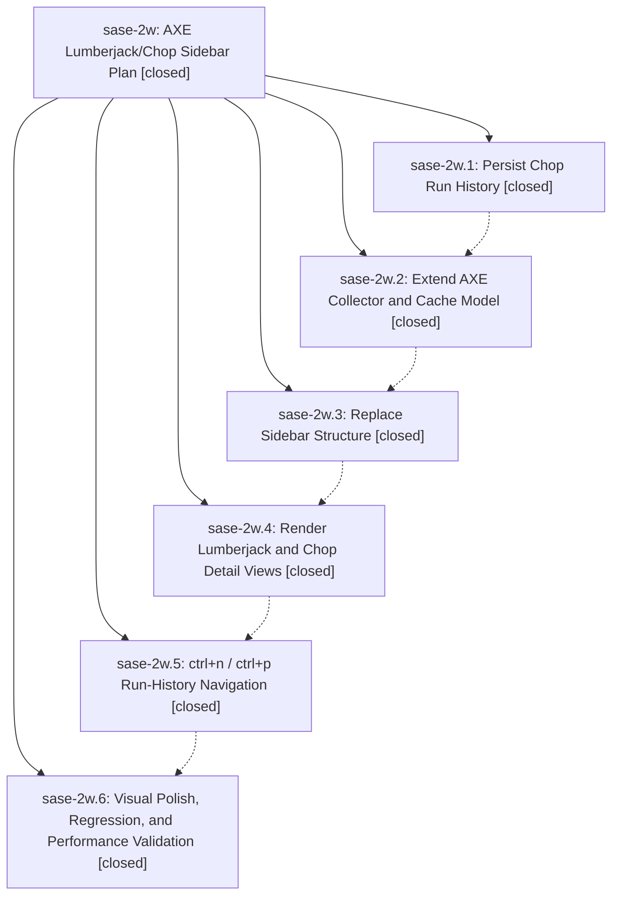

# Bead: sase-2w — AXE Lumberjack/Chop Sidebar Plan

[Bead Pages](../README.md) / sase-2w

**Status:** ✓ closed · **Resolution:** (unrecorded) · **Type:** plan · **Tier:** epic
**Owner:** `bryanbugyi34@gmail.com`
**Created:** 2026-05-11 20:34:12 UTC · **Closed:** 2026-05-11 22:26:34 UTC
**Plan:** [202605/axe\_lumberjack\_chop\_sidebar.md](https://github.com/sase-org/sase--plans/blob/main/202605/axe_lumberjack_chop_sidebar.md)

## Notes

COMMIT: 5304792a

## Phases

| Bead | Title | Status | Size | Agents | Commits |
|---|---|---|---|---:|---:|
| [sase-2w.1](sase-2w.1.md) | Persist Chop Run History | ✓ closed | small | 0 | 1 |
| [sase-2w.2](sase-2w.2.md) | Extend AXE Collector and Cache Model | ✓ closed | small | 0 | 1 |
| [sase-2w.3](sase-2w.3.md) | Replace Sidebar Structure | ✓ closed | small | 0 | 1 |
| [sase-2w.4](sase-2w.4.md) | Render Lumberjack and Chop Detail Views | ✓ closed | small | 0 | 1 |
| [sase-2w.5](sase-2w.5.md) | ctrl+n / ctrl+p Run-History Navigation | ✓ closed | small | 0 | 1 |
| [sase-2w.6](sase-2w.6.md) | Visual Polish, Regression, and Performance Validation | ✓ closed | small | 0 | 1 |

## Lineage

## Commits

| Commit | Subject | Bead | Committed (UTC) |
|---|---|---|---|
| [`b9bf9b9`](https://github.com/sase-org/sase/commit/b9bf9b9b44b60152d0f34913a2dcf1a5c3a356b7) | feat: persist bounded per-chop run history (sase-2w.1) | [sase-2w.1](sase-2w.1.md) | 2026-05-11 20:46:27 |
| [`487a0c2`](https://github.com/sase-org/sase/commit/487a0c20dbc1c05a37adc456d12bc6ae7fddf62b) | feat: extend AXE collector and cache model for chop run history (sase-2w.2) | [sase-2w.2](sase-2w.2.md) | 2026-05-11 21:01:18 |
| [`6606bf1`](https://github.com/sase-org/sase/commit/6606bf1fd38d1263dadb74ae04245e17fd69441e) | feat: replace AXE sidebar parent with top-level lumberjack tree (sase-2w.3) | [sase-2w.3](sase-2w.3.md) | 2026-05-11 21:21:33 |
| [`787f223`](https://github.com/sase-org/sase/commit/787f2239c871b129b0392d2b07e83719d3ac3f51) | feat: render lumberjack overview and chop detail views (sase-2w.4) | [sase-2w.4](sase-2w.4.md) | 2026-05-11 21:47:38 |
| [`279cbeb`](https://github.com/sase-org/sase/commit/279cbeb47a438d80b6c2192e2f5e04956375716d) | feat: ctrl+n / ctrl+p cycles chop run history on AXE tab (sase-2w.5) | [sase-2w.5](sase-2w.5.md) | 2026-05-11 22:01:41 |
| [`9593d29`](https://github.com/sase-org/sase/commit/9593d2923174183e3b395c24ea4610df03deeee6) | feat: visual polish + PNG snapshot for AXE lumberjack/chop tree (sase-2w.6) | [sase-2w.6](sase-2w.6.md) | 2026-05-11 22:21:13 |
