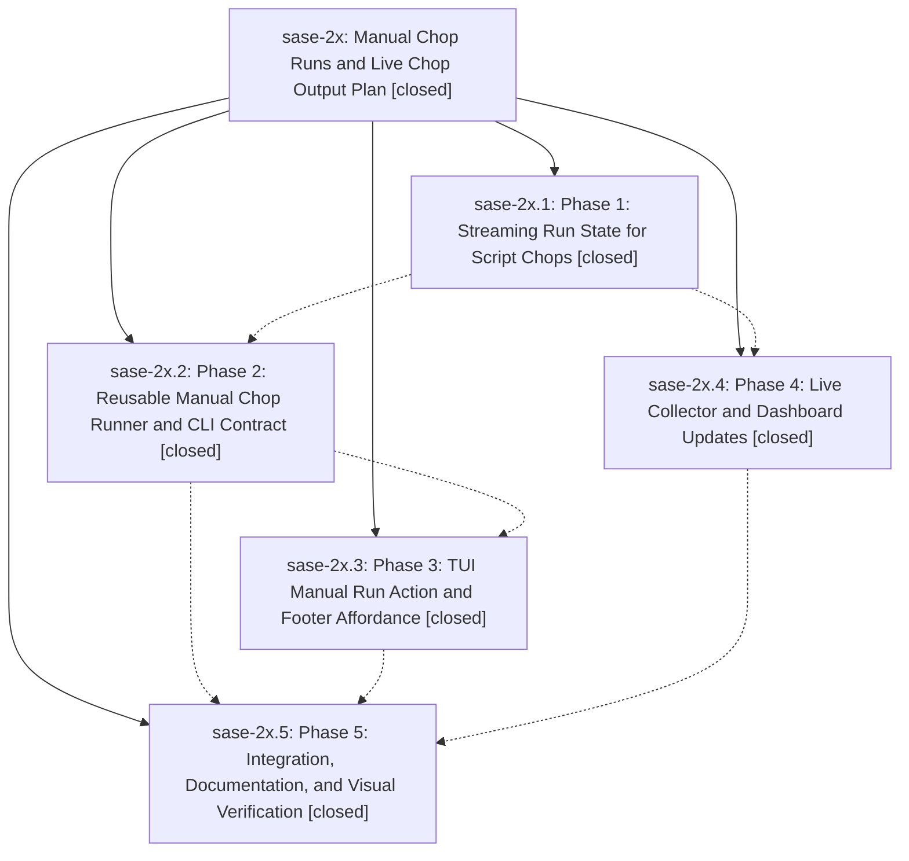

# Bead: sase-2x — Manual Chop Runs and Live Chop Output Plan

[Bead Pages](../README.md) / sase-2x

**Status:** ✓ closed · **Resolution:** (unrecorded) · **Type:** plan · **Tier:** epic
**Owner:** `bryanbugyi34@gmail.com`
**Created:** 2026-05-11 22:47:26 UTC · **Closed:** 2026-05-12 00:04:00 UTC
**Plan:** [202605/manual\_chop\_runs\_live\_output.md](https://github.com/sase-org/sase--plans/blob/main/202605/manual_chop_runs_live_output.md)

## Notes

COMMIT: 541cb5e4

## Phases

| Bead | Title | Status | Size | Agents | Commits |
|---|---|---|---|---:|---:|
| [sase-2x.1](sase-2x.1.md) | Phase 1: Streaming Run State for Script Chops | ✓ closed | small | 0 | 1 |
| [sase-2x.2](sase-2x.2.md) | Phase 2: Reusable Manual Chop Runner and CLI Contract | ✓ closed | small | 0 | 1 |
| [sase-2x.3](sase-2x.3.md) | Phase 3: TUI Manual Run Action and Footer Affordance | ✓ closed | small | 0 | 1 |
| [sase-2x.4](sase-2x.4.md) | Phase 4: Live Collector and Dashboard Updates | ✓ closed | small | 0 | 1 |
| [sase-2x.5](sase-2x.5.md) | Phase 5: Integration, Documentation, and Visual Verification | ✓ closed | small | 0 | 1 |

## Lineage

## Commits

| Commit | Subject | Bead | Committed (UTC) |
|---|---|---|---|
| [`fbb023f`](https://github.com/sase-org/sase/commit/fbb023fd003ec3c110de7f39317ec5d217c67312) | feat(axe): stream script chop output to per-run logs during execution (sase-2x.1) | [sase-2x.1](sase-2x.1.md) | 2026-05-11 23:12:59 |
| [`d6d1c9e`](https://github.com/sase-org/sase/commit/d6d1c9e213a77e6ca79a2f7bd9bad3065462b961) | feat(axe): live chop run dashboard, sidebar markers, and pinned-offset reconciliation (sase-2x.4) | [sase-2x.4](sase-2x.4.md) | 2026-05-11 23:23:56 |
| [`d81adc6`](https://github.com/sase-org/sase/commit/d81adc6c3f72cde71643678b7ee6b52deec5f0bf) | feat(axe): extract reusable chop runner and add CLI --lumberjack selector (sase-2x.2) | [sase-2x.2](sase-2x.2.md) | 2026-05-11 23:34:57 |
| [`1bdb62f`](https://github.com/sase-org/sase/commit/1bdb62f24f685803b03800dbf53afd068f285479) | feat(axe): TUI manual chop run action and footer affordance (sase-2x.3) | [sase-2x.3](sase-2x.3.md) | 2026-05-11 23:47:50 |
| [`0bf61e1`](https://github.com/sase-org/sase/commit/0bf61e132a39fc2d022cfe7a0a096283c6005a81) | chore(axe): document manual chop runs and add running-state snapshot (sase-2x.5) | [sase-2x.5](sase-2x.5.md) | 2026-05-12 00:00:19 |
