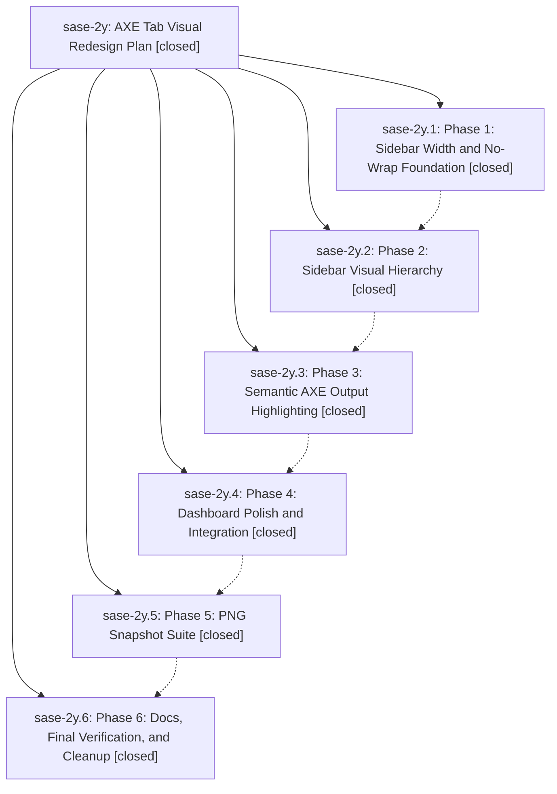

# Bead: sase-2y — AXE Tab Visual Redesign Plan

[Bead Pages](../README.md) / sase-2y

**Status:** ✓ closed · **Resolution:** (unrecorded) · **Type:** plan · **Tier:** epic
**Owner:** `bryanbugyi34@gmail.com`
**Created:** 2026-05-12 00:28:57 UTC · **Closed:** 2026-05-12 02:13:53 UTC
**Plan:** [202605/axe\_tab\_visual\_redesign.md](https://github.com/sase-org/sase--plans/blob/main/202605/axe_tab_visual_redesign.md)

## Notes

COMMIT: d68a637c

## Phases

| Bead | Title | Status | Size | Agents | Commits |
|---|---|---|---|---:|---:|
| [sase-2y.1](sase-2y.1.md) | Phase 1: Sidebar Width and No-Wrap Foundation | ✓ closed | small | 0 | 1 |
| [sase-2y.2](sase-2y.2.md) | Phase 2: Sidebar Visual Hierarchy | ✓ closed | small | 0 | 1 |
| [sase-2y.3](sase-2y.3.md) | Phase 3: Semantic AXE Output Highlighting | ✓ closed | small | 0 | 1 |
| [sase-2y.4](sase-2y.4.md) | Phase 4: Dashboard Polish and Integration | ✓ closed | small | 0 | 1 |
| [sase-2y.5](sase-2y.5.md) | Phase 5: PNG Snapshot Suite | ✓ closed | small | 0 | 1 |
| [sase-2y.6](sase-2y.6.md) | Phase 6: Docs, Final Verification, and Cleanup | ✓ closed | small | 0 | 1 |

## Lineage

## Commits

| Commit | Subject | Bead | Committed (UTC) |
|---|---|---|---|
| [`b2aa21f`](https://github.com/sase-org/sase/commit/b2aa21f1b38ea43c46136a367a38c08bba251148) | feat(ace/axe): dynamically size AXE sidebar to widest row (Phase 1 of sase-2y) (sase-2y.1) | [sase-2y.1](sase-2y.1.md) | 2026-05-12 00:50:11 |
| [`5b3014e`](https://github.com/sase-org/sase/commit/5b3014ee7ff3283fad4e0e83143c6a2274dd8daa) | feat(ace/axe): visually distinguish lumberjack, chop, and bgcmd sidebar rows (Phase 2 of sase-2y) (sase-2y.2) | [sase-2y.2](sase-2y.2.md) | 2026-05-12 01:04:43 |
| [`848bb66`](https://github.com/sase-org/sase/commit/848bb6689704e80ce0af045c186e7f38eb7d6604) | feat(ace/axe): semantically highlight controlled lumberjack and chop output (Phase 3 of sase-2y) (sase-2y.3) | [sase-2y.3](sase-2y.3.md) | 2026-05-12 01:15:48 |
| [`1dea8a5`](https://github.com/sase-org/sase/commit/1dea8a51f31613a788d2a1e9c93baa74ad21c253) | feat(ace/axe): polish AXE dashboard for narrow widths and sidebar palette (Phase 4 of sase-2y) (sase-2y.4) | [sase-2y.4](sase-2y.4.md) | 2026-05-12 01:30:08 |
| [`f80ac22`](https://github.com/sase-org/sase/commit/f80ac22e0ab0225bc0d285987e87d26eadf2c885) | chore: Add SDD prompt and plan for finish\_sase\_2y (sase-2y) | [sase-2y](README.md) | 2026-05-12 01:54:35 |
| [`a8d9a56`](https://github.com/sase-org/sase/commit/a8d9a56cbf63217ee269035c3cf98605d342bf82) | test(ace/axe): expand AXE PNG snapshot suite with phase 5 acceptance cases (Phase 5 of sase-2y) (sase-2y.5) | [sase-2y.5](sase-2y.5.md) | 2026-05-12 02:13:00 |
| [`08fc157`](https://github.com/sase-org/sase/commit/08fc1571652feb5afc0b6ca6195b28e26fd5a70f) | docs(ace): document AXE sidebar taxonomy, dynamic width, and controlled-output highlighting (Phase 6 of sase-2y) (sase-2y.6) | [sase-2y.6](sase-2y.6.md) | 2026-05-12 02:14:08 |
