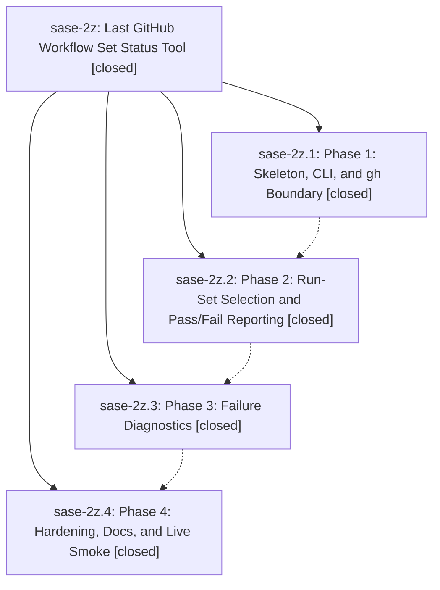

# Bead: sase-2z — Last GitHub Workflow Set Status Tool

[Bead Pages](../README.md) / sase-2z

**Status:** ✓ closed · **Resolution:** (unrecorded) · **Type:** plan · **Tier:** epic
**Owner:** `bryanbugyi34@gmail.com`
**Created:** 2026-05-12 01:00:08 UTC · **Closed:** 2026-05-12 01:48:52 UTC
**Plan:** [202605/last\_workflow\_set\_status\_tool.md](https://github.com/sase-org/sase--plans/blob/main/202605/last_workflow_set_status_tool.md)

## Notes

COMMIT: 6110d4ea

## Phases

| Bead | Title | Status | Size | Agents | Commits |
|---|---|---|---|---:|---:|
| [sase-2z.1](sase-2z.1.md) | Phase 1: Skeleton, CLI, and gh Boundary | ✓ closed | small | 0 | 1 |
| [sase-2z.2](sase-2z.2.md) | Phase 2: Run-Set Selection and Pass/Fail Reporting | ✓ closed | small | 0 | 1 |
| [sase-2z.3](sase-2z.3.md) | Phase 3: Failure Diagnostics | ✓ closed | small | 0 | 1 |
| [sase-2z.4](sase-2z.4.md) | Phase 4: Hardening, Docs, and Live Smoke | ✓ closed | small | 0 | 0 |

## Lineage

## Commits

| Commit | Subject | Bead | Committed (UTC) |
|---|---|---|---|
| [`750ef14`](https://github.com/sase-org/sase/commit/750ef147f9e9987eeac5223fae978aff52f55591) | feat(tools): add Phase 1 skeleton of last\_workflow\_set\_status (sase-2z.1) | [sase-2z.1](sase-2z.1.md) | 2026-05-12 01:09:52 |
| [`631f961`](https://github.com/sase-org/sase/commit/631f96189774c5a3bdf747c0f68340bdbea2c284) | feat(tools): implement run-set selection and pass/fail reporting (sase-2z.2) | [sase-2z.2](sase-2z.2.md) | 2026-05-12 01:20:59 |
| [`5fbb6a5`](https://github.com/sase-org/sase/commit/5fbb6a54b94c2576c28c9739fabefdaea0472a69) | feat(tools): add failure diagnostics to last\_workflow\_set\_status (sase-2z.3) | [sase-2z.3](sase-2z.3.md) | 2026-05-12 01:33:16 |
| [`57e6853`](https://github.com/sase-org/sase/commit/57e68538cef9907efd26f00fc7f0d31968952278) | chore: Add SDD prompt and plan for sase\_2z\_completion (sase-2z) | [sase-2z](README.md) | 2026-05-12 01:42:26 |
| [`8b270b1`](https://github.com/sase-org/sase/commit/8b270b12391e97152d799c75fd4b91804618b141) | fix(tools): harden last\_workflow\_set\_status gh boundary (sase-2z.4) (sase-2z) | [sase-2z](README.md) | 2026-05-12 01:49:09 |
