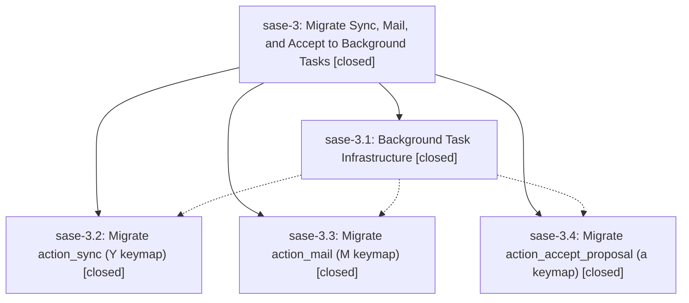

# Bead: sase-3 — Migrate Sync, Mail, and Accept to Background Tasks

[Bead Pages](../README.md) / sase-3

**Status:** ✓ closed · **Resolution:** (unrecorded) · **Type:** plan · **Tier:** epic
**Owner:** `bryanbugyi34@gmail.com`
**Created:** 2026-03-19 22:43:01 UTC · **Closed:** 2026-03-19 23:22:53 UTC
**Plan:** [202603/background\_tasks.md](https://github.com/sase-org/sase--plans/blob/main/202603/background_tasks.md)

## Phases

| Bead | Title | Status | Size | Agents | Commits |
|---|---|---|---|---:|---:|
| [sase-3.1](sase-3.1.md) | Background Task Infrastructure | ✓ closed | small | 0 | 1 |
| [sase-3.2](sase-3.2.md) | Migrate action\_sync (Y keymap) | ✓ closed | small | 0 | 1 |
| [sase-3.3](sase-3.3.md) | Migrate action\_mail (M keymap) | ✓ closed | small | 0 | 1 |
| [sase-3.4](sase-3.4.md) | Migrate action\_accept\_proposal (a keymap) | ✓ closed | small | 0 | 1 |

## Lineage

## Commits

| Commit | Subject | Bead | Committed (UTC) |
|---|---|---|---|
| [`288f262`](https://github.com/sase-org/sase/commit/288f262392b8efb7495dab9e2f96150598764dce) | feat: Add background task infrastructure for TUI (sase-3.1) | [sase-3.1](sase-3.1.md) | 2026-03-19 22:56:07 |
| [`0e13317`](https://github.com/sase-org/sase/commit/0e13317f5e043294b00e09cca3b103ab386496ec) | feat: Migrate action\_sync to background task execution (sase-3.2) | [sase-3.2](sase-3.2.md) | 2026-03-19 23:04:58 |
| [`90063e4`](https://github.com/sase-org/sase/commit/90063e439f8f2d329352c68a8c1f3d7d237df09e) | feat: Migrate action\_mail to background task execution (sase-3.3) | [sase-3.3](sase-3.3.md) | 2026-03-19 23:11:15 |
| [`1ce513d`](https://github.com/sase-org/sase/commit/1ce513d812d70418ce9515459292614496a554ed) | feat: Migrate action\_accept\_proposal to background task execution (sase-3.4) | [sase-3.4](sase-3.4.md) | 2026-03-19 23:20:52 |
