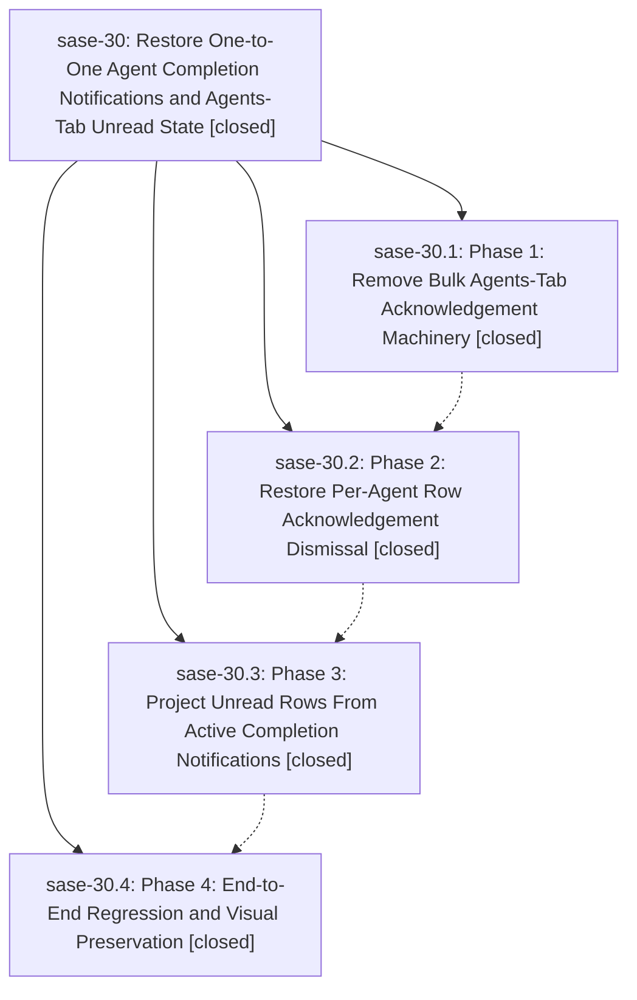

# Bead: sase-30 — Restore One-to-One Agent Completion Notifications and Agents-Tab Unread State

[Bead Pages](../README.md) / sase-30

**Status:** ✓ closed · **Resolution:** (unrecorded) · **Type:** plan · **Tier:** epic
**Owner:** `bryanbugyi34@gmail.com`
**Created:** 2026-05-12 01:20:09 UTC · **Closed:** 2026-05-12 03:58:13 UTC
**Plan:** [202605/agent\_completion\_notification\_unread\_contract.md](https://github.com/sase-org/sase--plans/blob/main/202605/agent_completion_notification_unread_contract.md)

## Notes

COMMIT: c4cb0fa4

## Phases

| Bead | Title | Status | Size | Agents | Commits |
|---|---|---|---|---:|---:|
| [sase-30.1](sase-30.1.md) | Phase 1: Remove Bulk Agents-Tab Acknowledgement Machinery | ✓ closed | small | 0 | 1 |
| [sase-30.2](sase-30.2.md) | Phase 2: Restore Per-Agent Row Acknowledgement Dismissal | ✓ closed | small | 0 | 1 |
| [sase-30.3](sase-30.3.md) | Phase 3: Project Unread Rows From Active Completion Notifications | ✓ closed | small | 0 | 1 |
| [sase-30.4](sase-30.4.md) | Phase 4: End-to-End Regression and Visual Preservation | ✓ closed | small | 0 | 1 |

## Lineage

## Commits

| Commit | Subject | Bead | Committed (UTC) |
|---|---|---|---|
| [`95f4962`](https://github.com/sase-org/sase/commit/95f4962baabfff96f2e662f913914af6fc9597ce) | chore: Add SDD prompt and plan for sase\_30\_completion\_unread\_contract (sase-30) | [sase-30](README.md) | 2026-05-12 02:23:19 |
| [`6655a57`](https://github.com/sase-org/sase/commit/6655a57c3326f4e8f756248f46135ee71fe83942) | ref: remove bulk Agents-tab completion-dismiss machinery (sase-30.1) | [sase-30.1](sase-30.1.md) | 2026-05-12 03:20:47 |
| [`cf17bb4`](https://github.com/sase-org/sase/commit/cf17bb4c25a0ef8cd96492ba639c6c951958d439) | ref: restore per-agent row acknowledgement dismissal (sase-30.2) | [sase-30.2](sase-30.2.md) | 2026-05-12 03:28:15 |
| [`89bc61a`](https://github.com/sase-org/sase/commit/89bc61a202bd90bf2924002c15886eb00e34907e) | ref: project Agents-tab unread rows from active completion notifications (sase-30.3) | [sase-30.3](sase-30.3.md) | 2026-05-12 03:42:23 |
| [`f99d762`](https://github.com/sase-org/sase/commit/f99d7623832b6535982b649c676646c443c4c6c6) | test: add E2E one-to-one agent completion notification contract (sase-30.4) | [sase-30.4](sase-30.4.md) | 2026-05-12 03:53:43 |
