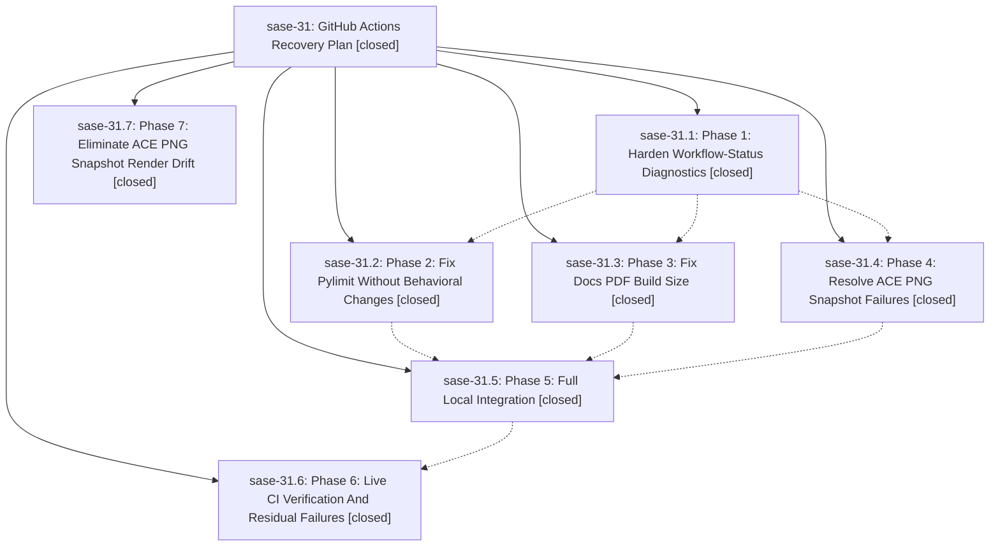

# Bead: sase-31 — GitHub Actions Recovery Plan

[Bead Pages](../README.md) / sase-31

**Status:** ✓ closed · **Resolution:** (unrecorded) · **Type:** plan · **Tier:** epic
**Owner:** `bryanbugyi34@gmail.com`
**Created:** 2026-05-12 02:01:34 UTC · **Closed:** 2026-05-12 04:35:19 UTC
**Plan:** [202605/github\_actions\_recovery.md](https://github.com/sase-org/sase--plans/blob/main/202605/github_actions_recovery.md)

## Notes

COMMIT: 7817db81

## Phases

| Bead | Title | Status | Size | Agents | Commits |
|---|---|---|---|---:|---:|
| [sase-31.1](sase-31.1.md) | Phase 1: Harden Workflow-Status Diagnostics | ✓ closed | small | 0 | 1 |
| [sase-31.2](sase-31.2.md) | Phase 2: Fix Pylimit Without Behavioral Changes | ✓ closed | small | 0 | 1 |
| [sase-31.3](sase-31.3.md) | Phase 3: Fix Docs PDF Build Size | ✓ closed | small | 0 | 1 |
| [sase-31.4](sase-31.4.md) | Phase 4: Resolve ACE PNG Snapshot Failures | ✓ closed | small | 0 | 1 |
| [sase-31.5](sase-31.5.md) | Phase 5: Full Local Integration | ✓ closed | small | 0 | 1 |
| [sase-31.6](sase-31.6.md) | Phase 6: Live CI Verification And Residual Failures | ✓ closed | small | 0 | 0 |
| [sase-31.7](sase-31.7.md) | Phase 7: Eliminate ACE PNG Snapshot Render Drift | ✓ closed | small | 0 | 1 |

## Lineage

## Commits

| Commit | Subject | Bead | Committed (UTC) |
|---|---|---|---|
| [`0acf652`](https://github.com/sase-org/sase/commit/0acf652458bf05c4d28122791ac300cd12ae0411) | fix: surface log tail alongside annotations in workflow-status diagnostics (sase-31.1) | [sase-31.1](sase-31.1.md) | 2026-05-12 03:18:25 |
| [`c9fc371`](https://github.com/sase-org/sase/commit/c9fc3717d4c148da3e258fc2e962ea7a75dd8c37) | ref: split axe\_dashboard helpers below the pylimit threshold (sase-31.2) | [sase-31.2](sase-31.2.md) | 2026-05-12 03:27:34 |
| [`0a1ac71`](https://github.com/sase-org/sase/commit/0a1ac71fba70034d48735c008ad300ef917ac092) | fix: shrink docs handbook PDF below the 22 MiB limit (sase-31.3) | [sase-31.3](sase-31.3.md) | 2026-05-12 03:38:05 |
| [`b8830bf`](https://github.com/sase-org/sase/commit/b8830bfb686da85323f26f22ff8869a73b63fcd5) | fix(ace/visual): pin fontconfig to bundled Fira Code (Phase 4 of sase-31) (sase-31.4) | [sase-31.4](sase-31.4.md) | 2026-05-12 03:47:43 |
| [`6e79f32`](https://github.com/sase-org/sase/commit/6e79f32eef3c17539029357cb4a7997e8dffdb64) | ref: split oversized test files below the pylimit threshold (Phase 5 of sase-31) (sase-31.5) | [sase-31.5](sase-31.5.md) | 2026-05-12 04:06:29 |
| [`8805149`](https://github.com/sase-org/sase/commit/8805149ed73be98350bb01b6df9529d854a662ca) | chore: Add SDD prompt and plan for sase\_31\_close\_ace\_png\_drift (sase-31) | [sase-31](README.md) | 2026-05-12 04:23:12 |
| [`d102fa8`](https://github.com/sase-org/sase/commit/d102fa8d381379429d6d7912138b622cf6f126bb) | fix(ace/visual): adopt CI-rendered PNG goldens and absorb sub-pixel render drift (Phase 7 of sase-31) (sase-31.7) | [sase-31.7](sase-31.7.md) | 2026-05-12 04:34:20 |
| [`f86e3fd`](https://github.com/sase-org/sase/commit/f86e3fd2d83a3d4888fcbf4647c7a5078725f6bf) | chore: mark github\_actions\_recovery plan done (sase-31) | [sase-31](README.md) | 2026-05-12 04:35:34 |
