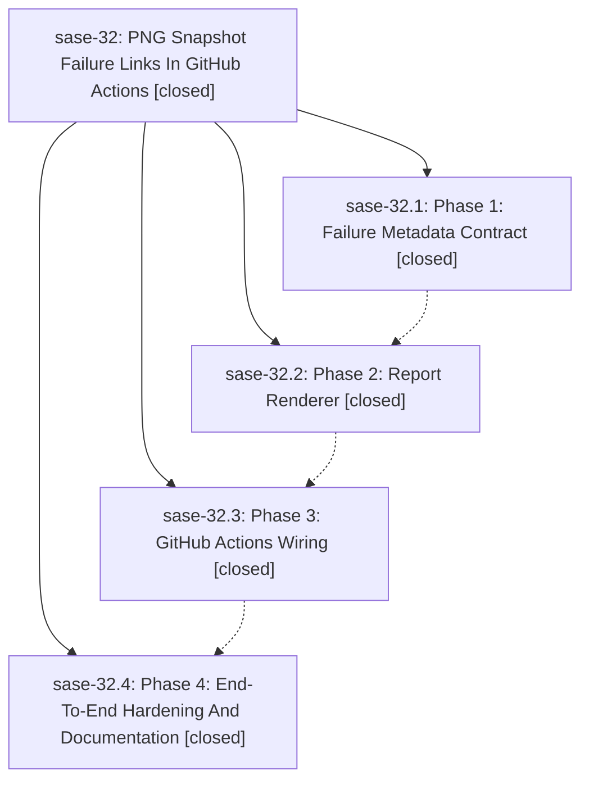

# Bead: sase-32 — PNG Snapshot Failure Links In GitHub Actions

[Bead Pages](../README.md) / sase-32

**Status:** ✓ closed · **Resolution:** (unrecorded) · **Type:** plan · **Tier:** epic
**Owner:** `bryanbugyi34@gmail.com`
**Created:** 2026-05-12 02:09:33 UTC · **Closed:** 2026-05-12 03:41:00 UTC
**Plan:** [202605/visual\_snapshot\_failure\_links.md](https://github.com/sase-org/sase--plans/blob/main/202605/visual_snapshot_failure_links.md)

## Notes

COMMIT: 02a34fa8

## Phases

| Bead | Title | Status | Size | Agents | Commits |
|---|---|---|---|---:|---:|
| [sase-32.1](sase-32.1.md) | Phase 1: Failure Metadata Contract | ✓ closed | small | 0 | 1 |
| [sase-32.2](sase-32.2.md) | Phase 2: Report Renderer | ✓ closed | small | 0 | 1 |
| [sase-32.3](sase-32.3.md) | Phase 3: GitHub Actions Wiring | ✓ closed | small | 0 | 1 |
| [sase-32.4](sase-32.4.md) | Phase 4: End-To-End Hardening And Documentation | ✓ closed | small | 0 | 1 |

## Lineage

## Commits

| Commit | Subject | Bead | Committed (UTC) |
|---|---|---|---|
| [`96b8f3f`](https://github.com/sase-org/sase/commit/96b8f3f0b1ffea01b03bbfd474834be3de7c239c) | feat: write failure.json sidecars for ACE PNG snapshot failures (sase-32.1) | [sase-32.1](sase-32.1.md) | 2026-05-12 03:16:50 |
| [`128918f`](https://github.com/sase-org/sase/commit/128918ff90ffbb77df1c68b73cc2129f1a8418fa) | feat: add visual snapshot failure report renderer (sase-32.2) | [sase-32.2](sase-32.2.md) | 2026-05-12 03:25:15 |
| [`6119429`](https://github.com/sase-org/sase/commit/6119429bd01219ee26e16d3c67a2865af56ab982) | feat: wire visual snapshot failure report into CI (sase-32.3) | [sase-32.3](sase-32.3.md) | 2026-05-12 03:30:15 |
| [`ec73a69`](https://github.com/sase-org/sase/commit/ec73a6936402c4528ccbe2c4eb4c16ccfba5b032) | chore: document visual snapshot failure report flow (sase-32.4) | [sase-32.4](sase-32.4.md) | 2026-05-12 03:36:34 |
