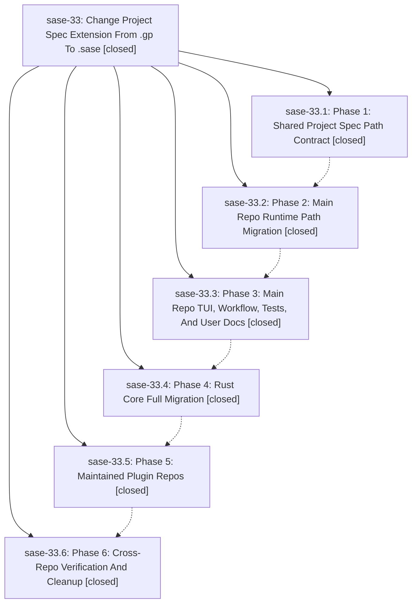

# Bead: sase-33 — Change Project Spec Extension From .gp To .sase

[Bead Pages](../README.md) / sase-33

**Status:** ✓ closed · **Resolution:** (unrecorded) · **Type:** plan · **Tier:** epic
**Owner:** `bryanbugyi34@gmail.com`
**Created:** 2026-05-12 13:48:41 UTC · **Closed:** 2026-05-12 16:22:40 UTC
**Plan:** [202605/project\_spec\_extension\_sase.md](https://github.com/sase-org/sase--plans/blob/main/202605/project_spec_extension_sase.md)

## Notes

COMMIT: 2785ed28

## Phases

| Bead | Title | Status | Size | Agents | Commits |
|---|---|---|---|---:|---:|
| [sase-33.1](sase-33.1.md) | Phase 1: Shared Project Spec Path Contract | ✓ closed | small | 0 | 1 |
| [sase-33.2](sase-33.2.md) | Phase 2: Main Repo Runtime Path Migration | ✓ closed | small | 0 | 1 |
| [sase-33.3](sase-33.3.md) | Phase 3: Main Repo TUI, Workflow, Tests, And User Docs | ✓ closed | small | 0 | 1 |
| [sase-33.4](sase-33.4.md) | Phase 4: Rust Core Full Migration | ✓ closed | small | 0 | 1 |
| [sase-33.5](sase-33.5.md) | Phase 5: Maintained Plugin Repos | ✓ closed | small | 0 | 0 |
| [sase-33.6](sase-33.6.md) | Phase 6: Cross-Repo Verification And Cleanup | ✓ closed | small | 0 | 0 |

## Lineage

## Commits

| Commit | Subject | Bead | Committed (UTC) |
|---|---|---|---|
| [`bb3c05f`](https://github.com/sase-org/sase/commit/bb3c05f1c2e79af350e2bb62330559c74eccf7be) | feat: add shared project spec path helpers (sase-33.1) | [sase-33.1](sase-33.1.md) | 2026-05-12 14:37:28 |
| [`55a961a`](https://github.com/sase-org/sase/commit/55a961a40b09ca1a2963d3dd81d7dabb8bc79f45) | feat: migrate main-repo runtime to .sase project specs (sase-33.2) | [sase-33.2](sase-33.2.md) | 2026-05-12 14:58:16 |
| [`88bd937`](https://github.com/sase-org/sase/commit/88bd937b93a6f0f086eff832d3f1a2ca21c17ac9) | feat: finish .sase migration for TUI, tests, and docs (sase-33.3) | [sase-33.3](sase-33.3.md) | 2026-05-12 15:30:18 |
| [`sase-core@e794c2b`](https://github.com/sase-org/sase-core/commit/e794c2bec923133d1eec0fc9b3e7b6bf3fcafe44) | feat: migrate Rust core to canonical .sase project spec extension (sase-33.4) | [sase-33.4](sase-33.4.md) | 2026-05-12 15:44:57 |
| [`f1e917c`](https://github.com/sase-org/sase/commit/f1e917c298729b9f08838ada4ff1eecdc0303bdd) | chore: Add SDD prompt and plan for phase5\_plugin\_sase\_migration (sase-33) | [sase-33](README.md) | 2026-05-12 16:08:50 |
