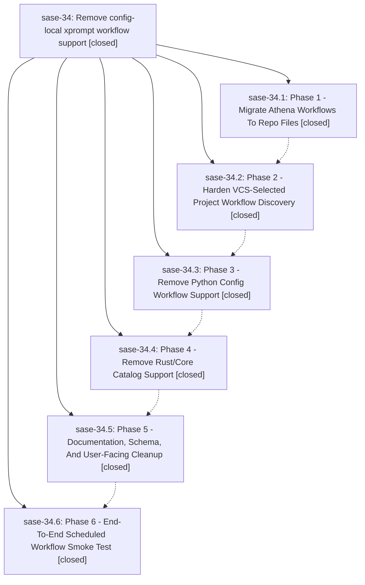

# Bead: sase-34 — Remove config-local xprompt workflow support

[Bead Pages](../README.md) / sase-34

**Status:** ✓ closed · **Resolution:** (unrecorded) · **Type:** plan · **Tier:** epic
**Owner:** `bryanbugyi34@gmail.com`
**Created:** 2026-05-12 16:01:42 UTC · **Closed:** 2026-05-12 17:37:09 UTC
**Plan:** [202605/remove\_local\_xprompt\_workflows.md](https://github.com/sase-org/sase--plans/blob/main/202605/remove_local_xprompt_workflows.md)

## Notes

COMMIT: 8a037ff7

## Phases

| Bead | Title | Status | Size | Agents | Commits |
|---|---|---|---|---:|---:|
| [sase-34.1](sase-34.1.md) | Phase 1 - Migrate Athena Workflows To Repo Files | ✓ closed | small | 0 | 1 |
| [sase-34.2](sase-34.2.md) | Phase 2 - Harden VCS-Selected Project Workflow Discovery | ✓ closed | small | 0 | 1 |
| [sase-34.3](sase-34.3.md) | Phase 3 - Remove Python Config Workflow Support | ✓ closed | small | 0 | 1 |
| [sase-34.4](sase-34.4.md) | Phase 4 - Remove Rust/Core Catalog Support | ✓ closed | small | 0 | 1 |
| [sase-34.5](sase-34.5.md) | Phase 5 - Documentation, Schema, And User-Facing Cleanup | ✓ closed | small | 0 | 1 |
| [sase-34.6](sase-34.6.md) | Phase 6 - End-To-End Scheduled Workflow Smoke Test | ✓ closed | small | 0 | 0 |

## Lineage

## Commits

| Commit | Subject | Bead | Committed (UTC) |
|---|---|---|---|
| [`e98ab21`](https://github.com/sase-org/sase/commit/e98ab21f796bd144323949b7137eba715f55a3b8) | feat: migrate athena workflows to xprompts/ (sase-34.1) | [sase-34.1](sase-34.1.md) | 2026-05-12 16:23:57 |
| [`a3dee16`](https://github.com/sase-org/sase/commit/a3dee16de1d08e109dcdbd8a827df9c3e17553db) | fix: normalize owner/repo VCS refs to known project workspace (sase-34.2) | [sase-34.2](sase-34.2.md) | 2026-05-12 16:38:05 |
| [`609c26f`](https://github.com/sase-org/sase/commit/609c26f66c0d346fd3e25451f865bdb5b9f90965) | ref: remove Python config workflow support (sase-34.3) | [sase-34.3](sase-34.3.md) | 2026-05-12 17:01:05 |
| [`sase-core@9861b34`](https://github.com/sase-org/sase-core/commit/9861b342d842ef757ab9d4a1b8aee1f61e8c2f07) | ref: remove config workflow support from Rust xprompt catalog (sase-34.4) | [sase-34.4](sase-34.4.md) | 2026-05-12 17:10:07 |
| [`2235361`](https://github.com/sase-org/sase/commit/2235361459e5ebf3515ae42489bd392b7ff064c9) | chore: remove config workflow docs and schema (sase-34.5) | [sase-34.5](sase-34.5.md) | 2026-05-12 17:16:39 |
| [`c07613a`](https://github.com/sase-org/sase/commit/c07613a31df0ffc01a2f012fc78331f8dc7212f6) | chore: Add SDD prompt and plan for sase\_34\_closeout\_1 (sase-34) | [sase-34](README.md) | 2026-05-12 17:31:21 |
| [`3305cda`](https://github.com/sase-org/sase/commit/3305cda6b3b81c834fd542b9bdd59eeeacb8ae3e) | chore: close sase-34 closeout doc drift (sase-34) | [sase-34](README.md) | 2026-05-12 17:37:23 |
