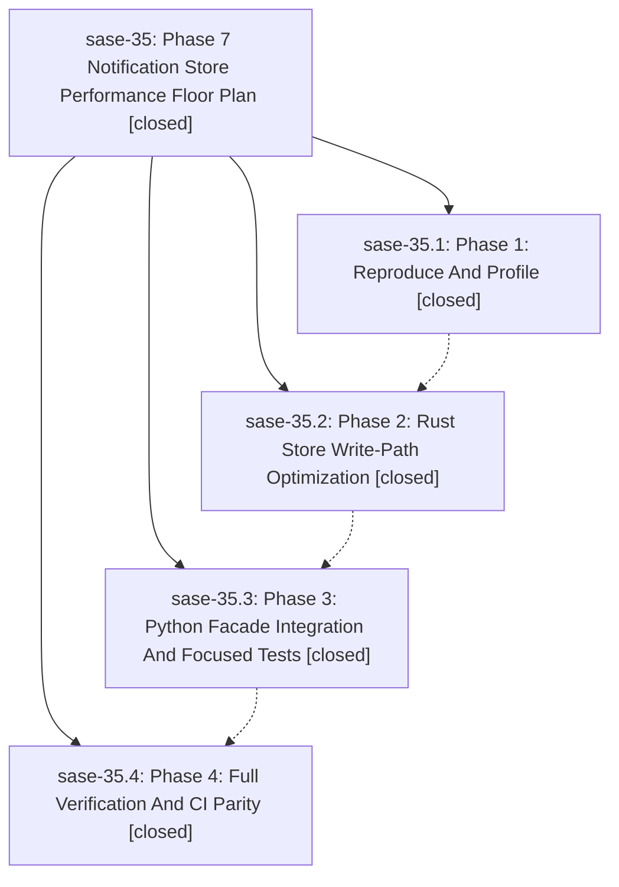

# Bead: sase-35 — Phase 7 Notification Store Performance Floor Plan

[Bead Pages](../README.md) / sase-35

**Status:** ✓ closed · **Resolution:** (unrecorded) · **Type:** plan · **Tier:** epic
**Owner:** `bryanbugyi34@gmail.com`
**Created:** 2026-05-12 16:18:28 UTC · **Closed:** 2026-05-12 17:05:03 UTC
**Plan:** [202605/phase7\_notification\_perf.md](https://github.com/sase-org/sase--plans/blob/main/202605/phase7_notification_perf.md)

## Notes

COMMIT: 9af2d8f1

## Phases

| Bead | Title | Status | Size | Agents | Commits |
|---|---|---|---|---:|---:|
| [sase-35.1](sase-35.1.md) | Phase 1: Reproduce And Profile | ✓ closed | small | 0 | 0 |
| [sase-35.2](sase-35.2.md) | Phase 2: Rust Store Write-Path Optimization | ✓ closed | small | 0 | 1 |
| [sase-35.3](sase-35.3.md) | Phase 3: Python Facade Integration And Focused Tests | ✓ closed | small | 0 | 1 |
| [sase-35.4](sase-35.4.md) | Phase 4: Full Verification And CI Parity | ✓ closed | small | 0 | 0 |

## Lineage

## Commits

| Commit | Subject | Bead | Committed (UTC) |
|---|---|---|---|
| [`sase-core@74ca5dc`](https://github.com/sase-org/sase-core/commit/74ca5dcca93255b41af51678c1497944e8502b31) | feat: add counts-only notification append and rewrite APIs (sase-35.2) | [sase-35.2](sase-35.2.md) | 2026-05-12 16:42:09 |
| [`fb59c1f`](https://github.com/sase-org/sase/commit/fb59c1f48fa99ee40050650df27e38849dae6493) | perf(notifications): route facade write paths through counts-only Rust bindings (sase-35.3) | [sase-35.3](sase-35.3.md) | 2026-05-12 16:51:15 |
