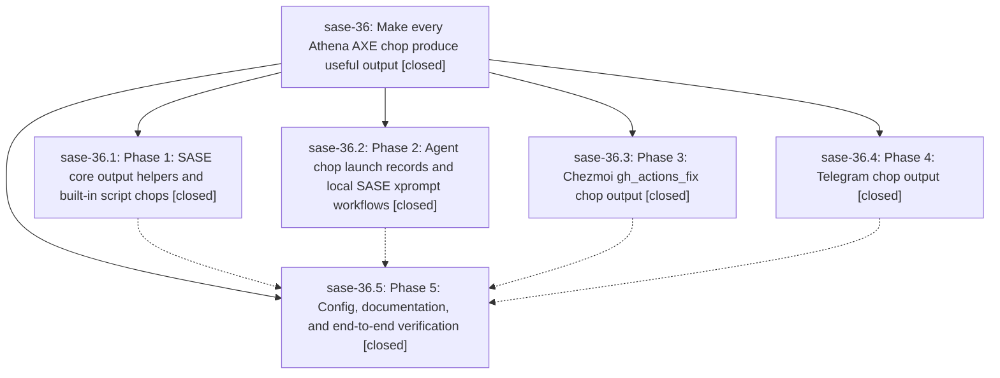

# Bead: sase-36 — Make every Athena AXE chop produce useful output

[Bead Pages](../README.md) / sase-36

**Status:** ✓ closed · **Resolution:** (unrecorded) · **Type:** plan · **Tier:** epic
**Owner:** `bryanbugyi34@gmail.com`
**Created:** 2026-05-12 17:51:06 UTC · **Closed:** 2026-05-12 18:52:32 UTC
**Plan:** [202605/chop\_output\_coverage.md](https://github.com/sase-org/sase--plans/blob/main/202605/chop_output_coverage.md)

## Notes

COMMIT: 7ee4e1a7

## Phases

| Bead | Title | Status | Size | Agents | Commits |
|---|---|---|---|---:|---:|
| [sase-36.1](sase-36.1.md) | Phase 1: SASE core output helpers and built-in script chops | ✓ closed | small | 0 | 0 |
| [sase-36.2](sase-36.2.md) | Phase 2: Agent chop launch records and local SASE xprompt workflows | ✓ closed | small | 0 | 0 |
| [sase-36.3](sase-36.3.md) | Phase 3: Chezmoi gh\_actions\_fix chop output | ✓ closed | small | 0 | 0 |
| [sase-36.4](sase-36.4.md) | Phase 4: Telegram chop output | ✓ closed | small | 0 | 0 |
| [sase-36.5](sase-36.5.md) | Phase 5: Config, documentation, and end-to-end verification | ✓ closed | small | 0 | 1 |

## Lineage

## Commits

| Commit | Subject | Bead | Committed (UTC) |
|---|---|---|---|
| [`0c8e126`](https://github.com/sase-org/sase/commit/0c8e12690d8086f83c32b10c30f40ebbd9d23c00) | feat: improve AXE chop run output (sase-36.5) | [sase-36.5](sase-36.5.md) | 2026-05-12 18:28:35 |
| [`8e2d871`](https://github.com/sase-org/sase/commit/8e2d8716ab270cc6e97495bb81fd878edd745f19) | chore: Add SDD prompt and plan for sase36\_completion (sase-36) | [sase-36](README.md) | 2026-05-12 18:34:41 |
| [`05cac0e`](https://github.com/sase-org/sase/commit/05cac0ef16eb357ddae24b7e4481c071b82f907f) | feat: summarize Athena chop output (sase-36) | [sase-36](README.md) | 2026-05-12 18:52:49 |
