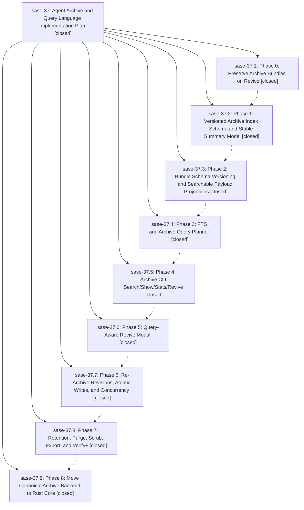

# Bead: sase-37 — Agent Archive and Query Language Implementation Plan

[Bead Pages](../README.md) / sase-37

**Status:** ✓ closed · **Resolution:** (unrecorded) · **Type:** plan · **Tier:** epic
**Owner:** `bryanbugyi34@gmail.com`
**Created:** 2026-05-12 20:08:41 UTC · **Closed:** 2026-05-12 22:26:18 UTC
**Plan:** [202605/agent\_archive\_query.md](https://github.com/sase-org/sase--plans/blob/main/202605/agent_archive_query.md)

## Notes

COMMIT: bb5f3b46

## Phases

| Bead | Title | Status | Size | Agents | Commits |
|---|---|---|---|---:|---:|
| [sase-37.1](sase-37.1.md) | Phase 0: Preserve Archive Bundles on Revive | ✓ closed | small | 0 | 0 |
| [sase-37.2](sase-37.2.md) | Phase 1: Versioned Archive Index Schema and Stable Summary Model | ✓ closed | small | 0 | 1 |
| [sase-37.3](sase-37.3.md) | Phase 2: Bundle Schema Versioning and Searchable Payload Projections | ✓ closed | small | 0 | 1 |
| [sase-37.4](sase-37.4.md) | Phase 3: FTS and Archive Query Planner | ✓ closed | small | 0 | 1 |
| [sase-37.5](sase-37.5.md) | Phase 4: Archive CLI Search/Show/Stats/Revive | ✓ closed | small | 0 | 1 |
| [sase-37.6](sase-37.6.md) | Phase 5: Query-Aware Revive Modal | ✓ closed | small | 0 | 1 |
| [sase-37.7](sase-37.7.md) | Phase 6: Re-Archive Revisions, Atomic Writes, and Concurrency | ✓ closed | small | 0 | 1 |
| [sase-37.8](sase-37.8.md) | Phase 7: Retention, Purge, Scrub, Export, and Verify+ | ✓ closed | small | 0 | 1 |
| [sase-37.9](sase-37.9.md) | Phase 8: Move Canonical Archive Backend to Rust Core | ✓ closed | small | 0 | 2 |

## Lineage

## Commits

| Commit | Subject | Bead | Committed (UTC) |
|---|---|---|---|
| [`7fcb570`](https://github.com/sase-org/sase/commit/7fcb5706dcaeb3ad9b9d41a4ec5d207e859813db) | feat: add v2 dismissed bundle archive index (sase-37.2) | [sase-37.2](sase-37.2.md) | 2026-05-12 20:27:54 |
| [`bea1750`](https://github.com/sase-org/sase/commit/bea1750ad08675e856f1cdf83cb07c71872ad029) | feat: add searchable archive bundle projections (sase-37.3) | [sase-37.3](sase-37.3.md) | 2026-05-12 20:36:22 |
| [`085e86d`](https://github.com/sase-org/sase/commit/085e86d922e34022c5595496092e7da02b76b1af) | feat: add archive query planner (sase-37.4) | [sase-37.4](sase-37.4.md) | 2026-05-12 20:55:18 |
| [`08b9111`](https://github.com/sase-org/sase/commit/08b9111ae32e94d44d13e2ff073a28070c20f5e5) | feat: add dismissed agent archive CLI (sase-37.5) | [sase-37.5](sase-37.5.md) | 2026-05-12 21:05:48 |
| [`0ef1b84`](https://github.com/sase-org/sase/commit/0ef1b84cdf6fac3da01d1f95ec0a3caa2a5b1245) | feat: add archive-backed revive search (sase-37.6) | [sase-37.6](sase-37.6.md) | 2026-05-12 21:21:18 |
| [`ce8cb9e`](https://github.com/sase-org/sase/commit/ce8cb9e374d1647f462ddcf40d34c02321a15fbe) | feat: harden dismissed agent archive storage (sase-37.7) | [sase-37.7](sase-37.7.md) | 2026-05-12 21:34:32 |
| [`ac5487d`](https://github.com/sase-org/sase/commit/ac5487d67ddd428cfff41bc74c0b38272600a25d) | feat: add archive lifecycle commands (sase-37.8) | [sase-37.8](sase-37.8.md) | 2026-05-12 21:52:07 |
| [`b9954bb`](https://github.com/sase-org/sase/commit/b9954bb0ae0254b2afc6c9ec4ef3c4d9529de618) | feat: route archive operations through Rust facade (sase-37.9) | [sase-37.9](sase-37.9.md) | 2026-05-12 22:21:13 |
| [`sase-core@e458501`](https://github.com/sase-org/sase-core/commit/e458501429500525adb18880c22c20f5f54a19ff) | feat: add Rust agent archive backend (sase-37.9) | [sase-37.9](sase-37.9.md) | 2026-05-12 22:22:19 |
| [`4f21697`](https://github.com/sase-org/sase/commit/4f216979a66d3658611a50762f5fda6eddbf1822) | chore: Add SDD prompt and plan for sase\_37\_completion (sase-37) | [sase-37](README.md) | 2026-05-12 22:26:43 |
