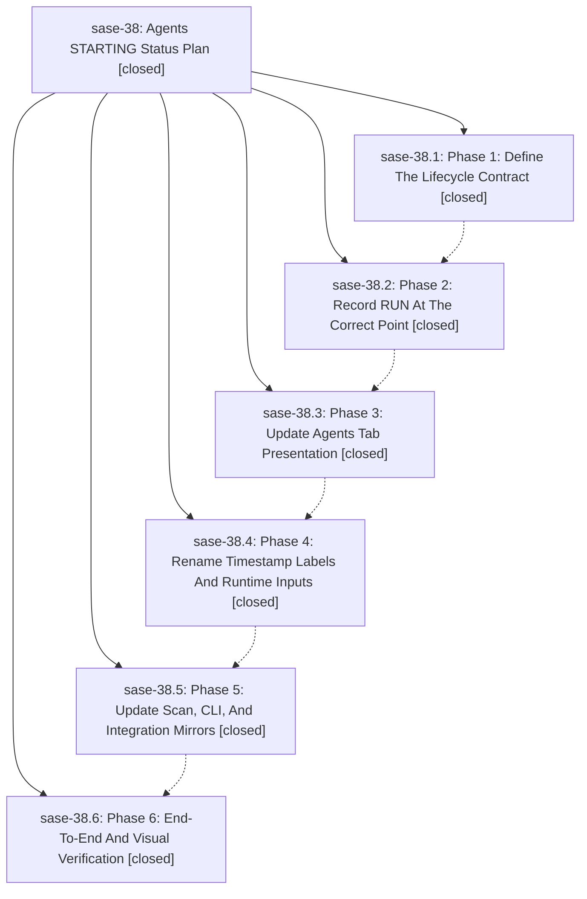

# Bead: sase-38 — Agents STARTING Status Plan

[Bead Pages](../README.md) / sase-38

**Status:** ✓ closed · **Resolution:** (unrecorded) · **Type:** plan · **Tier:** epic
**Owner:** `bryanbugyi34@gmail.com`
**Created:** 2026-05-12 21:19:25 UTC · **Closed:** 2026-05-12 22:54:55 UTC
**Plan:** [202605/agents\_starting\_status.md](https://github.com/sase-org/sase--plans/blob/main/202605/agents_starting_status.md)

## Notes

COMMIT: 190687579

## Phases

| Bead | Title | Status | Size | Agents | Commits |
|---|---|---|---|---:|---:|
| [sase-38.1](sase-38.1.md) | Phase 1: Define The Lifecycle Contract | ✓ closed | small | 0 | 0 |
| [sase-38.2](sase-38.2.md) | Phase 2: Record RUN At The Correct Point | ✓ closed | small | 0 | 1 |
| [sase-38.3](sase-38.3.md) | Phase 3: Update Agents Tab Presentation | ✓ closed | small | 0 | 1 |
| [sase-38.4](sase-38.4.md) | Phase 4: Rename Timestamp Labels And Runtime Inputs | ✓ closed | small | 0 | 1 |
| [sase-38.5](sase-38.5.md) | Phase 5: Update Scan, CLI, And Integration Mirrors | ✓ closed | small | 0 | 1 |
| [sase-38.6](sase-38.6.md) | Phase 6: End-To-End And Visual Verification | ✓ closed | small | 0 | 0 |

## Lineage

## Commits

| Commit | Subject | Bead | Committed (UTC) |
|---|---|---|---|
| [`85305d5`](https://github.com/sase-org/sase/commit/85305d599a29f47e0134b408c8ef3ef7fc5ada1c) | fix: record agent run start at execution boundary (sase-38.2) | [sase-38.2](sase-38.2.md) | 2026-05-12 21:47:10 |
| [`3e5cf34`](https://github.com/sase-org/sase/commit/3e5cf34c94491a8fbecd42a7e14270d570e7c899) | feat: show starting agents in the Agents tab (sase-38.3) | [sase-38.3](sase-38.3.md) | 2026-05-12 22:11:47 |
| [`4757560`](https://github.com/sase-org/sase/commit/47575609b25e60d2c5bed8eb6bf098de2450d201) | feat: Use RUN timestamps for agent runtimes (sase-38.4) | [sase-38.4](sase-38.4.md) | 2026-05-12 22:30:24 |
| [`c76f6c6`](https://github.com/sase-org/sase/commit/c76f6c660ff67e3c6ed20efa0a7019bc756a8ba2) | fix: preserve starting agents in scan mirrors (sase-38.5) | [sase-38.5](sase-38.5.md) | 2026-05-12 22:42:13 |
| [`138742d`](https://github.com/sase-org/sase/commit/138742da19cf90232b25208b5afdd7c4401e8727) | chore: Add SDD prompt and plan for finish\_sase\_38 (sase-38) | [sase-38](README.md) | 2026-05-12 22:55:12 |
