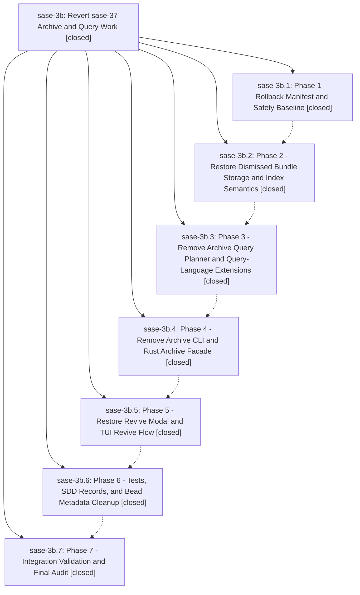

# Bead: sase-3b — Revert sase-37 Archive and Query Work

[Bead Pages](../README.md) / sase-3b

**Status:** ✓ closed · **Resolution:** (unrecorded) · **Type:** plan · **Tier:** epic
**Owner:** `bryanbugyi34@gmail.com`
**Created:** 2026-05-13 01:48:03 UTC · **Closed:** 2026-05-13 03:35:56 UTC
**Plan:** [202605/revert\_sase\_37\_archive.md](https://github.com/sase-org/sase--plans/blob/main/202605/revert_sase_37_archive.md)

## Notes

COMMIT: b353446a0

## Phases

| Bead | Title | Status | Size | Agents | Commits |
|---|---|---|---|---:|---:|
| [sase-3b.1](sase-3b.1.md) | Phase 1 - Rollback Manifest and Safety Baseline | ✓ closed | small | 0 | 1 |
| [sase-3b.2](sase-3b.2.md) | Phase 2 - Restore Dismissed Bundle Storage and Index Semantics | ✓ closed | small | 0 | 1 |
| [sase-3b.3](sase-3b.3.md) | Phase 3 - Remove Archive Query Planner and Query-Language Extensions | ✓ closed | small | 0 | 1 |
| [sase-3b.4](sase-3b.4.md) | Phase 4 - Remove Archive CLI and Rust Archive Facade | ✓ closed | small | 0 | 1 |
| [sase-3b.5](sase-3b.5.md) | Phase 5 - Restore Revive Modal and TUI Revive Flow | ✓ closed | small | 0 | 1 |
| [sase-3b.6](sase-3b.6.md) | Phase 6 - Tests, SDD Records, and Bead Metadata Cleanup | ✓ closed | small | 0 | 1 |
| [sase-3b.7](sase-3b.7.md) | Phase 7 - Integration Validation and Final Audit | ✓ closed | small | 0 | 0 |

## Lineage

## Commits

| Commit | Subject | Bead | Committed (UTC) |
|---|---|---|---|
| [`250a77b`](https://github.com/sase-org/sase/commit/250a77bf06e128f1345f2709b7085846f5f7fb8a) | chore: add sase-37 rollback manifest (sase-3b.1) | [sase-3b.1](sase-3b.1.md) | 2026-05-13 02:02:08 |
| [`f7b7220`](https://github.com/sase-org/sase/commit/f7b7220dccd86ba0ecdff58410f76fb76baa623b) | feat: restore dismissed bundle storage semantics (sase-3b.2) | [sase-3b.2](sase-3b.2.md) | 2026-05-13 02:25:12 |
| [`6dfb0cf`](https://github.com/sase-org/sase/commit/6dfb0cf56eba39bea823942352933a539ac7b141) | feat: remove archive query planner extensions (sase-3b.3) | [sase-3b.3](sase-3b.3.md) | 2026-05-13 02:35:41 |
| [`803e51a`](https://github.com/sase-org/sase/commit/803e51ae6be05b5ac29c3bb35b921209f347958d) | feat: remove archive query CLI surface (sase-3b.4) | [sase-3b.4](sase-3b.4.md) | 2026-05-13 02:44:36 |
| [`e8f7fd9`](https://github.com/sase-org/sase/commit/e8f7fd90ccdbde3b6e5a46260a1e75deb3c1b5e9) | fix: restore legacy TUI revive flow (sase-3b.5) | [sase-3b.5](sase-3b.5.md) | 2026-05-13 03:06:33 |
| [`a1616b1`](https://github.com/sase-org/sase/commit/a1616b1b2d292ece20ae1a5b89abeabc54e0b2b8) | feat: remove archive query cleanup leftovers (sase-3b.6) | [sase-3b.6](sase-3b.6.md) | 2026-05-13 03:18:47 |
