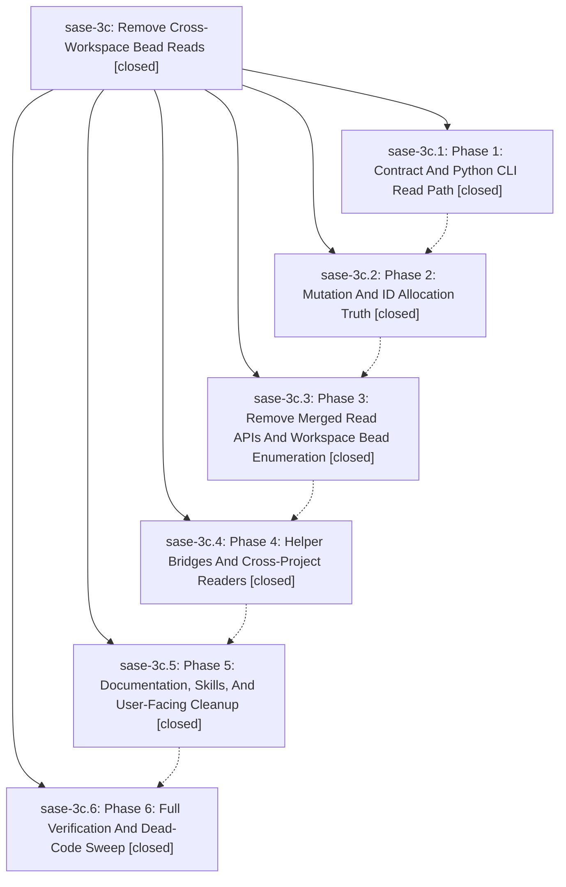

# Bead: sase-3c — Remove Cross-Workspace Bead Reads

[Bead Pages](../README.md) / sase-3c

**Status:** ✓ closed · **Resolution:** (unrecorded) · **Type:** plan · **Tier:** epic
**Owner:** `bryanbugyi34@gmail.com`
**Created:** 2026-05-13 02:56:40 UTC · **Closed:** 2026-05-13 04:35:56 UTC
**Plan:** [202605/remove\_cross\_workspace\_bead\_reads.md](https://github.com/sase-org/sase--plans/blob/main/202605/remove_cross_workspace_bead_reads.md)

## Notes

COMMIT: 0d8e84055

## Phases

| Bead | Title | Status | Size | Agents | Commits |
|---|---|---|---|---:|---:|
| [sase-3c.1](sase-3c.1.md) | Phase 1: Contract And Python CLI Read Path | ✓ closed | small | 0 | 1 |
| [sase-3c.2](sase-3c.2.md) | Phase 2: Mutation And ID Allocation Truth | ✓ closed | small | 0 | 1 |
| [sase-3c.3](sase-3c.3.md) | Phase 3: Remove Merged Read APIs And Workspace Bead Enumeration | ✓ closed | small | 0 | 1 |
| [sase-3c.4](sase-3c.4.md) | Phase 4: Helper Bridges And Cross-Project Readers | ✓ closed | small | 0 | 1 |
| [sase-3c.5](sase-3c.5.md) | Phase 5: Documentation, Skills, And User-Facing Cleanup | ✓ closed | small | 0 | 1 |
| [sase-3c.6](sase-3c.6.md) | Phase 6: Full Verification And Dead-Code Sweep | ✓ closed | small | 0 | 1 |

## Lineage

## Commits

| Commit | Subject | Bead | Committed (UTC) |
|---|---|---|---|
| [`e6375ee`](https://github.com/sase-org/sase/commit/e6375ee1a020c7c9b8255e170d9b4e16a7bc4876) | fix: scope bead CLI reads to the current store (sase-3c.1) | [sase-3c.1](sase-3c.1.md) | 2026-05-13 03:12:01 |
| [`37b00a5`](https://github.com/sase-org/sase/commit/37b00a5d1098adf4cbac07b7690dbff2b49d6b22) | feat: allocate bead IDs from local store (sase-3c.2) | [sase-3c.2](sase-3c.2.md) | 2026-05-13 03:26:19 |
| [`b21bbbd`](https://github.com/sase-org/sase/commit/b21bbbd752e718af6c0ae000b5c704e98586fad8) | feat: remove merged bead read facade (sase-3c.3) | [sase-3c.3](sase-3c.3.md) | 2026-05-13 03:52:35 |
| [`d0cd565`](https://github.com/sase-org/sase/commit/d0cd565d348d61d9c3b7c172d4bf324acc31c403) | ref: use canonical bead stores in mobile helpers (sase-3c.4) | [sase-3c.4](sase-3c.4.md) | 2026-05-13 04:04:15 |
| [`46dc491`](https://github.com/sase-org/sase/commit/46dc4913815c6892901e7ece04bbe205a4412cff) | chore: update bead source-of-truth guidance (sase-3c.5) | [sase-3c.5](sase-3c.5.md) | 2026-05-13 04:17:26 |
| [`dead987`](https://github.com/sase-org/sase/commit/dead9872fca52c0dd32b8cd981b3dcb714c149a4) | feat: remove legacy bead fast-path fallback (sase-3c.6) | [sase-3c.6](sase-3c.6.md) | 2026-05-13 04:26:10 |
| [`af428b8`](https://github.com/sase-org/sase/commit/af428b814d58410b8371308d38540f971d750607) | chore: Add SDD prompt and plan for sase\_3c\_completion (sase-3c) | [sase-3c](README.md) | 2026-05-13 04:29:41 |
| [`13172da`](https://github.com/sase-org/sase/commit/13172dae937d40c048a5433c170e209ae83e1854) | fix: resolve beads from nested checkout directories (sase-3c) | [sase-3c](README.md) | 2026-05-13 04:36:18 |
