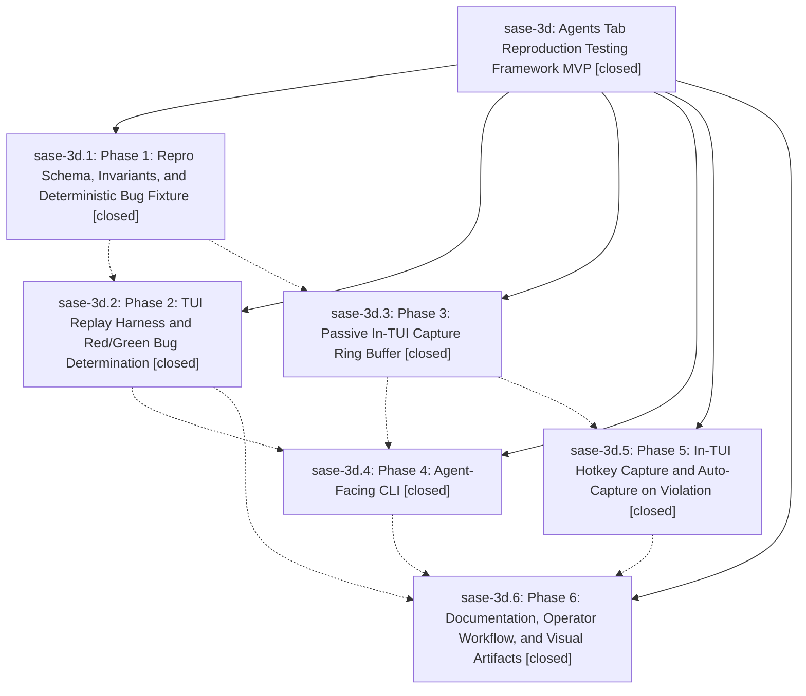

# Bead: sase-3d — Agents Tab Reproduction Testing Framework MVP

[Bead Pages](../README.md) / sase-3d

**Status:** ✓ closed · **Resolution:** (unrecorded) · **Type:** plan · **Tier:** epic
**Owner:** `bryanbugyi34@gmail.com`
**Created:** 2026-05-13 15:41:43 UTC · **Closed:** 2026-05-13 16:56:04 UTC
**Plan:** [202605/agents\_tab\_repro\_mvp.md](https://github.com/sase-org/sase--plans/blob/main/202605/agents_tab_repro_mvp.md)

## Notes

COMMIT: ee9aa4da7

## Phases

| Bead | Title | Status | Size | Agents | Commits |
|---|---|---|---|---:|---:|
| [sase-3d.1](sase-3d.1.md) | Phase 1: Repro Schema, Invariants, and Deterministic Bug Fixture | ✓ closed | small | 0 | 1 |
| [sase-3d.2](sase-3d.2.md) | Phase 2: TUI Replay Harness and Red/Green Bug Determination | ✓ closed | small | 0 | 1 |
| [sase-3d.3](sase-3d.3.md) | Phase 3: Passive In-TUI Capture Ring Buffer | ✓ closed | small | 0 | 1 |
| [sase-3d.4](sase-3d.4.md) | Phase 4: Agent-Facing CLI | ✓ closed | small | 0 | 1 |
| [sase-3d.5](sase-3d.5.md) | Phase 5: In-TUI Hotkey Capture and Auto-Capture on Violation | ✓ closed | small | 0 | 1 |
| [sase-3d.6](sase-3d.6.md) | Phase 6: Documentation, Operator Workflow, and Visual Artifacts | ✓ closed | small | 0 | 1 |

## Lineage

## Commits

| Commit | Subject | Bead | Committed (UTC) |
|---|---|---|---|
| [`3b53431`](https://github.com/sase-org/sase/commit/3b534311d1211d27f440647f81ee1fcb73b3dff3) | feat: add agents tab repro invariants (sase-3d.1) | [sase-3d.1](sase-3d.1.md) | 2026-05-13 15:59:06 |
| [`373f5d6`](https://github.com/sase-org/sase/commit/373f5d6ada45b30a1abf85c481abf322609ddce9) | feat: add passive agents tab repro capture (sase-3d.3) | [sase-3d.3](sase-3d.3.md) | 2026-05-13 16:11:47 |
| [`bb10656`](https://github.com/sase-org/sase/commit/bb106564d239db5c53074e79ea295c5388681d27) | feat: add Agents-tab replay harness (sase-3d.2) | [sase-3d.2](sase-3d.2.md) | 2026-05-13 16:18:43 |
| [`219a471`](https://github.com/sase-org/sase/commit/219a471a9232b58df0d8e79d22fb3705b464ff4c) | feat: add in-TUI Agents repro capture (sase-3d.5) | [sase-3d.5](sase-3d.5.md) | 2026-05-13 16:24:01 |
| [`969b0bd`](https://github.com/sase-org/sase/commit/969b0bd54a745ae9f2f995047fe2d9d80572e598) | feat: add Agents-tab repro CLI (sase-3d.4) | [sase-3d.4](sase-3d.4.md) | 2026-05-13 16:35:44 |
| [`9360359`](https://github.com/sase-org/sase/commit/93603590475e485f0a8cb33db5cd1bfc73399c51) | chore: document Agents-tab repro workflow (sase-3d.6) | [sase-3d.6](sase-3d.6.md) | 2026-05-13 16:45:27 |
| [`ca3a1d1`](https://github.com/sase-org/sase/commit/ca3a1d1f900929546e2821db3a9d5bae4ec9a974) | chore: close agents tab repro epic (sase-3d) | [sase-3d](README.md) | 2026-05-13 16:56:21 |
