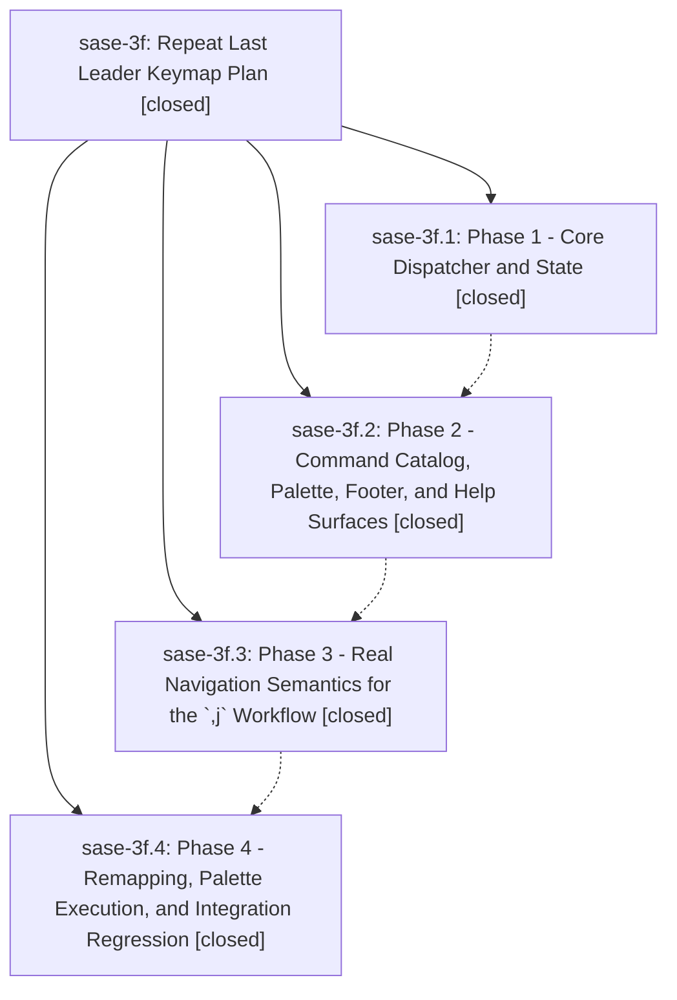

# Bead: sase-3f — Repeat Last Leader Keymap Plan

[Bead Pages](../README.md) / sase-3f

**Status:** ✓ closed · **Resolution:** (unrecorded) · **Type:** plan · **Tier:** epic
**Owner:** `bryanbugyi34@gmail.com`
**Created:** 2026-05-13 21:56:19 UTC · **Closed:** 2026-05-13 22:46:19 UTC
**Plan:** [202605/repeat\_last\_leader\_keymap.md](https://github.com/sase-org/sase--plans/blob/main/202605/repeat_last_leader_keymap.md)

## Notes

COMMIT: 37dfd8ae3

## Phases

| Bead | Title | Status | Size | Agents | Commits |
|---|---|---|---|---:|---:|
| [sase-3f.1](sase-3f.1.md) | Phase 1 - Core Dispatcher and State | ✓ closed | small | 0 | 1 |
| [sase-3f.2](sase-3f.2.md) | Phase 2 - Command Catalog, Palette, Footer, and Help Surfaces | ✓ closed | small | 0 | 1 |
| [sase-3f.3](sase-3f.3.md) | Phase 3 - Real Navigation Semantics for the \`,j\` Workflow | ✓ closed | small | 0 | 1 |
| [sase-3f.4](sase-3f.4.md) | Phase 4 - Remapping, Palette Execution, and Integration Regression | ✓ closed | small | 0 | 1 |

## Lineage

## Commits

| Commit | Subject | Bead | Committed (UTC) |
|---|---|---|---|
| [`293a1b3`](https://github.com/sase-org/sase/commit/293a1b3f57260d33f654d17a32b272988615986f) | feat: repeat last leader command (sase-3f.1) | [sase-3f.1](sase-3f.1.md) | 2026-05-13 22:10:26 |
| [`0196076`](https://github.com/sase-org/sase/commit/0196076946eefb7e6d3e77843eb7618bf74fb865) | feat: surface repeat-last leader command in TUI help (sase-3f.2) | [sase-3f.2](sase-3f.2.md) | 2026-05-13 22:18:16 |
| [`75b9627`](https://github.com/sase-org/sase/commit/75b9627ee4ab05a76b32d5df923d70b9b0cf6280) | chore: add unread leader repeat regression (sase-3f.3) | [sase-3f.3](sase-3f.3.md) | 2026-05-13 22:26:28 |
| [`6369822`](https://github.com/sase-org/sase/commit/6369822b9bc32fc62560a7fa14053873398c6720) | chore: add repeat last leader regression coverage (sase-3f.4) | [sase-3f.4](sase-3f.4.md) | 2026-05-13 22:36:18 |
