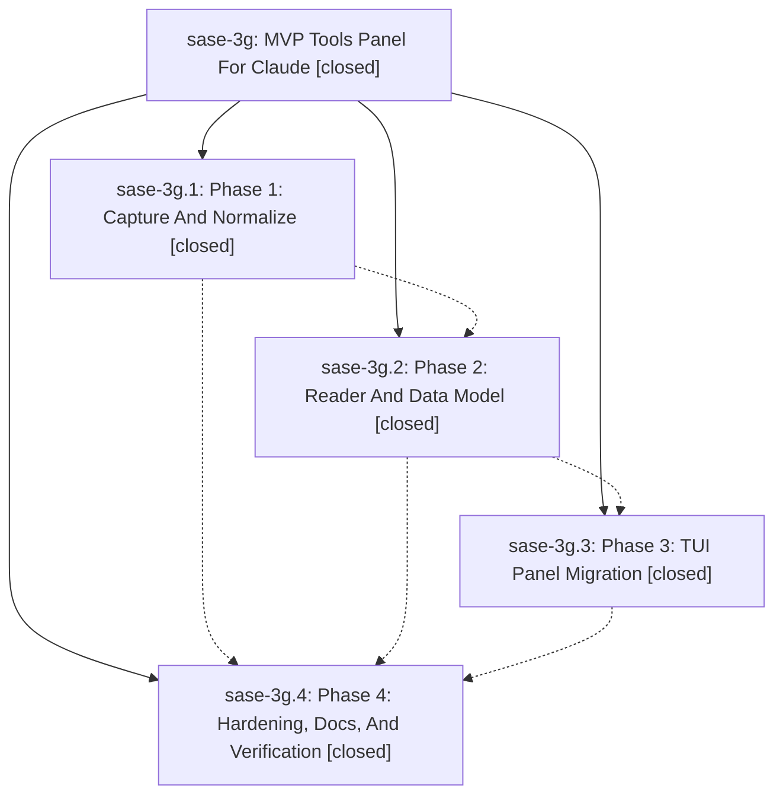

# Bead: sase-3g — MVP Tools Panel For Claude

[Bead Pages](../README.md) / sase-3g

**Status:** ✓ closed · **Resolution:** (unrecorded) · **Type:** plan · **Tier:** epic
**Owner:** `bryanbugyi34@gmail.com`
**Created:** 2026-05-14 17:19:48 UTC · **Closed:** 2026-05-14 18:17:15 UTC
**Plan:** [202605/claude\_tools\_panel.md](https://github.com/sase-org/sase--plans/blob/main/202605/claude_tools_panel.md)

## Notes

COMMIT: 67fe7ad23

## Phases

| Bead | Title | Status | Size | Agents | Commits |
|---|---|---|---|---:|---:|
| [sase-3g.1](sase-3g.1.md) | Phase 1: Capture And Normalize | ✓ closed | small | 0 | 1 |
| [sase-3g.2](sase-3g.2.md) | Phase 2: Reader And Data Model | ✓ closed | small | 0 | 1 |
| [sase-3g.3](sase-3g.3.md) | Phase 3: TUI Panel Migration | ✓ closed | small | 0 | 1 |
| [sase-3g.4](sase-3g.4.md) | Phase 4: Hardening, Docs, And Verification | ✓ closed | small | 0 | 1 |

## Lineage

## Commits

| Commit | Subject | Bead | Committed (UTC) |
|---|---|---|---|
| [`55473ce`](https://github.com/sase-org/sase/commit/55473ceb414f199df23cb893eda345b2647fc6a2) | feat: capture Claude tool call artifacts (sase-3g.1) | [sase-3g.1](sase-3g.1.md) | 2026-05-14 17:38:10 |
| [`cadb4c8`](https://github.com/sase-org/sase/commit/cadb4c89848746dab01f93b3f542d55db9d1097b) | feat: add TUI tool-call reader (sase-3g.2) | [sase-3g.2](sase-3g.2.md) | 2026-05-14 17:48:58 |
| [`edf61b5`](https://github.com/sase-org/sase/commit/edf61b576e27b9c0fc45c5083b2f43b388bf78b1) | feat: migrate agent detail view to tools panel (sase-3g.3) | [sase-3g.3](sase-3g.3.md) | 2026-05-14 18:03:24 |
| [`3f3e107`](https://github.com/sase-org/sase/commit/3f3e107f0b33cf0a92301df7b7ab9dab54b3ccf1) | chore: harden Claude tools panel docs (sase-3g.4) | [sase-3g.4](sase-3g.4.md) | 2026-05-14 18:11:03 |
