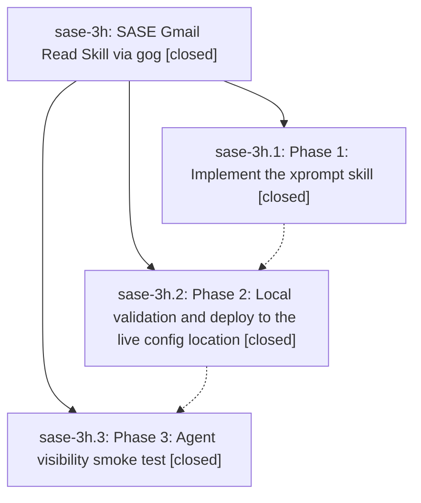

# Bead: sase-3h — SASE Gmail Read Skill via gog

[Bead Pages](../README.md) / sase-3h

**Status:** ✓ closed · **Resolution:** (unrecorded) · **Type:** plan · **Tier:** epic
**Owner:** `bryanbugyi34@gmail.com`
**Created:** 2026-05-14 18:21:38 UTC · **Closed:** 2026-05-14 18:51:07 UTC
**Plan:** [202605/gmail\_gog\_skill\_1.md](https://github.com/sase-org/sase--plans/blob/main/202605/gmail_gog_skill_1.md)

## Notes

COMMIT: 663697c94

## Phases

| Bead | Title | Status | Size | Agents | Commits |
|---|---|---|---|---:|---:|
| [sase-3h.1](sase-3h.1.md) | Phase 1: Implement the xprompt skill | ✓ closed | small | 0 | 0 |
| [sase-3h.2](sase-3h.2.md) | Phase 2: Local validation and deploy to the live config location | ✓ closed | small | 0 | 0 |
| [sase-3h.3](sase-3h.3.md) | Phase 3: Agent visibility smoke test | ✓ closed | small | 0 | 0 |

## Lineage

## Commits

| Commit | Subject | Bead | Committed (UTC) |
|---|---|---|---|
| [`7232fec`](https://github.com/sase-org/sase/commit/7232feca894f3cc619b6eff899582ea894c90d0c) | chore: close Gmail read skill epic (sase-3h) | [sase-3h](README.md) | 2026-05-14 18:51:31 |
