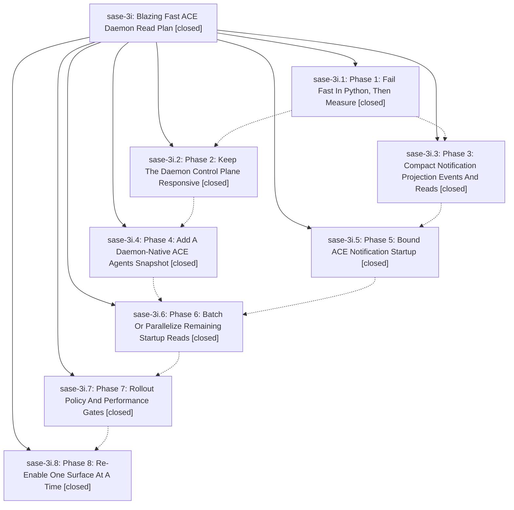

# Bead: sase-3i — Blazing Fast ACE Daemon Read Plan

[Bead Pages](../README.md) / sase-3i

**Status:** ✓ closed · **Resolution:** (unrecorded) · **Type:** plan · **Tier:** epic
**Owner:** `bryanbugyi34@gmail.com`
**Created:** 2026-05-14 20:00:23 UTC · **Closed:** 2026-05-15 17:52:32 UTC
**Plan:** [202605/blazing\_fast\_ace\_daemon.md](https://github.com/sase-org/sase--plans/blob/main/202605/blazing_fast_ace_daemon.md)

## Phases

| Bead | Title | Status | Size | Agents | Commits |
|---|---|---|---|---:|---:|
| [sase-3i.1](sase-3i.1.md) | Phase 1: Fail Fast In Python, Then Measure | ✓ closed | small | 0 | 1 |
| [sase-3i.2](sase-3i.2.md) | Phase 2: Keep The Daemon Control Plane Responsive | ✓ closed | small | 0 | 2 |
| [sase-3i.3](sase-3i.3.md) | Phase 3: Compact Notification Projection Events And Reads | ✓ closed | small | 0 | 2 |
| [sase-3i.4](sase-3i.4.md) | Phase 4: Add A Daemon-Native ACE Agents Snapshot | ✓ closed | small | 0 | 2 |
| [sase-3i.5](sase-3i.5.md) | Phase 5: Bound ACE Notification Startup | ✓ closed | small | 0 | 1 |
| [sase-3i.6](sase-3i.6.md) | Phase 6: Batch Or Parallelize Remaining Startup Reads | ✓ closed | small | 0 | 1 |
| [sase-3i.7](sase-3i.7.md) | Phase 7: Rollout Policy And Performance Gates | ✓ closed | small | 0 | 1 |
| [sase-3i.8](sase-3i.8.md) | Phase 8: Re-Enable One Surface At A Time | ✓ closed | small | 0 | 1 |

## Lineage

## Commits

| Commit | Subject | Bead | Committed (UTC) |
|---|---|---|---|
| [`fa4e801`](https://github.com/sase-org/sase/commit/fa4e801915c79e3b8f62e563a23b9247b6bf9118) | feat: add daemon read fast-fail session (sase-3i.1) | [sase-3i.1](sase-3i.1.md) | 2026-05-14 20:19:50 |
| [`sase-core@3cdb141`](https://github.com/sase-org/sase-core/commit/3cdb14177b55821970837771275d03cdf87dffdd) | chore: satisfy current clippy lints (sase-3i.2) | [sase-3i.2](sase-3i.2.md) | 2026-05-14 20:29:57 |
| [`sase-core@5731dfe`](https://github.com/sase-org/sase-core/commit/5731dfe1b0c6c9d36e220ae966ce00becb9401a4) | chore: allow fallback response argument list (sase-3i.2) | [sase-3i.2](sase-3i.2.md) | 2026-05-14 20:32:56 |
| [`sase-core@eab0dcd`](https://github.com/sase-org/sase-core/commit/eab0dcd35055dedd2c6d06bee7e174bee867d3dd) | feat: compact notification projection reads (sase-3i.3) | [sase-3i.3](sase-3i.3.md) | 2026-05-14 20:36:44 |
| [`d1de9d8`](https://github.com/sase-org/sase/commit/d1de9d8ab7fbea6f0c366cc2670d8ab4ec080f3c) | chore: close notification projection phase bead (sase-3i.3) | [sase-3i.3](sase-3i.3.md) | 2026-05-14 20:38:59 |
| [`sase-core@90f65b8`](https://github.com/sase-org/sase-core/commit/90f65b8fa758520fa8ffd7f202316471a868bf81) | feat: add ACE agent snapshot daemon read (sase-3i.4) | [sase-3i.4](sase-3i.4.md) | 2026-05-14 20:51:30 |
| [`6c30d58`](https://github.com/sase-org/sase/commit/6c30d584c93111ebbbc64087dfca55767a2dbaf9) | feat: route ACE agents through daemon snapshot (sase-3i.4) | [sase-3i.4](sase-3i.4.md) | 2026-05-14 20:53:46 |
| [`2f27d18`](https://github.com/sase-org/sase/commit/2f27d18f4f1b092b02c03cecc59e3e708cac969d) | fix: bound ACE notification startup reads (sase-3i.5) | [sase-3i.5](sase-3i.5.md) | 2026-05-14 20:59:23 |
| [`eb1836e`](https://github.com/sase-org/sase/commit/eb1836ea330e5e2c5e41610537cca416d0d507c7) | feat: reuse ACE daemon client for startup reads (sase-3i.6) | [sase-3i.6](sase-3i.6.md) | 2026-05-14 21:08:36 |
| [`3898904`](https://github.com/sase-org/sase/commit/3898904d92a2e5e8b867cff271ae23068e0b6392) | feat: gate ACE daemon read rollout with perf evidence (sase-3i.7) | [sase-3i.7](sase-3i.7.md) | 2026-05-14 21:20:26 |
| [`d1023dc`](https://github.com/sase-org/sase/commit/d1023dc4219ce1c26a702b924842d6a2e8032677) | feat: enable staged ACE notification daemon reads (sase-3i.8) | [sase-3i.8](sase-3i.8.md) | 2026-05-14 21:43:43 |
| [`004fa58`](https://github.com/sase-org/sase/commit/004fa5883cdd1a1b0e51e5aa98e375b6db0a6c20) | fix: fall back from empty host VCS detection (sase-3i) | [sase-3i](README.md) | 2026-05-14 22:10:57 |
