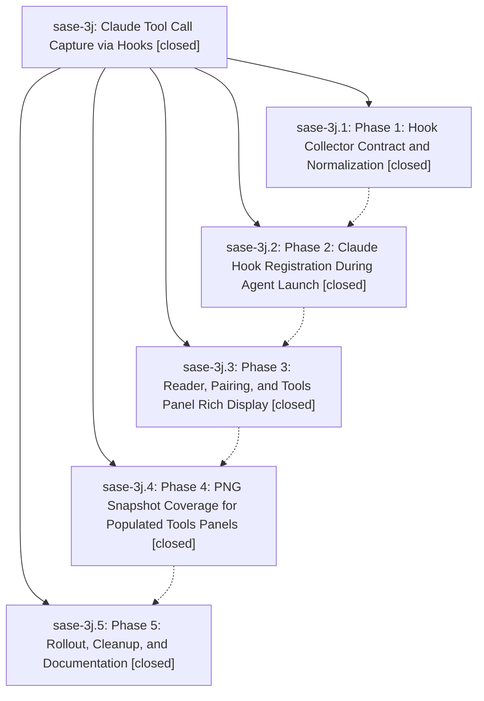

# Bead: sase-3j — Claude Tool Call Capture via Hooks

[Bead Pages](../README.md) / sase-3j

**Status:** ✓ closed · **Resolution:** (unrecorded) · **Type:** plan · **Tier:** epic
**Owner:** `bryanbugyi34@gmail.com`
**Created:** 2026-05-15 01:02:41 UTC · **Closed:** 2026-05-15 02:52:33 UTC
**Plan:** [202605/claude\_tool\_hooks\_3.md](https://github.com/sase-org/sase--plans/blob/main/202605/claude_tool_hooks_3.md)

## Phases

| Bead | Title | Status | Size | Agents | Commits |
|---|---|---|---|---:|---:|
| [sase-3j.1](sase-3j.1.md) | Phase 1: Hook Collector Contract and Normalization | ✓ closed | small | 0 | 1 |
| [sase-3j.2](sase-3j.2.md) | Phase 2: Claude Hook Registration During Agent Launch | ✓ closed | small | 0 | 1 |
| [sase-3j.3](sase-3j.3.md) | Phase 3: Reader, Pairing, and Tools Panel Rich Display | ✓ closed | small | 0 | 1 |
| [sase-3j.4](sase-3j.4.md) | Phase 4: PNG Snapshot Coverage for Populated Tools Panels | ✓ closed | small | 0 | 1 |
| [sase-3j.5](sase-3j.5.md) | Phase 5: Rollout, Cleanup, and Documentation | ✓ closed | small | 0 | 0 |

## Lineage

## Commits

| Commit | Subject | Bead | Committed (UTC) |
|---|---|---|---|
| [`8c79e37`](https://github.com/sase-org/sase/commit/8c79e37d06941aa7f2505cb1eb0d8a441d2eaf0c) | feat: add SASE Claude tool-call hook collector (schema v3) (sase-3j.1) | [sase-3j.1](sase-3j.1.md) | 2026-05-15 01:34:39 |
| [`f50ab2e`](https://github.com/sase-org/sase/commit/f50ab2e42fde24f0dcb213d1fadb3e85e0baf292) | feat: register Claude tool-call hooks at agent launch (sase-3j.2) | [sase-3j.2](sase-3j.2.md) | 2026-05-15 01:46:07 |
| [`fbc5dee`](https://github.com/sase-org/sase/commit/fbc5deedc091d7a4a8ca8e312414abf2c2bac723) | feat: prefer Claude hook tool-call records over stream rows (sase-3j.3) | [sase-3j.3](sase-3j.3.md) | 2026-05-15 01:57:31 |
| [`d694b58`](https://github.com/sase-org/sase/commit/d694b5880865e6b1640550ecaaefec8a388e7f6c) | feat: PNG snapshot coverage for populated Tools panel (sase-3j.4) | [sase-3j.4](sase-3j.4.md) | 2026-05-15 02:15:39 |
