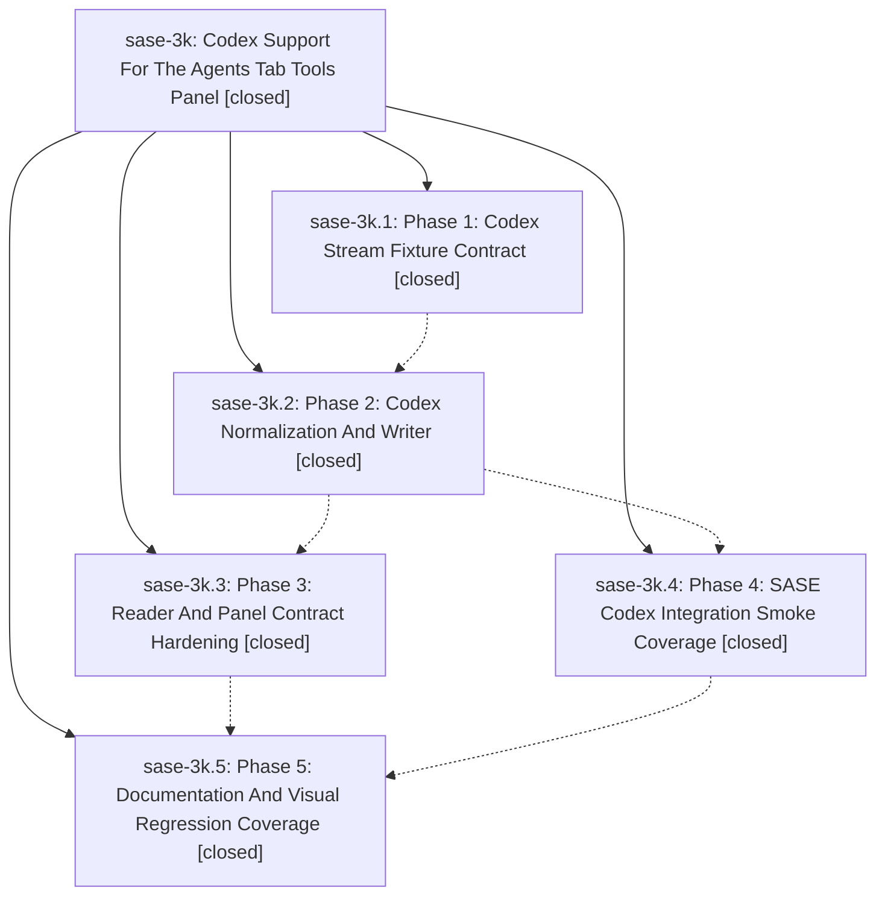

# Bead: sase-3k — Codex Support For The Agents Tab Tools Panel

[Bead Pages](../README.md) / sase-3k

**Status:** ✓ closed · **Resolution:** (unrecorded) · **Type:** plan · **Tier:** epic
**Owner:** `bryanbugyi34@gmail.com`
**Created:** 2026-05-15 03:04:19 UTC · **Closed:** 2026-05-15 04:03:55 UTC
**Plan:** [202605/codex\_tools\_panel\_2.md](https://github.com/sase-org/sase--plans/blob/main/202605/codex_tools_panel_2.md)

## Notes

COMMIT: 294d46916

## Phases

| Bead | Title | Status | Size | Agents | Commits |
|---|---|---|---|---:|---:|
| [sase-3k.1](sase-3k.1.md) | Phase 1: Codex Stream Fixture Contract | ✓ closed | small | 0 | 1 |
| [sase-3k.2](sase-3k.2.md) | Phase 2: Codex Normalization And Writer | ✓ closed | small | 0 | 1 |
| [sase-3k.3](sase-3k.3.md) | Phase 3: Reader And Panel Contract Hardening | ✓ closed | small | 0 | 1 |
| [sase-3k.4](sase-3k.4.md) | Phase 4: SASE Codex Integration Smoke Coverage | ✓ closed | small | 0 | 1 |
| [sase-3k.5](sase-3k.5.md) | Phase 5: Documentation And Visual Regression Coverage | ✓ closed | small | 0 | 1 |

## Lineage

## Commits

| Commit | Subject | Bead | Committed (UTC) |
|---|---|---|---|
| [`722e218`](https://github.com/sase-org/sase/commit/722e21864326b3255e8561127643e708c59c47fc) | chore: add CLI stream fixture contract (sase-3k.1) | [sase-3k.1](sase-3k.1.md) | 2026-05-15 03:23:16 |
| [`a8812a8`](https://github.com/sase-org/sase/commit/a8812a8e1bf4937f70d1e0b4874a5b74b8cb7d2b) | feat: normalize CLI tool stream rows (sase-3k.2) | [sase-3k.2](sase-3k.2.md) | 2026-05-15 03:36:25 |
| [`63aa153`](https://github.com/sase-org/sase/commit/63aa153985eccdd7710124b20f3970296d15cd4d) | chore: add codex integration smoke coverage (sase-3k.4) | [sase-3k.4](sase-3k.4.md) | 2026-05-15 03:44:15 |
| [`efc9cb0`](https://github.com/sase-org/sase/commit/efc9cb009e60bc98c2e301ed4befe130f24f75b9) | feat: harden tool reader pairing and panel cache (sase-3k.3) | [sase-3k.3](sase-3k.3.md) | 2026-05-15 03:48:26 |
| [`cc76a99`](https://github.com/sase-org/sase/commit/cc76a9909949d4f7fbbdd2dce324d1d651a96507) | chore: document tools panel stream coverage (sase-3k.5) | [sase-3k.5](sase-3k.5.md) | 2026-05-15 03:58:16 |
