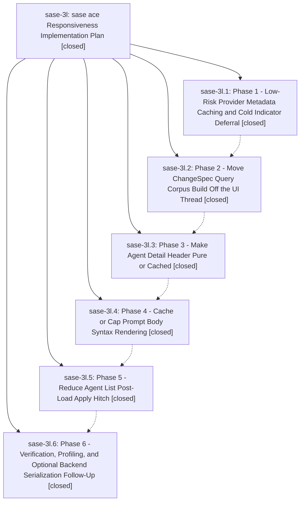

# Bead: sase-3l — sase ace Responsiveness Implementation Plan

[Bead Pages](../README.md) / sase-3l

**Status:** ✓ closed · **Resolution:** (unrecorded) · **Type:** plan · **Tier:** epic
**Owner:** `bryanbugyi34@gmail.com`
**Created:** 2026-05-15 05:07:49 UTC · **Closed:** 2026-05-15 13:36:19 UTC
**Plan:** [202605/ace\_responsiveness.md](https://github.com/sase-org/sase--plans/blob/main/202605/ace_responsiveness.md)

## Notes

COMMIT: c447241c7

## Phases

| Bead | Title | Status | Size | Agents | Commits |
|---|---|---|---|---:|---:|
| [sase-3l.1](sase-3l.1.md) | Phase 1 - Low-Risk Provider Metadata Caching and Cold Indicator Deferral | ✓ closed | small | 0 | 0 |
| [sase-3l.2](sase-3l.2.md) | Phase 2 - Move ChangeSpec Query Corpus Build Off the UI Thread | ✓ closed | small | 0 | 1 |
| [sase-3l.3](sase-3l.3.md) | Phase 3 - Make Agent Detail Header Pure or Cached | ✓ closed | small | 0 | 1 |
| [sase-3l.4](sase-3l.4.md) | Phase 4 - Cache or Cap Prompt Body Syntax Rendering | ✓ closed | small | 0 | 1 |
| [sase-3l.5](sase-3l.5.md) | Phase 5 - Reduce Agent List Post-Load Apply Hitch | ✓ closed | small | 0 | 1 |
| [sase-3l.6](sase-3l.6.md) | Phase 6 - Verification, Profiling, and Optional Backend Serialization Follow-Up | ✓ closed | small | 0 | 1 |

## Lineage

## Commits

| Commit | Subject | Bead | Committed (UTC) |
|---|---|---|---|
| [`e08cca7`](https://github.com/sase-org/sase/commit/e08cca704ba67157e64b9157dc1adc863e410da6) | fix: prepare ChangeSpec query corpus off UI thread (sase-3l.2) | [sase-3l.2](sase-3l.2.md) | 2026-05-15 12:50:50 |
| [`c2f557c`](https://github.com/sase-org/sase/commit/c2f557cada54d09d91bfda7e05f284981d2c36e9) | fix: keep agent detail header hot path pure (sase-3l.3) | [sase-3l.3](sase-3l.3.md) | 2026-05-15 13:04:42 |
| [`22aa81e`](https://github.com/sase-org/sase/commit/22aa81eef93e92ab8eb61bd43a0dacc17cb5e170) | fix: cap prompt markdown syntax rendering (sase-3l.4) | [sase-3l.4](sase-3l.4.md) | 2026-05-15 13:16:15 |
| [`8cd9ec6`](https://github.com/sase-org/sase/commit/8cd9ec6a8e58fca2e0c659a10de556dfad22d02a) | fix: batch agent list rebuild options (sase-3l.5) | [sase-3l.5](sase-3l.5.md) | 2026-05-15 13:22:23 |
| [`7d9ca49`](https://github.com/sase-org/sase/commit/7d9ca499c93461a80f8a55fe74632a9305b74fc5) | chore: record phase 6 responsiveness verification (sase-3l.6) | [sase-3l.6](sase-3l.6.md) | 2026-05-15 13:30:08 |
