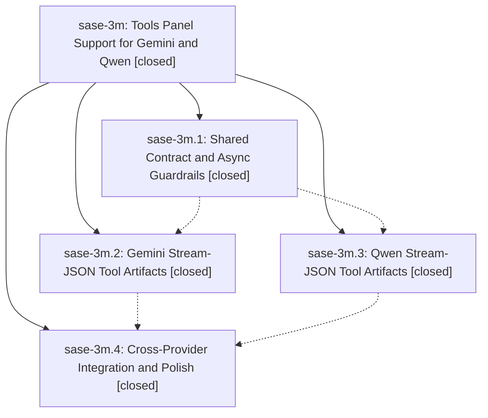

# Bead: sase-3m — Tools Panel Support for Gemini and Qwen

[Bead Pages](../README.md) / sase-3m

**Status:** ✓ closed · **Resolution:** (unrecorded) · **Type:** plan · **Tier:** epic
**Owner:** `bryanbugyi34@gmail.com`
**Created:** 2026-05-15 13:57:27 UTC · **Closed:** 2026-05-15 14:36:32 UTC
**Plan:** [202605/tools\_panel\_gemini\_qwen.md](https://github.com/sase-org/sase--plans/blob/main/202605/tools_panel_gemini_qwen.md)

## Notes

COMMIT: 6d49bdc4d

## Phases

| Bead | Title | Status | Size | Agents | Commits |
|---|---|---|---|---:|---:|
| [sase-3m.1](sase-3m.1.md) | Shared Contract and Async Guardrails | ✓ closed | small | 0 | 1 |
| [sase-3m.2](sase-3m.2.md) | Gemini Stream-JSON Tool Artifacts | ✓ closed | small | 0 | 1 |
| [sase-3m.3](sase-3m.3.md) | Qwen Stream-JSON Tool Artifacts | ✓ closed | small | 0 | 1 |
| [sase-3m.4](sase-3m.4.md) | Cross-Provider Integration and Polish | ✓ closed | small | 0 | 1 |

## Lineage

## Commits

| Commit | Subject | Bead | Committed (UTC) |
|---|---|---|---|
| [`ff1dd79`](https://github.com/sase-org/sase/commit/ff1dd79f91211ec53cf90001c7168a9cb0e78b7f) | feat: add shared stream tool call contract (sase-3m.1) | [sase-3m.1](sase-3m.1.md) | 2026-05-15 14:07:25 |
| [`713b93f`](https://github.com/sase-org/sase/commit/713b93f7efdbd2cc608ad6c62bc8e16032954ef7) | feat: add Gemini stream-json tool artifacts (sase-3m.2) | [sase-3m.2](sase-3m.2.md) | 2026-05-15 14:18:57 |
| [`7b69c64`](https://github.com/sase-org/sase/commit/7b69c647b95adc2918b6cf25ef3ee9c9be1fbaf0) | feat: record Qwen stream tool artifacts (sase-3m.3) | [sase-3m.3](sase-3m.3.md) | 2026-05-15 14:23:56 |
| [`8f7c17d`](https://github.com/sase-org/sase/commit/8f7c17d854ab83e73dfff5eb3915227c77daca99) | fix: scope tool calls by runtime (sase-3m.4) | [sase-3m.4](sase-3m.4.md) | 2026-05-15 14:31:40 |
