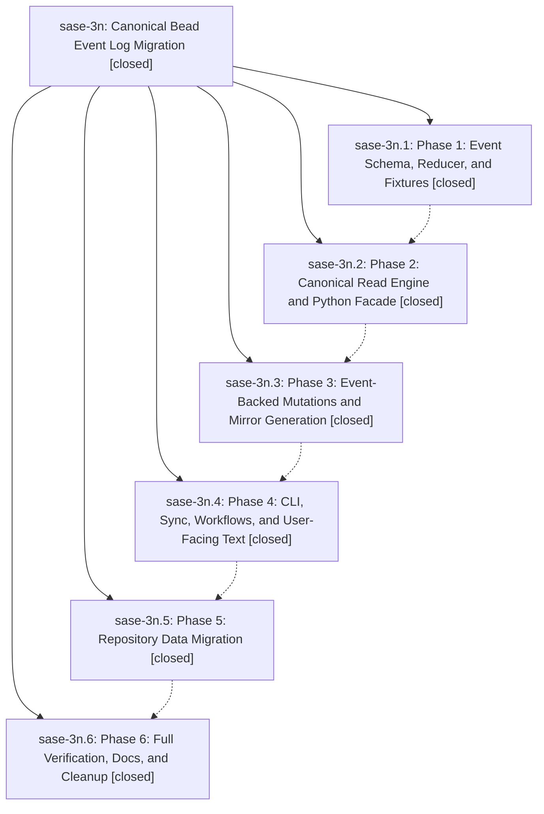

# Bead: sase-3n — Canonical Bead Event Log Migration

[Bead Pages](../README.md) / sase-3n

**Status:** ✓ closed · **Resolution:** (unrecorded) · **Type:** plan · **Tier:** epic
**Owner:** `bryanbugyi34@gmail.com`
**Created:** 2026-05-15 14:51:36 UTC · **Closed:** 2026-05-16 14:37:09 UTC
**Plan:** [202605/bead\_event\_log\_migration.md](https://github.com/sase-org/sase--plans/blob/main/202605/bead_event_log_migration.md)

## Phases

| Bead | Title | Status | Size | Agents | Commits |
|---|---|---|---|---:|---:|
| [sase-3n.1](sase-3n.1.md) | Phase 1: Event Schema, Reducer, and Fixtures | ✓ closed | small | 0 | 0 |
| [sase-3n.2](sase-3n.2.md) | Phase 2: Canonical Read Engine and Python Facade | ✓ closed | small | 0 | 1 |
| [sase-3n.3](sase-3n.3.md) | Phase 3: Event-Backed Mutations and Mirror Generation | ✓ closed | small | 0 | 1 |
| [sase-3n.4](sase-3n.4.md) | Phase 4: CLI, Sync, Workflows, and User-Facing Text | ✓ closed | small | 0 | 1 |
| [sase-3n.5](sase-3n.5.md) | Phase 5: Repository Data Migration | ✓ closed | small | 0 | 1 |
| [sase-3n.6](sase-3n.6.md) | Phase 6: Full Verification, Docs, and Cleanup | ✓ closed | small | 0 | 1 |

## Lineage

## Commits

| Commit | Subject | Bead | Committed (UTC) |
|---|---|---|---|
| [`830ec3c`](https://github.com/sase-org/sase/commit/830ec3c37b8eebaf8cfb182270dac650ab9766fa) | chore: add event-backed bead read coverage (sase-3n.2) | [sase-3n.2](sase-3n.2.md) | 2026-05-15 15:26:07 |
| [`2645150`](https://github.com/sase-org/sase/commit/264515037866ac8c08f4e5a2cbec718bc5940782) | chore: close event-backed mutation bead (sase-3n.3) | [sase-3n.3](sase-3n.3.md) | 2026-05-15 15:48:21 |
| [`7f593c8`](https://github.com/sase-org/sase/commit/7f593c8b0d0f439f62474175e3092ba3001321f5) | feat: sync full bead state through CLI workflows (sase-3n.4) | [sase-3n.4](sase-3n.4.md) | 2026-05-15 16:04:52 |
| [`b49de1f`](https://github.com/sase-org/sase/commit/b49de1f214cc0dd56b5fcc22993018fa4ea86b88) | chore: migrate bead state to event store (sase-3n.5) | [sase-3n.5](sase-3n.5.md) | 2026-05-15 16:16:57 |
| [`c3e1e4b`](https://github.com/sase-org/sase/commit/c3e1e4b8b08b4eb7e4af036855539bb5c1260d4c) | chore: document canonical bead event storage (sase-3n.6) | [sase-3n.6](sase-3n.6.md) | 2026-05-15 16:30:59 |
| [`c6088c7`](https://github.com/sase-org/sase/commit/c6088c7391e127ecb514ce591bf783c2cc2c9218) | chore: close bead event log migration epic (sase-3n) | [sase-3n](README.md) | 2026-05-15 16:35:25 |
