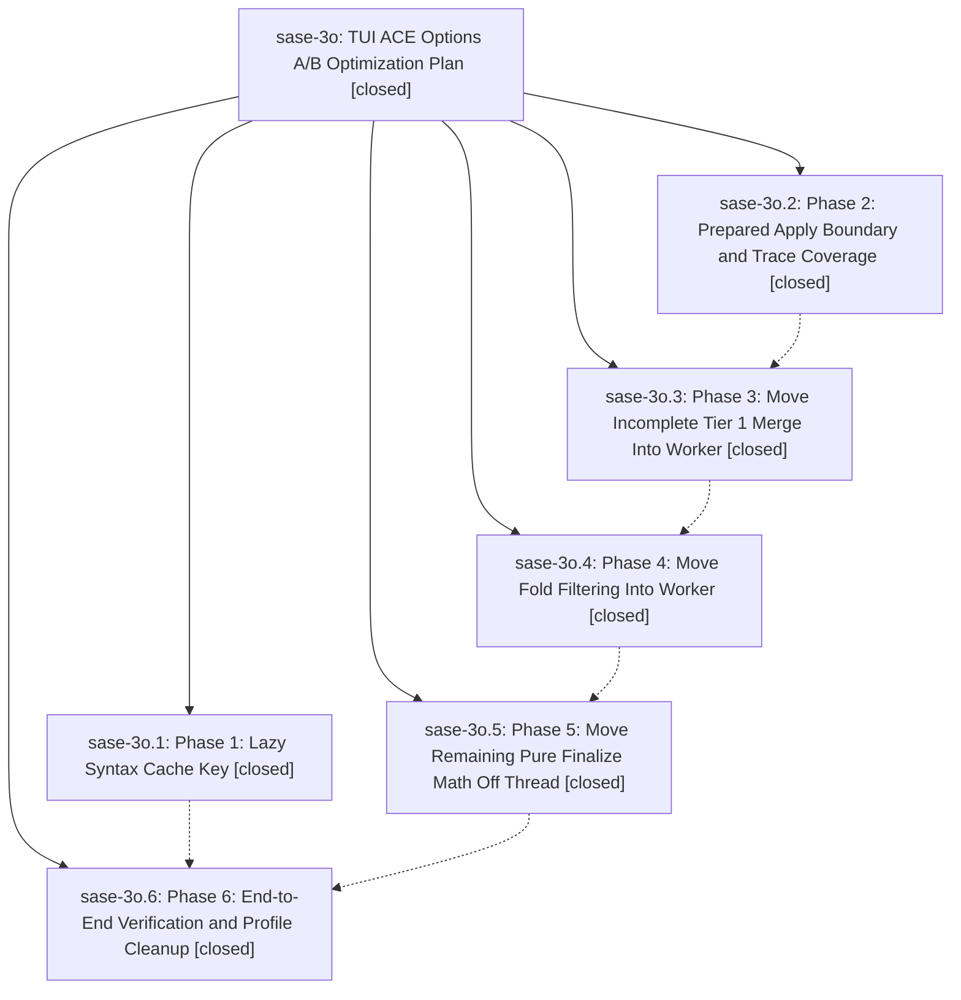

# Bead: sase-3o — TUI ACE Options A/B Optimization Plan

[Bead Pages](../README.md) / sase-3o

**Status:** ✓ closed · **Resolution:** (unrecorded) · **Type:** plan · **Tier:** epic
**Owner:** `bryanbugyi34@gmail.com`
**Created:** 2026-05-15 15:27:30 UTC · **Closed:** 2026-05-15 16:52:04 UTC
**Plan:** [202605/tui\_ace\_options\_a\_b.md](https://github.com/sase-org/sase--plans/blob/main/202605/tui_ace_options_a_b.md)

## Notes

COMMIT: 4b75d50c3

## Phases

| Bead | Title | Status | Size | Agents | Commits |
|---|---|---|---|---:|---:|
| [sase-3o.1](sase-3o.1.md) | Phase 1: Lazy Syntax Cache Key | ✓ closed | small | 0 | 1 |
| [sase-3o.2](sase-3o.2.md) | Phase 2: Prepared Apply Boundary and Trace Coverage | ✓ closed | small | 0 | 1 |
| [sase-3o.3](sase-3o.3.md) | Phase 3: Move Incomplete Tier 1 Merge Into Worker | ✓ closed | small | 0 | 1 |
| [sase-3o.4](sase-3o.4.md) | Phase 4: Move Fold Filtering Into Worker | ✓ closed | small | 0 | 1 |
| [sase-3o.5](sase-3o.5.md) | Phase 5: Move Remaining Pure Finalize Math Off Thread | ✓ closed | small | 0 | 1 |
| [sase-3o.6](sase-3o.6.md) | Phase 6: End-to-End Verification and Profile Cleanup | ✓ closed | small | 0 | 1 |

## Lineage

## Commits

| Commit | Subject | Bead | Committed (UTC) |
|---|---|---|---|
| [`8ab63f6`](https://github.com/sase-org/sase/commit/8ab63f68454742d7c876fbe3ac30b6229b59a507) | fix: reuse lazy syntax renders across height changes (sase-3o.1) | [sase-3o.1](sase-3o.1.md) | 2026-05-15 15:40:30 |
| [`917f4cd`](https://github.com/sase-org/sase/commit/917f4cd98e8e21f07b3df00689de23a9c179ac67) | feat: add prepared agent apply boundary (sase-3o.2) | [sase-3o.2](sase-3o.2.md) | 2026-05-15 15:53:47 |
| [`c534e08`](https://github.com/sase-org/sase/commit/c534e080364627d9c06bfba455907064d7345bf0) | feat: move incomplete Tier 1 merge into worker (sase-3o.3) | [sase-3o.3](sase-3o.3.md) | 2026-05-15 16:07:34 |
| [`ce9eee7`](https://github.com/sase-org/sase/commit/ce9eee7769e3eebc711d0325b4626025c62fd149) | ref: prepare fold filtering in worker (sase-3o.4) | [sase-3o.4](sase-3o.4.md) | 2026-05-15 16:21:53 |
| [`279c47e`](https://github.com/sase-org/sase/commit/279c47ef7862935b7cf1b889416dcddbfc81e958) | ref: move pure finalize math into agent loading worker (sase-3o.5) | [sase-3o.5](sase-3o.5.md) | 2026-05-15 16:38:40 |
| [`40e17bb`](https://github.com/sase-org/sase/commit/40e17bb3223011fcf87f15fe732db7624024ace3) | chore: verify Options A/B phase work and rerank follow-ups (sase-3o.6) | [sase-3o.6](sase-3o.6.md) | 2026-05-15 16:46:08 |
| [`89d6f08`](https://github.com/sase-org/sase/commit/89d6f0869aa28ffb3d112f2a245973004714f7d9) | chore: close TUI ACE Options A/B epic (sase-3o) | [sase-3o](README.md) | 2026-05-15 16:52:40 |
