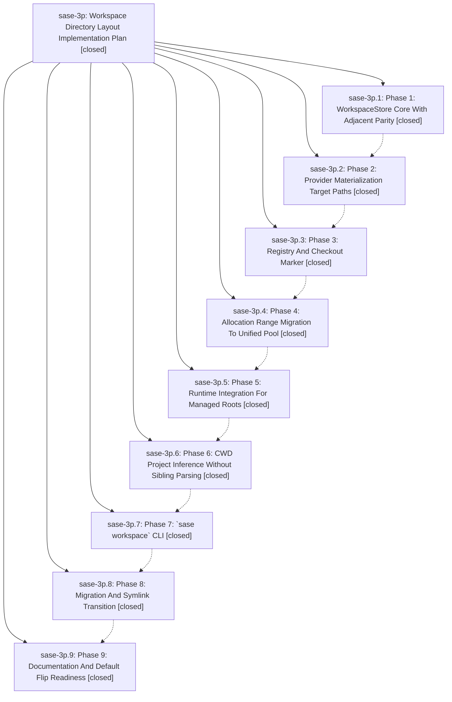

# Bead: sase-3p — Workspace Directory Layout Implementation Plan

[Bead Pages](../README.md) / sase-3p

**Status:** ✓ closed · **Resolution:** (unrecorded) · **Type:** plan · **Tier:** epic
**Owner:** `bryanbugyi34@gmail.com`
**Created:** 2026-05-15 16:48:12 UTC · **Closed:** 2026-05-15 18:48:01 UTC
**Plan:** [sdd/plans/202605/workspace\_directory\_layout.md](https://github.com/sase-org/sase--plans/blob/main/sdd/plans/202605/workspace_directory_layout.md)

## Notes

COMMIT: eb25453e7

## Phases

| Bead | Title | Status | Size | Agents | Commits |
|---|---|---|---|---:|---:|
| [sase-3p.1](sase-3p.1.md) | Phase 1: WorkspaceStore Core With Adjacent Parity | ✓ closed | small | 0 | 1 |
| [sase-3p.2](sase-3p.2.md) | Phase 2: Provider Materialization Target Paths | ✓ closed | small | 0 | 1 |
| [sase-3p.3](sase-3p.3.md) | Phase 3: Registry And Checkout Marker | ✓ closed | small | 0 | 1 |
| [sase-3p.4](sase-3p.4.md) | Phase 4: Allocation Range Migration To Unified Pool | ✓ closed | small | 0 | 1 |
| [sase-3p.5](sase-3p.5.md) | Phase 5: Runtime Integration For Managed Roots | ✓ closed | small | 0 | 1 |
| [sase-3p.6](sase-3p.6.md) | Phase 6: CWD Project Inference Without Sibling Parsing | ✓ closed | small | 0 | 1 |
| [sase-3p.7](sase-3p.7.md) | Phase 7: \`sase workspace\` CLI | ✓ closed | small | 0 | 1 |
| [sase-3p.8](sase-3p.8.md) | Phase 8: Migration And Symlink Transition | ✓ closed | small | 0 | 1 |
| [sase-3p.9](sase-3p.9.md) | Phase 9: Documentation And Default Flip Readiness | ✓ closed | small | 0 | 1 |

## Lineage

## Commits

| Commit | Subject | Bead | Committed (UTC) |
|---|---|---|---|
| [`041e3bf`](https://github.com/sase-org/sase/commit/041e3bf35d48c264205f71e7df824e67629a9379) | feat: add WorkspaceStore core with adjacent parity (sase-3p.1) | [sase-3p.1](sase-3p.1.md) | 2026-05-15 17:12:33 |
| [`532a62d`](https://github.com/sase-org/sase/commit/532a62d9a8e0ba8e9ea61f41fca7629d62ef0c2a) | feat: add target-aware workspace materialization (sase-3p.2) | [sase-3p.2](sase-3p.2.md) | 2026-05-15 17:25:55 |
| [`9cceb10`](https://github.com/sase-org/sase/commit/9cceb103b1560c8bc6abc4141b99e18f300a50fe) | feat: add managed workspaces registry and checkout marker (sase-3p.3) | [sase-3p.3](sase-3p.3.md) | 2026-05-15 17:33:42 |
| [`c73bee6`](https://github.com/sase-org/sase/commit/c73bee66da97a47e1856021f7b799d9c9cdbb9c9) | feat: migrate workspace allocation to unified pool (sase-3p.4) | [sase-3p.4](sase-3p.4.md) | 2026-05-15 17:42:05 |
| [`18a5f49`](https://github.com/sase-org/sase/commit/18a5f494b13184e7da33c82b40d40c966c773b0f) | feat: route runtime workspace resolution through WorkspaceStore (sase-3p.5) | [sase-3p.5](sase-3p.5.md) | 2026-05-15 17:58:06 |
| [`3a75c73`](https://github.com/sase-org/sase/commit/3a75c7370e2adf8fca3e4c8cedcb3e9a8d809e88) | feat: infer project from checkout marker before sibling scan (sase-3p.6) | [sase-3p.6](sase-3p.6.md) | 2026-05-15 18:07:22 |
| [`8207346`](https://github.com/sase-org/sase/commit/8207346ce7d5644e9868820555a16ed3fff48e3d) | feat: add \`sase workspace\` CLI for managed checkouts (sase-3p.7) | [sase-3p.7](sase-3p.7.md) | 2026-05-15 18:18:31 |
| [`8145a68`](https://github.com/sase-org/sase/commit/8145a6843f14b64805095c7479b001e99c04b667) | feat: add \`sase workspace migrate\` for adjacent → xdg-state transition (sase-3p.8) | [sase-3p.8](sase-3p.8.md) | 2026-05-15 18:29:22 |
| [`2147ba8`](https://github.com/sase-org/sase/commit/2147ba8c70d0b5f0ad21cbc8c8c2b7add2560c29) | chore: document workspace directory layout and config (sase-3p.9) | [sase-3p.9](sase-3p.9.md) | 2026-05-15 18:36:50 |
