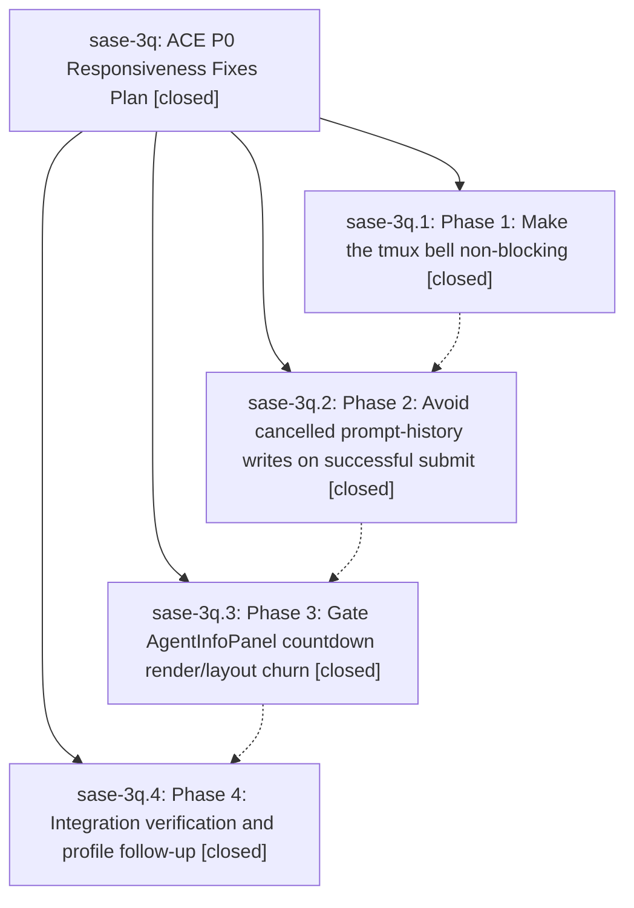

# Bead: sase-3q — ACE P0 Responsiveness Fixes Plan

[Bead Pages](../README.md) / sase-3q

**Status:** ✓ closed · **Resolution:** (unrecorded) · **Type:** plan · **Tier:** epic
**Owner:** `bryanbugyi34@gmail.com`
**Created:** 2026-05-15 17:50:58 UTC · **Closed:** 2026-05-15 18:40:15 UTC
**Plan:** [202605/ace\_p0\_responsiveness.md](https://github.com/sase-org/sase--plans/blob/main/202605/ace_p0_responsiveness.md)

## Notes

COMMIT: 64c5ab908

## Phases

| Bead | Title | Status | Size | Agents | Commits |
|---|---|---|---|---:|---:|
| [sase-3q.1](sase-3q.1.md) | Phase 1: Make the tmux bell non-blocking | ✓ closed | small | 0 | 1 |
| [sase-3q.2](sase-3q.2.md) | Phase 2: Avoid cancelled prompt-history writes on successful submit | ✓ closed | small | 0 | 1 |
| [sase-3q.3](sase-3q.3.md) | Phase 3: Gate AgentInfoPanel countdown render/layout churn | ✓ closed | small | 0 | 1 |
| [sase-3q.4](sase-3q.4.md) | Phase 4: Integration verification and profile follow-up | ✓ closed | small | 0 | 0 |

## Lineage

## Commits

| Commit | Subject | Bead | Committed (UTC) |
|---|---|---|---|
| [`3e7d93c`](https://github.com/sase-org/sase/commit/3e7d93c10d5cb2ec24487a9eca525c519851461f) | feat: make tmux notification bell non-blocking (sase-3q.1) | [sase-3q.1](sase-3q.1.md) | 2026-05-15 18:10:44 |
| [`6977312`](https://github.com/sase-org/sase/commit/69773123db8de8b16743f41698eb7e76e122e97b) | feat: skip cancelled history write on successful prompt submit (sase-3q.2) | [sase-3q.2](sase-3q.2.md) | 2026-05-15 18:17:49 |
| [`43697f7`](https://github.com/sase-org/sase/commit/43697f7b4ea6a25c2d1c61e62db98211cd88e138) | feat: gate AgentInfoPanel countdown render/layout churn (sase-3q.3) | [sase-3q.3](sase-3q.3.md) | 2026-05-15 18:27:33 |
| [`3d6adc3`](https://github.com/sase-org/sase/commit/3d6adc3bd921a6167b40a25887ad33d626094dc1) | chore: close ACE P0 responsiveness epic (sase-3q) | [sase-3q](README.md) | 2026-05-15 18:40:38 |
