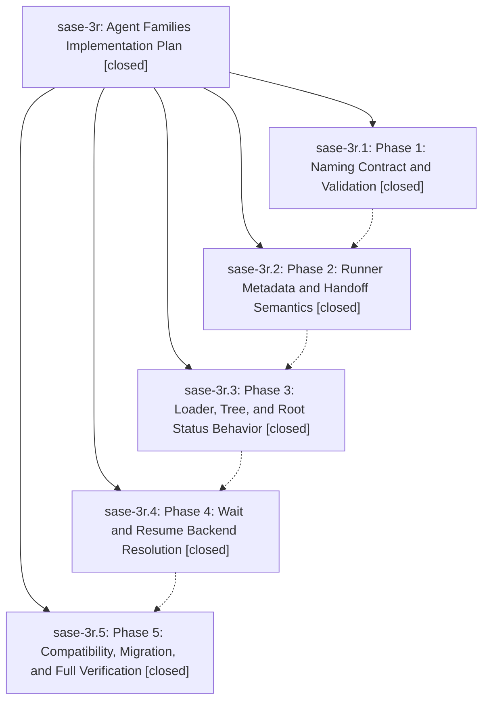

# Bead: sase-3r — Agent Families Implementation Plan

[Bead Pages](../README.md) / sase-3r

**Status:** ✓ closed · **Resolution:** (unrecorded) · **Type:** plan · **Tier:** epic
**Owner:** `bryanbugyi34@gmail.com`
**Created:** 2026-05-17 00:18:22 UTC · **Closed:** 2026-05-17 01:48:05 UTC
**Plan:** [202605/agent\_families\_2.md](https://github.com/sase-org/sase--plans/blob/main/202605/agent_families_2.md)

## Notes

COMMIT: b96995a50

## Phases

| Bead | Title | Status | Size | Agents | Commits |
|---|---|---|---|---:|---:|
| [sase-3r.1](sase-3r.1.md) | Phase 1: Naming Contract and Validation | ✓ closed | small | 0 | 2 |
| [sase-3r.2](sase-3r.2.md) | Phase 2: Runner Metadata and Handoff Semantics | ✓ closed | small | 0 | 2 |
| [sase-3r.3](sase-3r.3.md) | Phase 3: Loader, Tree, and Root Status Behavior | ✓ closed | small | 0 | 2 |
| [sase-3r.4](sase-3r.4.md) | Phase 4: Wait and Resume Backend Resolution | ✓ closed | small | 0 | 2 |
| [sase-3r.5](sase-3r.5.md) | Phase 5: Compatibility, Migration, and Full Verification | ✓ closed | small | 0 | 2 |

## Lineage

## Commits

| Commit | Subject | Bead | Committed (UTC) |
|---|---|---|---|
| [`0f61ca5`](https://github.com/sase-org/sase/commit/0f61ca5e7ae65e449a81bdf24962065cdb70fb36) | feat: instrument tiered agent loader with phase-1 measurement contract (sase-3r.1) | [sase-3r.1](sase-3r.1.md) | 2026-05-16 14:13:47 |
| [`c0195b2`](https://github.com/sase-org/sase/commit/c0195b2002db0c1e9c96e489d6b438f6f5992b78) | feat: wire visibility-aware artifact index query through Python facade (sase-3r.2) | [sase-3r.2](sase-3r.2.md) | 2026-05-16 14:34:33 |
| [`f7b157e`](https://github.com/sase-org/sase/commit/f7b157e79574a36c90b2d64af6c08d99b6f47909) | feat: wire visibility-aware inbox query into TUI loader (sase-3r.3) | [sase-3r.3](sase-3r.3.md) | 2026-05-16 14:55:33 |
| [`e99a379`](https://github.com/sase-org/sase/commit/e99a3792c67f7378f0519af571db864bfb856baf) | feat: keep agent artifact index fresh incrementally (sase-3r.4) | [sase-3r.4](sase-3r.4.md) | 2026-05-16 15:18:56 |
| [`49307f9`](https://github.com/sase-org/sase/commit/49307f914cf64025b53bc2c620f680e8b1a2de8d) | feat: lazy attempt history + inbox/archive search split (sase-3r.5) | [sase-3r.5](sase-3r.5.md) | 2026-05-16 15:33:09 |
| [`a6af84e`](https://github.com/sase-org/sase/commit/a6af84ef521cec01e2fd5f57df799a87b8b143ee) | feat: reserve hyphenated agent family suffixes (sase-3r.1) | [sase-3r.1](sase-3r.1.md) | 2026-05-17 00:46:20 |
| [`56fbf1c`](https://github.com/sase-org/sase/commit/56fbf1ced8a5578081edea7bbd83a93ac040f1e8) | feat: preserve agent family metadata in runner handoffs (sase-3r.2) | [sase-3r.2](sase-3r.2.md) | 2026-05-17 00:57:50 |
| [`39fe1af`](https://github.com/sase-org/sase/commit/39fe1afe9724d1bc000e327346d2f08ded5f7b4d) | feat: mirror agent family root status in TUI (sase-3r.3) | [sase-3r.3](sase-3r.3.md) | 2026-05-17 01:14:57 |
| [`c1ee456`](https://github.com/sase-org/sase/commit/c1ee456abb5d4b156a0812d9ec4a593b323f0201) | fix: resolve wait and resume through agent families (sase-3r.4) | [sase-3r.4](sase-3r.4.md) | 2026-05-17 01:25:46 |
| [`1dbb56e`](https://github.com/sase-org/sase/commit/1dbb56e0fd6d6cf3883b84ec15d876aa1b438fbd) | fix: allow bead-work hyphenated launch names (sase-3r.5) | [sase-3r.5](sase-3r.5.md) | 2026-05-17 01:38:59 |
