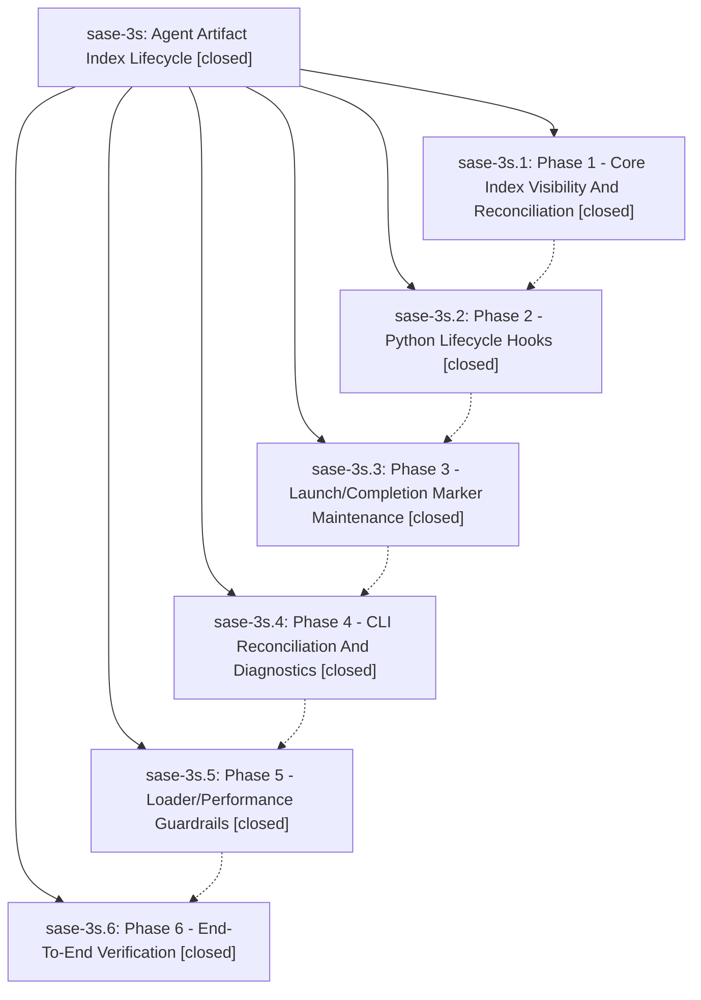

# Bead: sase-3s — Agent Artifact Index Lifecycle

[Bead Pages](../README.md) / sase-3s

**Status:** ✓ closed · **Resolution:** (unrecorded) · **Type:** plan · **Tier:** epic
**Owner:** `bryanbugyi34@gmail.com`
**Created:** 2026-05-20 21:36:30 UTC · **Closed:** 2026-05-20 22:45:37 UTC
**Plan:** [sdd/plans/202605/agent\_artifact\_index\_lifecycle.md](https://github.com/sase-org/sase--plans/blob/main/sdd/plans/202605/agent_artifact_index_lifecycle.md)

## Notes

COMMIT: 7e8354aad

[2026-07-27T18:58:48Z · sase-a1.6] [2026-05-20T22:44:58Z · bryanbugyi34@gmail.com] (restored 2026-07-27) COMMIT: 9e47f4c13

## Phases

| Bead | Title | Status | Size | Agents | Commits |
|---|---|---|---|---:|---:|
| [sase-3s.1](sase-3s.1.md) | Phase 1 - Core Index Visibility And Reconciliation | ✓ closed | small | 0 | 2 |
| [sase-3s.2](sase-3s.2.md) | Phase 2 - Python Lifecycle Hooks | ✓ closed | small | 0 | 3 |
| [sase-3s.3](sase-3s.3.md) | Phase 3 - Launch/Completion Marker Maintenance | ✓ closed | small | 0 | 2 |
| [sase-3s.4](sase-3s.4.md) | Phase 4 - CLI Reconciliation And Diagnostics | ✓ closed | small | 0 | 2 |
| [sase-3s.5](sase-3s.5.md) | Phase 5 - Loader/Performance Guardrails | ✓ closed | small | 0 | 3 |
| [sase-3s.6](sase-3s.6.md) | Phase 6 - End-To-End Verification | ✓ closed | small | 0 | 1 |

## Lineage

## Commits

| Commit | Subject | Bead | Committed (UTC) |
|---|---|---|---|
| [`5fec4d3`](https://github.com/sase-org/sase/commit/5fec4d378d9bbe0a973885ed58db0adb9b0b70bb) | feat: add agents index diagnostics harness (sase-3s.1) | [sase-3s.1](sase-3s.1.md) | 2026-05-16 17:06:34 |
| [`59fd888`](https://github.com/sase-org/sase/commit/59fd88847253320e822ab66615d58cc900be3982) | fix: preserve agents tab workflow child projections (sase-3s.4) | [sase-3s.4](sase-3s.4.md) | 2026-05-16 17:18:15 |
| [`sase-core@2e5b5e4`](https://github.com/sase-org/sase-core/commit/2e5b5e41926ffed19ff12739e25d89b8dab08bc1) | fix: tighten agent artifact inbox predicate (sase-3s.2) | [sase-3s.2](sase-3s.2.md) | 2026-05-16 17:21:07 |
| [`d61ab9f`](https://github.com/sase-org/sase/commit/d61ab9fb6d6d2c14f65cb8e941ac97ad76bd3953) | fix: pin agent artifact index schema v3 (sase-3s.2) | [sase-3s.2](sase-3s.2.md) | 2026-05-16 17:23:40 |
| [`7b36e4e`](https://github.com/sase-org/sase/commit/7b36e4e1efad16650042d06988e1aed0cbc4bbd1) | fix: keep agent artifact index fresh (sase-3s.3) | [sase-3s.3](sase-3s.3.md) | 2026-05-16 17:32:07 |
| [`sase-core@27827ec`](https://github.com/sase-org/sase-core/commit/27827ec89dac8ec6ccecdaf74a20a3b1377a765f) | feat: support parent-scoped agent index hydration (sase-3s.5) | [sase-3s.5](sase-3s.5.md) | 2026-05-16 17:49:49 |
| [`4b1383d`](https://github.com/sase-org/sase/commit/4b1383d716962a32dac931dcae810e8cedc44556) | feat: lazily hydrate workflow prompt steps (sase-3s.5) | [sase-3s.5](sase-3s.5.md) | 2026-05-16 17:50:28 |
| [`sase-core@4a3a0fc`](https://github.com/sase-org/sase-core/commit/4a3a0fcd11b93b7832c9751e8d1e00967dfb0342) | feat: persist dismissed agent visibility in index (sase-3s.1) | [sase-3s.1](sase-3s.1.md) | 2026-05-20 21:48:50 |
| [`07130e6`](https://github.com/sase-org/sase/commit/07130e629fe1b0b892dd143d907899ba18c0d9fb) | feat: maintain agent artifact index during lifecycle actions (sase-3s.2) | [sase-3s.2](sase-3s.2.md) | 2026-05-20 22:04:33 |
| [`68c04ca`](https://github.com/sase-org/sase/commit/68c04ca4d6c597c3fae0f742f8094a3f80b20311) | feat: update artifact index after marker writes (sase-3s.3) | [sase-3s.3](sase-3s.3.md) | 2026-05-20 22:11:48 |
| [`d1abb6d`](https://github.com/sase-org/sase/commit/d1abb6d7e1a2761c0f9b66e95070057537ba0139) | feat: add agent index gc reconciliation (sase-3s.4) | [sase-3s.4](sase-3s.4.md) | 2026-05-20 22:19:54 |
| [`7944c64`](https://github.com/sase-org/sase/commit/7944c64702e9648a47d6f65a9ed303a3a5fe80a9) | chore: add Phase 5 loader guardrail tests (sase-3s.5) | [sase-3s.5](sase-3s.5.md) | 2026-05-20 22:25:53 |
| [`2e7d2f5`](https://github.com/sase-org/sase/commit/2e7d2f5495efabe08807ee1ef1f7707edb6619cc) | chore: close agent artifact index verification bead (sase-3s.6) | [sase-3s.6](sase-3s.6.md) | 2026-05-20 22:35:46 |
| [`7239f67`](https://github.com/sase-org/sase/commit/7239f6703bf48ebd1b441fde1631f67eea475380) | ref: format artifact index lifecycle helpers (sase-3s) | [sase-3s](README.md) | 2026-05-20 22:46:01 |
