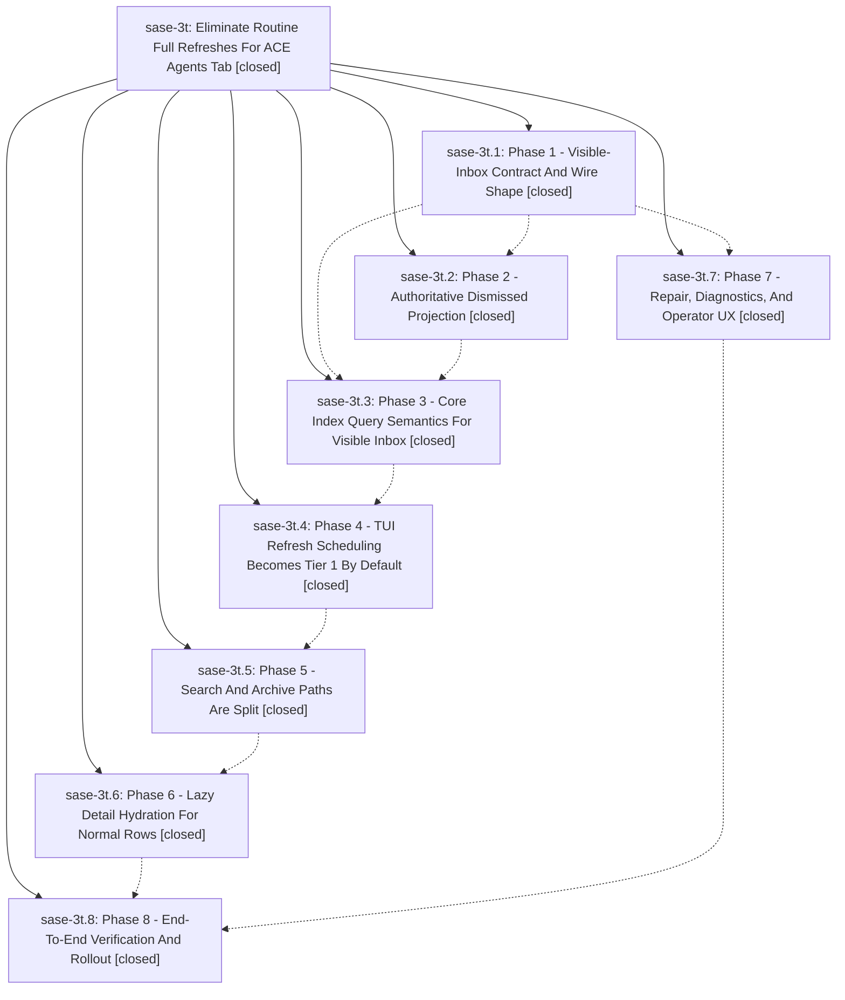

# Bead: sase-3t — Eliminate Routine Full Refreshes For ACE Agents Tab

[Bead Pages](../README.md) / sase-3t

**Status:** ✓ closed · **Resolution:** (unrecorded) · **Type:** plan · **Tier:** epic
**Owner:** `bryanbugyi34@gmail.com`
**Created:** 2026-05-21 13:58:47 UTC · **Closed:** 2026-05-21 15:35:30 UTC
**Plan:** [202605/agents\_tab\_full\_refresh\_elimination.md](https://github.com/sase-org/sase--plans/blob/main/202605/agents_tab_full_refresh_elimination.md)

## Notes

COMMIT: 69541b30c

## Phases

| Bead | Title | Status | Size | Agents | Commits |
|---|---|---|---|---:|---:|
| [sase-3t.1](sase-3t.1.md) | Phase 1 - Visible-Inbox Contract And Wire Shape | ✓ closed | small | 0 | 2 |
| [sase-3t.2](sase-3t.2.md) | Phase 2 - Authoritative Dismissed Projection | ✓ closed | small | 0 | 1 |
| [sase-3t.3](sase-3t.3.md) | Phase 3 - Core Index Query Semantics For Visible Inbox | ✓ closed | small | 0 | 1 |
| [sase-3t.4](sase-3t.4.md) | Phase 4 - TUI Refresh Scheduling Becomes Tier 1 By Default | ✓ closed | small | 0 | 1 |
| [sase-3t.5](sase-3t.5.md) | Phase 5 - Search And Archive Paths Are Split | ✓ closed | small | 0 | 1 |
| [sase-3t.6](sase-3t.6.md) | Phase 6 - Lazy Detail Hydration For Normal Rows | ✓ closed | small | 0 | 1 |
| [sase-3t.7](sase-3t.7.md) | Phase 7 - Repair, Diagnostics, And Operator UX | ✓ closed | small | 0 | 1 |
| [sase-3t.8](sase-3t.8.md) | Phase 8 - End-To-End Verification And Rollout | ✓ closed | small | 0 | 0 |

## Lineage

## Commits

| Commit | Subject | Bead | Committed (UTC) |
|---|---|---|---|
| [`sase-core@b36766e`](https://github.com/sase-org/sase-core/commit/b36766e70387cd439dfe05dcff854c0c0bec7595) | feat: add active limit to agent index query (sase-3t.1) | [sase-3t.1](sase-3t.1.md) | 2026-05-21 14:16:48 |
| [`2e01dbd`](https://github.com/sase-org/sase/commit/2e01dbdb86f7f93e794deaf44edbe796ba774584) | feat: add visible inbox load contract (sase-3t.1) | [sase-3t.1](sase-3t.1.md) | 2026-05-21 14:21:07 |
| [`56c0b47`](https://github.com/sase-org/sase/commit/56c0b47d0b37df9b8da4fc7c633bd195e8ee0f98) | feat: surface agent index repair diagnostics (sase-3t.7) | [sase-3t.7](sase-3t.7.md) | 2026-05-21 14:34:57 |
| [`92cf861`](https://github.com/sase-org/sase/commit/92cf861aeb182a051dea7735177a5e5ce22c3f2a) | feat: sync dismissed projection before index loads (sase-3t.2) | [sase-3t.2](sase-3t.2.md) | 2026-05-21 14:40:05 |
| [`sase-core@5b6ae02`](https://github.com/sase-org/sase-core/commit/5b6ae029c0e065c5720588f9bc809e61c3ba3f73) | fix: enforce visible inbox index semantics (sase-3t.3) | [sase-3t.3](sase-3t.3.md) | 2026-05-21 14:51:48 |
| [`b36b9b8`](https://github.com/sase-org/sase/commit/b36b9b81676e7d5f21240218b9b4e751ec8dca38) | feat: make Agents refresh Tier 1 by default (sase-3t.4) | [sase-3t.4](sase-3t.4.md) | 2026-05-21 15:02:43 |
| [`bcb5ea7`](https://github.com/sase-org/sase/commit/bcb5ea753761cd2876e658e8966f1bbb60a8bb20) | fix: keep agent search on visible-inbox loads (sase-3t.5) | [sase-3t.5](sase-3t.5.md) | 2026-05-21 15:08:59 |
| [`846aa12`](https://github.com/sase-org/sase/commit/846aa12d2df2c5df496abe121473c1284bdc9546) | feat: hydrate agent attempt history on demand (sase-3t.6) | [sase-3t.6](sase-3t.6.md) | 2026-05-21 15:17:30 |
