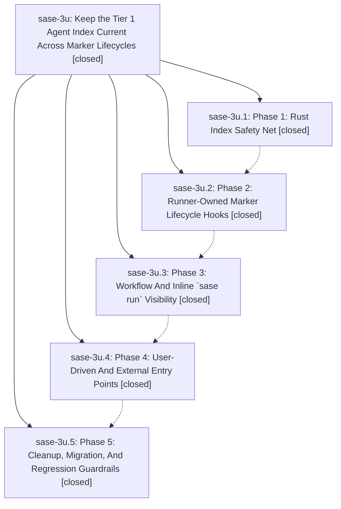

# Bead: sase-3u — Keep the Tier 1 Agent Index Current Across Marker Lifecycles

[Bead Pages](../README.md) / sase-3u

**Status:** ✓ closed · **Resolution:** (unrecorded) · **Type:** plan · **Tier:** epic
**Owner:** `bryanbugyi34@gmail.com`
**Created:** 2026-05-21 20:27:03 UTC · **Closed:** 2026-05-21 21:49:46 UTC
**Plan:** [202605/tier1\_agent\_index\_upkeep.md](https://github.com/sase-org/sase--plans/blob/main/202605/tier1_agent_index_upkeep.md)

## Notes

COMMIT: 1106e845c

## Phases

| Bead | Title | Status | Size | Agents | Commits |
|---|---|---|---|---:|---:|
| [sase-3u.1](sase-3u.1.md) | Phase 1: Rust Index Safety Net | ✓ closed | small | 0 | 2 |
| [sase-3u.2](sase-3u.2.md) | Phase 2: Runner-Owned Marker Lifecycle Hooks | ✓ closed | small | 0 | 1 |
| [sase-3u.3](sase-3u.3.md) | Phase 3: Workflow And Inline \`sase run\` Visibility | ✓ closed | small | 0 | 1 |
| [sase-3u.4](sase-3u.4.md) | Phase 4: User-Driven And External Entry Points | ✓ closed | small | 0 | 1 |
| [sase-3u.5](sase-3u.5.md) | Phase 5: Cleanup, Migration, And Regression Guardrails | ✓ closed | small | 0 | 1 |

## Lineage

## Commits

| Commit | Subject | Bead | Committed (UTC) |
|---|---|---|---|
| [`sase-core@b70847b`](https://github.com/sase-org/sase-core/commit/b70847bbabc04eb6f0fd52a1444214daf087bb49) | fix: refresh stale agent artifact index rows (sase-3u.1) | [sase-3u.1](sase-3u.1.md) | 2026-05-21 20:44:49 |
| [`eb26fe7`](https://github.com/sase-org/sase/commit/eb26fe7a7d20e6769bcd9e9b44df4dd2087136d6) | fix: sync agent artifact index schema pin (sase-3u.1) | [sase-3u.1](sase-3u.1.md) | 2026-05-21 20:47:35 |
| [`42f82c0`](https://github.com/sase-org/sase/commit/42f82c009f79dc846c4cb80d4a1e54e78a2e45b4) | fix: refresh agent artifact index after runner marker mutations (sase-3u.2) | [sase-3u.2](sase-3u.2.md) | 2026-05-21 21:00:55 |
| [`6fef799`](https://github.com/sase-org/sase/commit/6fef799343023606dc7d77eff539691e0546d768) | feat: refresh workflow marker artifact index (sase-3u.3) | [sase-3u.3](sase-3u.3.md) | 2026-05-21 21:12:24 |
| [`eab6c3f`](https://github.com/sase-org/sase/commit/eab6c3fb35a50d26bf77cf47c75739ff941195af) | fix: refresh agent index after external marker updates (sase-3u.4) | [sase-3u.4](sase-3u.4.md) | 2026-05-21 21:26:20 |
| [`7a748a7`](https://github.com/sase-org/sase/commit/7a748a70658623c259b1e3e7fd7467a4da941497) | fix: maintain agent artifact index on cleanup paths (sase-3u.5) | [sase-3u.5](sase-3u.5.md) | 2026-05-21 21:40:34 |
