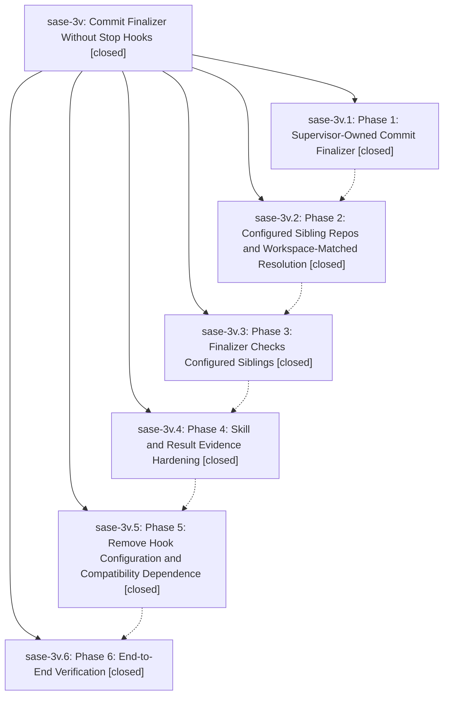

# Bead: sase-3v — Commit Finalizer Without Stop Hooks

[Bead Pages](../README.md) / sase-3v

**Status:** ✓ closed · **Resolution:** (unrecorded) · **Type:** plan · **Tier:** epic
**Owner:** `bryanbugyi34@gmail.com`
**Created:** 2026-05-21 23:12:10 UTC · **Closed:** 2026-05-22 01:25:05 UTC
**Plan:** [202605/commit\_finalizer\_no\_stop\_hooks.md](https://github.com/sase-org/sase--plans/blob/main/202605/commit_finalizer_no_stop_hooks.md)

## Notes

COMMIT: 2cbe1cb24

[2026-07-27T19:00:40Z · sase-a1.6] [2026-05-22T01:13:04Z · bryanbugyi34@gmail.com] (restored 2026-07-27) COMMIT: 6493e6b5a

## Phases

| Bead | Title | Status | Size | Agents | Commits |
|---|---|---|---|---:|---:|
| [sase-3v.1](sase-3v.1.md) | Phase 1: Supervisor-Owned Commit Finalizer | ✓ closed | small | 0 | 1 |
| [sase-3v.2](sase-3v.2.md) | Phase 2: Configured Sibling Repos and Workspace-Matched Resolution | ✓ closed | small | 0 | 1 |
| [sase-3v.3](sase-3v.3.md) | Phase 3: Finalizer Checks Configured Siblings | ✓ closed | small | 0 | 1 |
| [sase-3v.4](sase-3v.4.md) | Phase 4: Skill and Result Evidence Hardening | ✓ closed | small | 0 | 1 |
| [sase-3v.5](sase-3v.5.md) | Phase 5: Remove Hook Configuration and Compatibility Dependence | ✓ closed | small | 0 | 1 |
| [sase-3v.6](sase-3v.6.md) | Phase 6: End-to-End Verification | ✓ closed | small | 0 | 1 |

## Lineage

## Commits

| Commit | Subject | Bead | Committed (UTC) |
|---|---|---|---|
| [`b2190a5`](https://github.com/sase-org/sase/commit/b2190a5e36d62c78e066c18fd63fc7343191c80b) | feat: add provider commit finalizer (sase-3v.1) | [sase-3v.1](sase-3v.1.md) | 2026-05-21 23:42:21 |
| [`3653d72`](https://github.com/sase-org/sase/commit/3653d728d1db47e5a383d3e85ef21cb4198915c4) | feat: expose configured sibling repos to agents (sase-3v.2) | [sase-3v.2](sase-3v.2.md) | 2026-05-22 00:01:22 |
| [`951d0b6`](https://github.com/sase-org/sase/commit/951d0b65ee85369ab2bd4cd7bb410ff9f21f67fc) | feat: check configured siblings in commit finalizer (sase-3v.3) | [sase-3v.3](sase-3v.3.md) | 2026-05-22 00:16:46 |
| [`5d5b983`](https://github.com/sase-org/sase/commit/5d5b9830ebcff9e45613e07b8af7b6d22595acbb) | feat: add commit skill invocation evidence (sase-3v.4) | [sase-3v.4](sase-3v.4.md) | 2026-05-22 00:33:16 |
| [`479549a`](https://github.com/sase-org/sase/commit/479549a0c60df14388a2e63f4c29fb7a21eae7c8) | feat: remove SASE stop hook configuration (sase-3v.5) | [sase-3v.5](sase-3v.5.md) | 2026-05-22 00:46:41 |
| [`60e8d9e`](https://github.com/sase-org/sase/commit/60e8d9e6f6814b35bc3cbbcaf4328da6c1d84f0e) | chore: add commit finalizer verification marker (sase-3v.6) | [sase-3v.6](sase-3v.6.md) | 2026-05-22 00:58:28 |
| [`5282651`](https://github.com/sase-org/sase/commit/528265157bbeb6d9dbb9e4478f552e57b3808d10) | chore: Add SDD prompt and plan for commit\_finalizer\_closeout (sase-3v) | [sase-3v](README.md) | 2026-05-22 01:13:09 |
| [`8dec33e`](https://github.com/sase-org/sase/commit/8dec33e7a9b679f482f2a208ff2904104b017f16) | feat: deploy Gemini skills to jetski profile (sase-3v) | [sase-3v](README.md) | 2026-05-22 01:25:35 |
