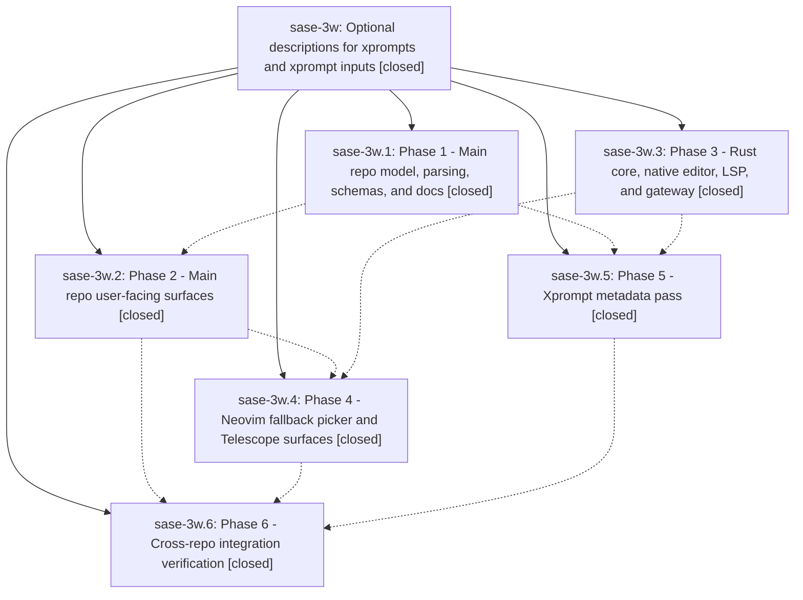

# Bead: sase-3w — Optional descriptions for xprompts and xprompt inputs

[Bead Pages](../README.md) / sase-3w

**Status:** ✓ closed · **Resolution:** (unrecorded) · **Type:** plan · **Tier:** epic
**Owner:** `bryanbugyi34@gmail.com`
**Created:** 2026-05-22 16:22:02 UTC · **Closed:** 2026-05-22 18:14:38 UTC
**Plan:** /home/bryan/.local/state/sase/workspaces/github.com\_sase-org\_sase/sase\_13/sdd/plans/202605/xprompt\_descriptions.md

## Phases

| Bead | Title | Status | Size | Agents | Commits |
|---|---|---|---|---:|---:|
| [sase-3w.1](sase-3w.1.md) | Phase 1 - Main repo model, parsing, schemas, and docs | ✓ closed | small | 0 | 1 |
| [sase-3w.2](sase-3w.2.md) | Phase 2 - Main repo user-facing surfaces | ✓ closed | small | 0 | 1 |
| [sase-3w.3](sase-3w.3.md) | Phase 3 - Rust core, native editor, LSP, and gateway | ✓ closed | small | 0 | 1 |
| [sase-3w.4](sase-3w.4.md) | Phase 4 - Neovim fallback picker and Telescope surfaces | ✓ closed | small | 0 | 0 |
| [sase-3w.5](sase-3w.5.md) | Phase 5 - Xprompt metadata pass | ✓ closed | small | 0 | 1 |
| [sase-3w.6](sase-3w.6.md) | Phase 6 - Cross-repo integration verification | ✓ closed | small | 0 | 1 |

## Lineage

## Commits

| Commit | Subject | Bead | Committed (UTC) |
|---|---|---|---|
| [`3397776`](https://github.com/sase-org/sase/commit/33977764864c2ca8ac540d876fad9378dd5cf16d) | feat: support xprompt descriptions in core loaders (sase-3w.1) | [sase-3w.1](sase-3w.1.md) | 2026-05-22 16:47:59 |
| [`sase-core@b7cf730`](https://github.com/sase-org/sase-core/commit/b7cf7300d26e87a8f981df825d23a6998e902e98) | feat: support xprompt input descriptions in core (sase-3w.3) | [sase-3w.3](sase-3w.3.md) | 2026-05-22 16:54:59 |
| [`f0c2116`](https://github.com/sase-org/sase/commit/f0c211690d8211297a2e80a3b62b67e9b85c2da1) | feat: surface xprompt descriptions in main repo (sase-3w.2) | [sase-3w.2](sase-3w.2.md) | 2026-05-22 17:12:19 |
| [`17cd8f7`](https://github.com/sase-org/sase/commit/17cd8f72e95c2884632c492f5d5cdc79b7dfe97a) | feat: add descriptions to bundled xprompts (sase-3w.5) | [sase-3w.5](sase-3w.5.md) | 2026-05-22 17:14:11 |
| [`01ce9ac`](https://github.com/sase-org/sase/commit/01ce9ac54d91db8194d9bf3a704f450e7d532bde) | chore: close xprompt description verification bead (sase-3w.6) | [sase-3w.6](sase-3w.6.md) | 2026-05-22 17:54:22 |
