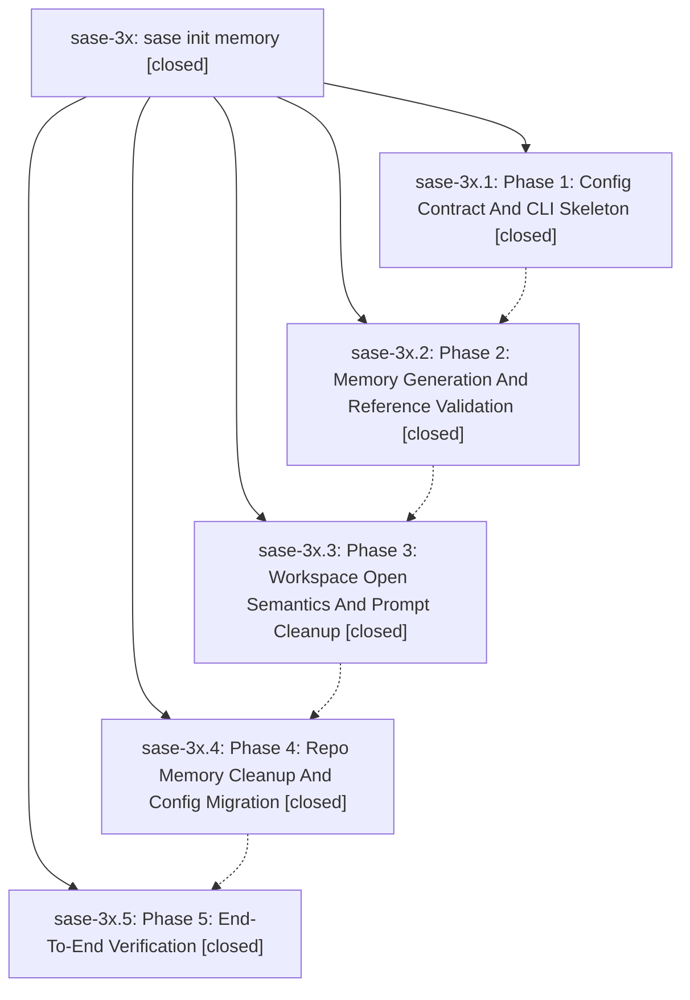

# Bead: sase-3x — sase init memory

[Bead Pages](../README.md) / sase-3x

**Status:** ✓ closed · **Resolution:** (unrecorded) · **Type:** plan · **Tier:** epic
**Owner:** `bryanbugyi34@gmail.com`
**Created:** 2026-05-22 21:56:08 UTC · **Closed:** 2026-05-22 23:08:35 UTC
**Plan:** [202605/init\_memory.md](https://github.com/sase-org/sase--plans/blob/main/202605/init_memory.md)

## Notes

COMMIT: d569d069d

## Phases

| Bead | Title | Status | Size | Agents | Commits |
|---|---|---|---|---:|---:|
| [sase-3x.1](sase-3x.1.md) | Phase 1: Config Contract And CLI Skeleton | ✓ closed | small | 0 | 1 |
| [sase-3x.2](sase-3x.2.md) | Phase 2: Memory Generation And Reference Validation | ✓ closed | small | 0 | 1 |
| [sase-3x.3](sase-3x.3.md) | Phase 3: Workspace Open Semantics And Prompt Cleanup | ✓ closed | small | 0 | 1 |
| [sase-3x.4](sase-3x.4.md) | Phase 4: Repo Memory Cleanup And Config Migration | ✓ closed | small | 0 | 1 |
| [sase-3x.5](sase-3x.5.md) | Phase 5: End-To-End Verification | ✓ closed | small | 0 | 0 |

## Lineage

## Commits

| Commit | Subject | Bead | Committed (UTC) |
|---|---|---|---|
| [`ac90fda`](https://github.com/sase-org/sase/commit/ac90fda1f3822ad66cd3a25386aa63a0dadbb466) | feat: add init memory CLI skeleton (sase-3x.1) | [sase-3x.1](sase-3x.1.md) | 2026-05-22 22:13:37 |
| [`b5c1c57`](https://github.com/sase-org/sase/commit/b5c1c57c4541d715d3fd75ec91ecd56f6c44dc14) | feat: implement init memory generation (sase-3x.2) | [sase-3x.2](sase-3x.2.md) | 2026-05-22 22:25:20 |
| [`b1cca0d`](https://github.com/sase-org/sase/commit/b1cca0d85765051a0f624c2ef05c591f3ab7fb1c) | feat: update workspace open semantics (sase-3x.3) | [sase-3x.3](sase-3x.3.md) | 2026-05-22 22:35:40 |
| [`1291f26`](https://github.com/sase-org/sase/commit/1291f262b0ddbd230bdcffe67db9085f6008ae1e) | chore: clean generated repo memory (sase-3x.4) | [sase-3x.4](sase-3x.4.md) | 2026-05-22 22:49:23 |
