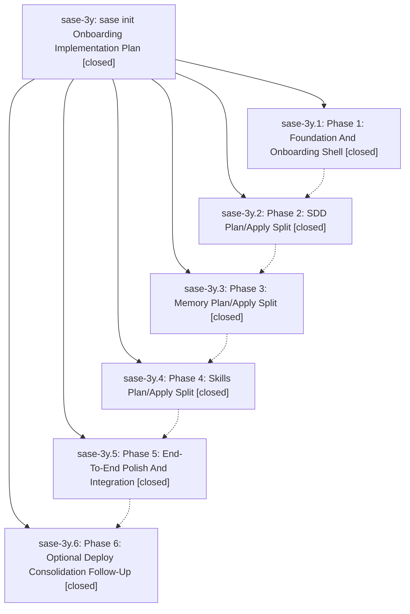

# Bead: sase-3y — sase init Onboarding Implementation Plan

[Bead Pages](../README.md) / sase-3y

**Status:** ✓ closed · **Resolution:** (unrecorded) · **Type:** plan · **Tier:** epic
**Owner:** `bryanbugyi34@gmail.com`
**Created:** 2026-05-23 01:59:37 UTC · **Closed:** 2026-05-23 04:07:48 UTC
**Plan:** [202605/sase\_init\_onboarding.md](https://github.com/sase-org/sase--plans/blob/main/202605/sase_init_onboarding.md)

## Notes

COMMIT: 91668e36e

## Phases

| Bead | Title | Status | Size | Agents | Commits |
|---|---|---|---|---:|---:|
| [sase-3y.1](sase-3y.1.md) | Phase 1: Foundation And Onboarding Shell | ✓ closed | small | 0 | 1 |
| [sase-3y.2](sase-3y.2.md) | Phase 2: SDD Plan/Apply Split | ✓ closed | small | 0 | 1 |
| [sase-3y.3](sase-3y.3.md) | Phase 3: Memory Plan/Apply Split | ✓ closed | small | 0 | 1 |
| [sase-3y.4](sase-3y.4.md) | Phase 4: Skills Plan/Apply Split | ✓ closed | small | 0 | 1 |
| [sase-3y.5](sase-3y.5.md) | Phase 5: End-To-End Polish And Integration | ✓ closed | small | 0 | 1 |
| [sase-3y.6](sase-3y.6.md) | Phase 6: Optional Deploy Consolidation Follow-Up | ✓ closed | small | 0 | 1 |

## Lineage

## Commits

| Commit | Subject | Bead | Committed (UTC) |
|---|---|---|---|
| [`8d45c2f`](https://github.com/sase-org/sase/commit/8d45c2ff275b08e6ee19d4d430f21ad2947f2a22) | feat: add bare init onboarding shell (sase-3y.1) | [sase-3y.1](sase-3y.1.md) | 2026-05-23 02:25:35 |
| [`08ec42e`](https://github.com/sase-org/sase/commit/08ec42ecd6e3c23a968bc60459e39967bf751960) | feat: add SDD init planning (sase-3y.2) | [sase-3y.2](sase-3y.2.md) | 2026-05-23 02:42:15 |
| [`9051116`](https://github.com/sase-org/sase/commit/90511162b3c1a15048a73184ac67e1d76e70095c) | feat: add memory init planning (sase-3y.3) | [sase-3y.3](sase-3y.3.md) | 2026-05-23 03:07:24 |
| [`73efd80`](https://github.com/sase-org/sase/commit/73efd8042f63172ed4043fd8fcb14dd0191ff68d) | feat: add init skills planning (sase-3y.4) | [sase-3y.4](sase-3y.4.md) | 2026-05-23 03:21:03 |
| [`5694ed0`](https://github.com/sase-org/sase/commit/5694ed0aab75b90cb2d37146c6a3ef16bdc7aae4) | feat: polish sase init coordinator (sase-3y.5) | [sase-3y.5](sase-3y.5.md) | 2026-05-23 03:35:05 |
| [`d001777`](https://github.com/sase-org/sase/commit/d001777756d254cbb6374ce853e9464dbead27da) | ref: consolidate init chezmoi deploy handling (sase-3y.6) | [sase-3y.6](sase-3y.6.md) | 2026-05-23 03:57:01 |
