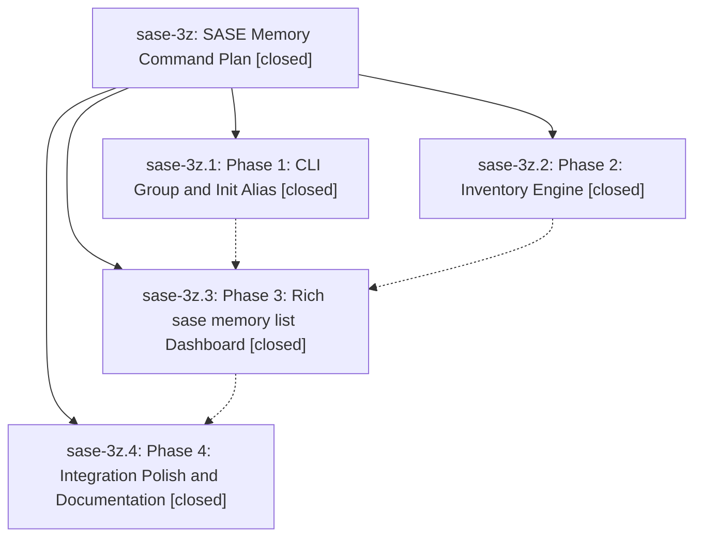

# Bead: sase-3z — SASE Memory Command Plan

[Bead Pages](../README.md) / sase-3z

**Status:** ✓ closed · **Resolution:** (unrecorded) · **Type:** plan · **Tier:** epic
**Owner:** `bryanbugyi34@gmail.com`
**Created:** 2026-05-23 02:26:02 UTC · **Closed:** 2026-05-23 03:46:08 UTC
**Plan:** [202605/memory\_command\_1.md](https://github.com/sase-org/sase--plans/blob/main/202605/memory_command_1.md)

## Notes

COMMIT: 666922635

## Phases

| Bead | Title | Status | Size | Agents | Commits |
|---|---|---|---|---:|---:|
| [sase-3z.1](sase-3z.1.md) | Phase 1: CLI Group and Init Alias | ✓ closed | small | 0 | 1 |
| [sase-3z.2](sase-3z.2.md) | Phase 2: Inventory Engine | ✓ closed | small | 0 | 0 |
| [sase-3z.3](sase-3z.3.md) | Phase 3: Rich sase memory list Dashboard | ✓ closed | small | 0 | 1 |
| [sase-3z.4](sase-3z.4.md) | Phase 4: Integration Polish and Documentation | ✓ closed | small | 0 | 1 |

## Lineage

## Commits

| Commit | Subject | Bead | Committed (UTC) |
|---|---|---|---|
| [`73eac2f`](https://github.com/sase-org/sase/commit/73eac2f14c812aca564bd890ee69761099e4086e) | feat: add memory command CLI shell (sase-3z.1) | [sase-3z.1](sase-3z.1.md) | 2026-05-23 02:55:57 |
| [`19f64b7`](https://github.com/sase-org/sase/commit/19f64b7200735eaaf82b9247001d9b86b9c3f453) | feat: render memory list dashboard (sase-3z.3) | [sase-3z.3](sase-3z.3.md) | 2026-05-23 03:15:09 |
| [`1cd7057`](https://github.com/sase-org/sase/commit/1cd70573c1e69d70d1831c6a4fd00e6415272be3) | feat: polish memory command help and docs (sase-3z.4) | [sase-3z.4](sase-3z.4.md) | 2026-05-23 03:30:47 |
| [`6fe230c`](https://github.com/sase-org/sase/commit/6fe230cdb1d53eb9d7a758652bcf25a0ce99c770) | ref: make memory inventory stats internal (sase-3z) | [sase-3z](README.md) | 2026-05-23 03:46:36 |
