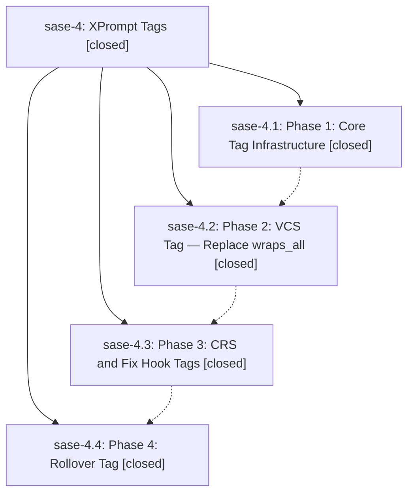

# Bead: sase-4 — XPrompt Tags

[Bead Pages](../README.md) / sase-4

**Status:** ✓ closed · **Resolution:** (unrecorded) · **Type:** plan · **Tier:** epic
**Owner:** `bryanbugyi34@gmail.com`
**Created:** 2026-03-20 02:15:07 UTC · **Closed:** 2026-03-20 03:07:57 UTC
**Plan:** [202603/xprompt\_tags.md](https://github.com/sase-org/sase--plans/blob/main/202603/xprompt_tags.md)

## Phases

| Bead | Title | Status | Size | Agents | Commits |
|---|---|---|---|---:|---:|
| [sase-4.1](sase-4.1.md) | Phase 1: Core Tag Infrastructure | ✓ closed | small | 0 | 1 |
| [sase-4.2](sase-4.2.md) | Phase 2: VCS Tag — Replace wraps\_all | ✓ closed | small | 0 | 1 |
| [sase-4.3](sase-4.3.md) | Phase 3: CRS and Fix Hook Tags | ✓ closed | small | 0 | 1 |
| [sase-4.4](sase-4.4.md) | Phase 4: Rollover Tag | ✓ closed | small | 0 | 2 |

## Lineage

## Commits

| Commit | Subject | Bead | Committed (UTC) |
|---|---|---|---|
| [`b1d3114`](https://github.com/sase-org/sase/commit/b1d311468e896e4346784f4cc4e7b50dc8aa3e5c) | feat: Add xprompt tag system for semantic role-based lookup (sase-4.1) | [sase-4.1](sase-4.1.md) | 2026-03-20 02:37:50 |
| [`8111db0`](https://github.com/sase-org/sase/commit/8111db01f7ce2b3f82daa19b87b7e65d27651e05) | feat: Replace wraps\_all with vcs tag in embedded workflow execution (sase-4.2) | [sase-4.2](sase-4.2.md) | 2026-03-20 02:46:36 |
| [`a013250`](https://github.com/sase-org/sase/commit/a0132507fd4d93354ba43f8759b60b35253436ff) | feat: Replace hardcoded #crs and #fix\_hook xprompt references with tag-based lookup (sase-4.3) | [sase-4.3](sase-4.3.md) | 2026-03-20 02:51:32 |
| [`e1edaf7`](https://github.com/sase-org/sase/commit/e1edaf773d28aca23f7774eef5fe331177401372) | feat: Add rollover tag to file/json xprompts and extend rollover test coverage (sase-4.4) | [sase-4.4](sase-4.4.md) | 2026-03-20 03:04:58 |
| [`63fab73`](https://github.com/sase-org/sase/commit/63fab7393542efe892b169c6e1f996bab021dde0) | fix: Remove duplicate rollover tag check left over from merge (sase-4.4) | [sase-4.4](sase-4.4.md) | 2026-03-20 03:05:30 |
