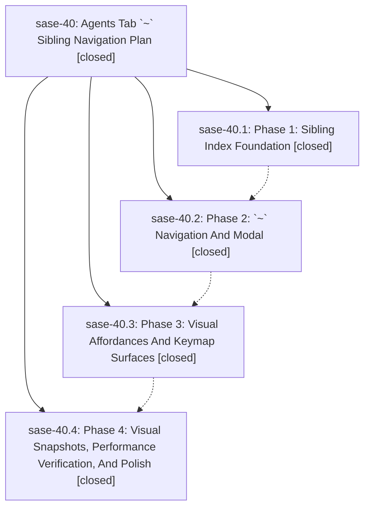

# Bead: sase-40 — Agents Tab \`~\` Sibling Navigation Plan

[Bead Pages](../README.md) / sase-40

**Status:** ✓ closed · **Resolution:** (unrecorded) · **Type:** plan · **Tier:** epic
**Owner:** `bryanbugyi34@gmail.com`
**Created:** 2026-05-23 18:10:50 UTC · **Closed:** 2026-05-23 19:19:55 UTC
**Plan:** [202605/agents\_sibling\_keymap.md](https://github.com/sase-org/sase--plans/blob/main/202605/agents_sibling_keymap.md)

## Notes

COMMIT: 8adbfed42

## Phases

| Bead | Title | Status | Size | Agents | Commits |
|---|---|---|---|---:|---:|
| [sase-40.1](sase-40.1.md) | Phase 1: Sibling Index Foundation | ✓ closed | small | 0 | 1 |
| [sase-40.2](sase-40.2.md) | Phase 2: \`~\` Navigation And Modal | ✓ closed | small | 0 | 1 |
| [sase-40.3](sase-40.3.md) | Phase 3: Visual Affordances And Keymap Surfaces | ✓ closed | small | 0 | 1 |
| [sase-40.4](sase-40.4.md) | Phase 4: Visual Snapshots, Performance Verification, And Polish | ✓ closed | small | 0 | 1 |

## Lineage

## Commits

| Commit | Subject | Bead | Committed (UTC) |
|---|---|---|---|
| [`f30def8`](https://github.com/sase-org/sase/commit/f30def850bd8727b675ad30537e908b5bfd24781) | feat: add agents sibling index foundation (sase-40.1) | [sase-40.1](sase-40.1.md) | 2026-05-23 18:31:40 |
| [`fe6ea4a`](https://github.com/sase-org/sase/commit/fe6ea4a5b4c2ce4c112f489f0c55067ab4e03183) | feat: add Agents tab sibling navigation (sase-40.2) | [sase-40.2](sase-40.2.md) | 2026-05-23 18:46:23 |
| [`8f82426`](https://github.com/sase-org/sase/commit/8f8242680bac2b7e62095a1b8049b8150af650e4) | feat: surface agent sibling navigation affordances (sase-40.3) | [sase-40.3](sase-40.3.md) | 2026-05-23 18:58:14 |
| [`8eed535`](https://github.com/sase-org/sase/commit/8eed5359a5a790edec359729d1a0c6f536d1eb9e) | feat: harden Agents sibling visual coverage (sase-40.4) | [sase-40.4](sase-40.4.md) | 2026-05-23 19:09:50 |
