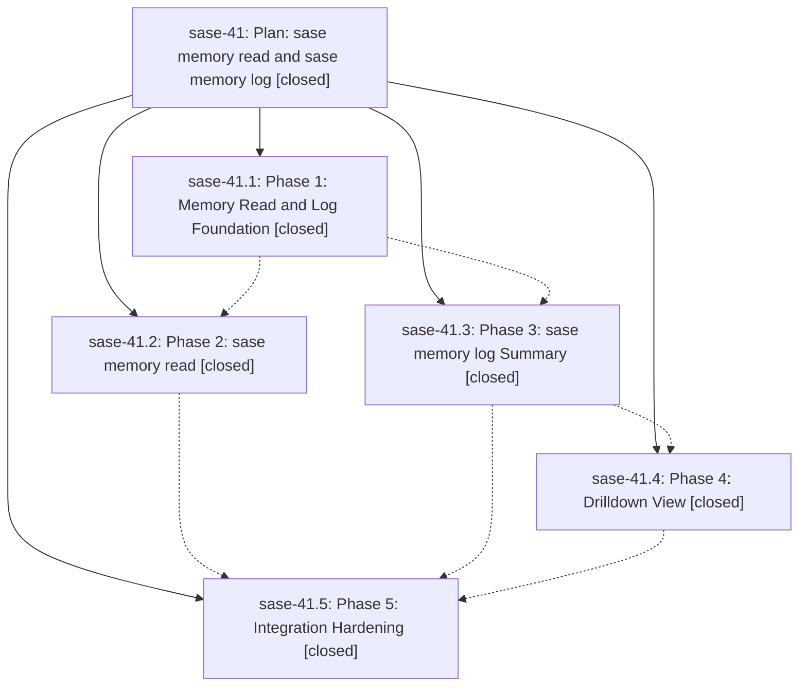

# Bead: sase-41 — Plan: sase memory read and sase memory log

[Bead Pages](../README.md) / sase-41

**Status:** ✓ closed · **Resolution:** (unrecorded) · **Type:** plan · **Tier:** epic
**Owner:** `bryanbugyi34@gmail.com`
**Created:** 2026-05-23 19:14:27 UTC · **Closed:** 2026-05-23 20:31:17 UTC
**Plan:** [202605/memory\_read\_log.md](https://github.com/sase-org/sase--plans/blob/main/202605/memory_read_log.md)

## Notes

COMMIT: de997505e

## Phases

| Bead | Title | Status | Size | Agents | Commits |
|---|---|---|---|---:|---:|
| [sase-41.1](sase-41.1.md) | Phase 1: Memory Read and Log Foundation | ✓ closed | small | 0 | 1 |
| [sase-41.2](sase-41.2.md) | Phase 2: sase memory read | ✓ closed | small | 0 | 1 |
| [sase-41.3](sase-41.3.md) | Phase 3: sase memory log Summary | ✓ closed | small | 0 | 1 |
| [sase-41.4](sase-41.4.md) | Phase 4: Drilldown View | ✓ closed | small | 0 | 1 |
| [sase-41.5](sase-41.5.md) | Phase 5: Integration Hardening | ✓ closed | small | 0 | 1 |

## Lineage

## Commits

| Commit | Subject | Bead | Committed (UTC) |
|---|---|---|---|
| [`039b596`](https://github.com/sase-org/sase/commit/039b59668964208f1a71b91f92654bc62edd6ce9) | feat: add memory read log foundation (sase-41.1) | [sase-41.1](sase-41.1.md) | 2026-05-23 19:41:16 |
| [`0544f6e`](https://github.com/sase-org/sase/commit/0544f6e9f1753948104a5461d5597d844550cf07) | feat: add audited memory read command (sase-41.2) | [sase-41.2](sase-41.2.md) | 2026-05-23 19:50:50 |
| [`e64fb94`](https://github.com/sase-org/sase/commit/e64fb943506e74654b192728f14a9db7465e806f) | feat: add memory log summary command (sase-41.3) | [sase-41.3](sase-41.3.md) | 2026-05-23 19:59:57 |
| [`48229e5`](https://github.com/sase-org/sase/commit/48229e5d12f11e81a4a224537e7f6b1e85ef7b79) | feat: add memory log drilldown views (sase-41.4) | [sase-41.4](sase-41.4.md) | 2026-05-23 20:10:33 |
| [`08ba558`](https://github.com/sase-org/sase/commit/08ba558c4b55224c6896f6e35bf19d4844e06f89) | feat: harden memory read log integration (sase-41.5) | [sase-41.5](sase-41.5.md) | 2026-05-23 20:20:26 |
