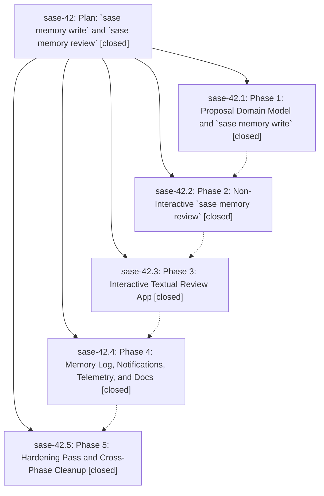

# Bead: sase-42 — Plan: \`sase memory write\` and \`sase memory review\`

[Bead Pages](../README.md) / sase-42

**Status:** ✓ closed · **Resolution:** (unrecorded) · **Type:** plan · **Tier:** epic
**Owner:** `bryanbugyi34@gmail.com`
**Created:** 2026-05-23 22:02:27 UTC · **Closed:** 2026-05-24 00:00:17 UTC
**Plan:** [202605/memory\_write\_review.md](https://github.com/sase-org/sase--plans/blob/main/202605/memory_write_review.md)

## Notes

COMMIT: d06db9437

## Phases

| Bead | Title | Status | Size | Agents | Commits |
|---|---|---|---|---:|---:|
| [sase-42.1](sase-42.1.md) | Phase 1: Proposal Domain Model and \`sase memory write\` | ✓ closed | small | 0 | 1 |
| [sase-42.2](sase-42.2.md) | Phase 2: Non-Interactive \`sase memory review\` | ✓ closed | small | 0 | 1 |
| [sase-42.3](sase-42.3.md) | Phase 3: Interactive Textual Review App | ✓ closed | small | 0 | 1 |
| [sase-42.4](sase-42.4.md) | Phase 4: Memory Log, Notifications, Telemetry, and Docs | ✓ closed | small | 0 | 1 |
| [sase-42.5](sase-42.5.md) | Phase 5: Hardening Pass and Cross-Phase Cleanup | ✓ closed | small | 0 | 1 |

## Lineage

## Commits

| Commit | Subject | Bead | Committed (UTC) |
|---|---|---|---|
| [`8c0bafe`](https://github.com/sase-org/sase/commit/8c0bafec8902bebd0135a1e70f02fcdcfd59bc46) | feat: add memory proposal write flow (sase-42.1) | [sase-42.1](sase-42.1.md) | 2026-05-23 22:36:58 |
| [`5847cae`](https://github.com/sase-org/sase/commit/5847caea7146a3fe236faffe97cb201fdb1e3a81) | feat: add non-interactive memory review CLI (sase-42.2) | [sase-42.2](sase-42.2.md) | 2026-05-23 22:55:15 |
| [`5b84418`](https://github.com/sase-org/sase/commit/5b844183a2fd2af588e7e60be21f670a179a3e44) | feat(memory): add interactive review TUI (sase-42.3) | [sase-42.3](sase-42.3.md) | 2026-05-23 23:11:11 |
| [`c049bc9`](https://github.com/sase-org/sase/commit/c049bc95a2d6df8e3b887fc8ccbd0c02dc68108b) | feat: add memory proposal audit notifications (sase-42.4) | [sase-42.4](sase-42.4.md) | 2026-05-23 23:34:16 |
| [`45b55d5`](https://github.com/sase-org/sase/commit/45b55d50b9b7377acbc3b140fa8f644e49c5b7fc) | fix: harden memory review and stdin writes (sase-42.5) | [sase-42.5](sase-42.5.md) | 2026-05-23 23:50:03 |
