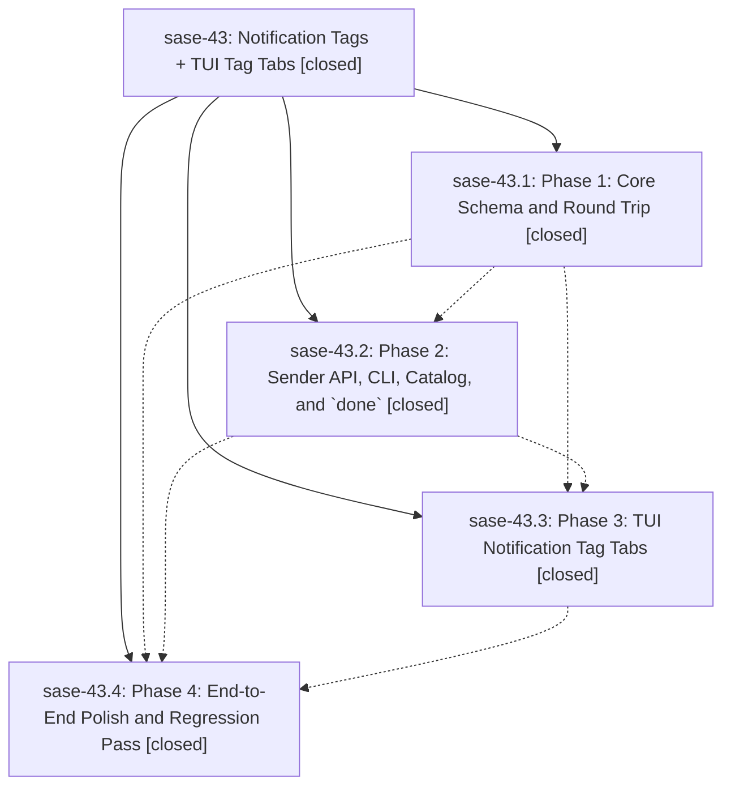

# Bead: sase-43 — Notification Tags + TUI Tag Tabs

[Bead Pages](../README.md) / sase-43

**Status:** ✓ closed · **Resolution:** (unrecorded) · **Type:** plan · **Tier:** epic
**Owner:** `bryanbugyi34@gmail.com`
**Created:** 2026-05-24 00:11:15 UTC · **Closed:** 2026-05-24 01:23:53 UTC
**Plan:** [202605/notification\_tags.md](https://github.com/sase-org/sase--plans/blob/main/202605/notification_tags.md)

## Notes

COMMIT: f0f8d3fb9

## Phases

| Bead | Title | Status | Size | Agents | Commits |
|---|---|---|---|---:|---:|
| [sase-43.1](sase-43.1.md) | Phase 1: Core Schema and Round Trip | ✓ closed | small | 0 | 1 |
| [sase-43.2](sase-43.2.md) | Phase 2: Sender API, CLI, Catalog, and \`done\` | ✓ closed | small | 0 | 1 |
| [sase-43.3](sase-43.3.md) | Phase 3: TUI Notification Tag Tabs | ✓ closed | small | 0 | 1 |
| [sase-43.4](sase-43.4.md) | Phase 4: End-to-End Polish and Regression Pass | ✓ closed | small | 0 | 1 |

## Lineage

## Commits

| Commit | Subject | Bead | Committed (UTC) |
|---|---|---|---|
| [`3eeb913`](https://github.com/sase-org/sase/commit/3eeb913542d583b3bc77e6bc45a99dcc02f55e51) | feat: add notification tag schema support (sase-43.1) | [sase-43.1](sase-43.1.md) | 2026-05-24 00:33:50 |
| [`59aea97`](https://github.com/sase-org/sase/commit/59aea97573129b94f251e332d83d5a7b294d2e2b) | feat: add notification tag CLI support (sase-43.2) | [sase-43.2](sase-43.2.md) | 2026-05-24 00:47:37 |
| [`5604bca`](https://github.com/sase-org/sase/commit/5604bcaa86a9f0d6f14d31a590774a7b3e1ca74e) | feat: add notification modal tag tabs (sase-43.3) | [sase-43.3](sase-43.3.md) | 2026-05-24 00:59:44 |
| [`4222fda`](https://github.com/sase-org/sase/commit/4222fda2c7346b778836c44605ee5d3b4036a959) | fix: keep done acknowledgements completion-scoped (sase-43.4) | [sase-43.4](sase-43.4.md) | 2026-05-24 01:12:36 |
