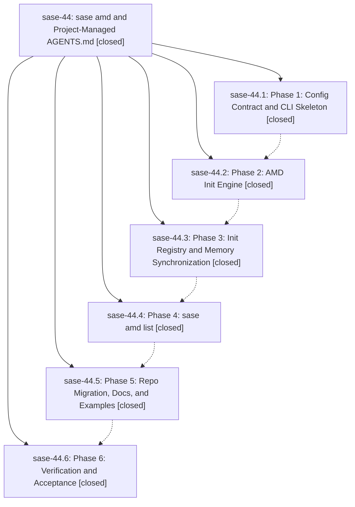

# Bead: sase-44 — sase amd and Project-Managed AGENTS.md

[Bead Pages](../README.md) / sase-44

**Status:** ✓ closed · **Resolution:** (unrecorded) · **Type:** plan · **Tier:** epic
**Owner:** `bryanbugyi34@gmail.com`
**Created:** 2026-05-24 21:52:40 UTC · **Closed:** 2026-05-24 23:33:31 UTC
**Plan:** [202605/amd\_command.md](https://github.com/sase-org/sase--plans/blob/main/202605/amd_command.md)

## Notes

COMMIT: 361b4b467

## Phases

| Bead | Title | Status | Size | Agents | Commits |
|---|---|---|---|---:|---:|
| [sase-44.1](sase-44.1.md) | Phase 1: Config Contract and CLI Skeleton | ✓ closed | small | 1 | 1 |
| [sase-44.2](sase-44.2.md) | Phase 2: AMD Init Engine | ✓ closed | small | 1 | 1 |
| [sase-44.3](sase-44.3.md) | Phase 3: Init Registry and Memory Synchronization | ✓ closed | small | 1 | 1 |
| [sase-44.4](sase-44.4.md) | Phase 4: sase amd list | ✓ closed | small | 1 | 1 |
| [sase-44.5](sase-44.5.md) | Phase 5: Repo Migration, Docs, and Examples | ✓ closed | small | 1 | 1 |
| [sase-44.6](sase-44.6.md) | Phase 6: Verification and Acceptance | ✓ closed | small | 0 | 0 |

## Lineage

## Agents

| Agent | Bead | Commits |
|---|---|---:|
| [bbugyi200.athena.sase-44.1](https://github.com/sase-org/sase--agents/blob/main/agents/bbugyi200.athena.sase-44.1/README.md) | [sase-44.1](sase-44.1.md) | 1 |
| [bbugyi200.athena.sase-44.2](https://github.com/sase-org/sase--agents/blob/main/agents/bbugyi200.athena.sase-44.2/README.md) | [sase-44.2](sase-44.2.md) | 1 |
| [bbugyi200.athena.sase-44.3](https://github.com/sase-org/sase--agents/blob/main/agents/bbugyi200.athena.sase-44.3/README.md) | [sase-44.3](sase-44.3.md) | 1 |
| [bbugyi200.athena.sase-44.4](https://github.com/sase-org/sase--agents/blob/main/agents/bbugyi200.athena.sase-44.4/README.md) | [sase-44.4](sase-44.4.md) | 1 |
| [bbugyi200.athena.sase-44.5](https://github.com/sase-org/sase--agents/blob/main/agents/bbugyi200.athena.sase-44.5/README.md) | [sase-44.5](sase-44.5.md) | 1 |

## Commits

| Commit | Subject | Bead | Committed (UTC) |
|---|---|---|---|
| [`5a07052`](https://github.com/sase-org/sase/commit/5a0705214207a9b7ebe17fac0828de93dd8c858d) | feat: add AMD CLI skeleton (sase-44.1) | [sase-44.1](sase-44.1.md) | 2026-05-24 22:15:29 |
| [`da42489`](https://github.com/sase-org/sase/commit/da4248906b3cdc08c445c972ea91b4e978551976) | feat: implement AMD init engine (sase-44.2) | [sase-44.2](sase-44.2.md) | 2026-05-24 22:30:40 |
| [`5e92e2f`](https://github.com/sase-org/sase/commit/5e92e2fc30bcaac1f3293ea8a496ba50dae8199d) | feat: sync AMD-managed instructions during memory init (sase-44.3) | [sase-44.3](sase-44.3.md) | 2026-05-24 22:46:33 |
| [`5ba2242`](https://github.com/sase-org/sase/commit/5ba2242b2f4cd16893b8995db0f4e98c0c91340a) | feat: add AMD inventory listing (sase-44.4) | [sase-44.4](sase-44.4.md) | 2026-05-24 23:01:10 |
| [`98784db`](https://github.com/sase-org/sase/commit/98784db6dd885f45792e6537f2ba973bb96e3f5e) | feat: enable AMD-managed project instructions (sase-44.5) | [sase-44.5](sase-44.5.md) | 2026-05-24 23:13:46 |
