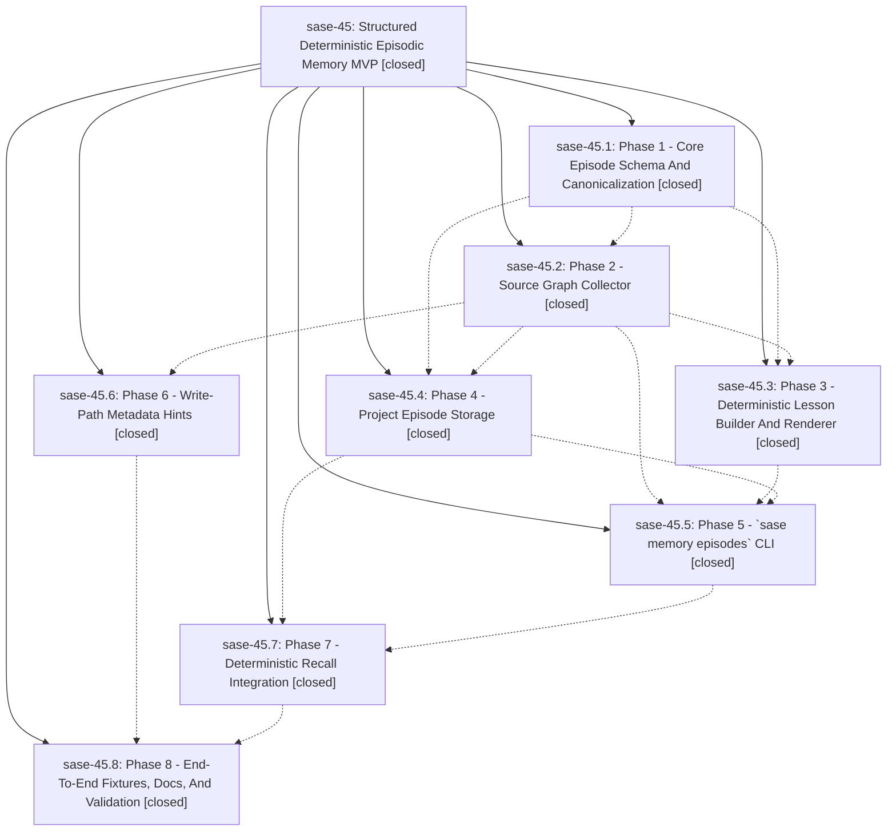

# Bead: sase-45 — Structured Deterministic Episodic Memory MVP

[Bead Pages](../README.md) / sase-45

**Status:** ✓ closed · **Resolution:** (unrecorded) · **Type:** plan · **Tier:** epic
**Owner:** `bryanbugyi34@gmail.com`
**Created:** 2026-05-26 22:34:14 UTC · **Closed:** 2026-05-27 01:36:13 UTC
**Plan:** [202605/structured\_episodic\_memory\_mvp.md](https://github.com/sase-org/sase--plans/blob/main/202605/structured_episodic_memory_mvp.md)

## Notes

COMMIT: c04475582

[2026-07-27T19:06:32Z · sase-a1.6] [2026-05-27T01:24:27Z · bryanbugyi34@gmail.com] (restored 2026-07-27) COMMIT: 25b876458

[2026-07-27T19:06:36Z · sase-a1.6] [2026-05-27T01:26:54Z · bryanbugyi34@gmail.com] (restored 2026-07-27) COMMIT: 211e4b8b6

## Phases

| Bead | Title | Status | Size | Agents | Commits |
|---|---|---|---|---:|---:|
| [sase-45.1](sase-45.1.md) | Phase 1 - Core Episode Schema And Canonicalization | ✓ closed | small | 1 | 2 |
| [sase-45.2](sase-45.2.md) | Phase 2 - Source Graph Collector | ✓ closed | small | 1 | 1 |
| [sase-45.3](sase-45.3.md) | Phase 3 - Deterministic Lesson Builder And Renderer | ✓ closed | small | 1 | 1 |
| [sase-45.4](sase-45.4.md) | Phase 4 - Project Episode Storage | ✓ closed | small | 1 | 1 |
| [sase-45.5](sase-45.5.md) | Phase 5 - \`sase memory episodes\` CLI | ✓ closed | small | 1 | 1 |
| [sase-45.6](sase-45.6.md) | Phase 6 - Write-Path Metadata Hints | ✓ closed | small | 1 | 1 |
| [sase-45.7](sase-45.7.md) | Phase 7 - Deterministic Recall Integration | ✓ closed | small | 1 | 1 |
| [sase-45.8](sase-45.8.md) | Phase 8 - End-To-End Fixtures, Docs, And Validation | ✓ closed | small | 1 | 1 |

## Lineage

## Agents

| Agent | Bead | Commits |
|---|---|---:|
| [bbugyi200.athena.sase-45](https://github.com/sase-org/sase--agents/blob/main/agents/bbugyi200.athena.sase-45/README.md) | [sase-45](README.md) | 3 |
| [bbugyi200.athena.sase-45.1](https://github.com/sase-org/sase--agents/blob/main/agents/bbugyi200.athena.sase-45.1/README.md) | [sase-45.1](sase-45.1.md) | 2 |
| [bbugyi200.athena.sase-45.2](https://github.com/sase-org/sase--agents/blob/main/agents/bbugyi200.athena.sase-45.2/README.md) | [sase-45.2](sase-45.2.md) | 1 |
| [bbugyi200.athena.sase-45.3](https://github.com/sase-org/sase--agents/blob/main/agents/bbugyi200.athena.sase-45.3/README.md) | [sase-45.3](sase-45.3.md) | 1 |
| [bbugyi200.athena.sase-45.4](https://github.com/sase-org/sase--agents/blob/main/agents/bbugyi200.athena.sase-45.4/README.md) | [sase-45.4](sase-45.4.md) | 1 |
| [bbugyi200.athena.sase-45.5](https://github.com/sase-org/sase--agents/blob/main/agents/bbugyi200.athena.sase-45.5/README.md) | [sase-45.5](sase-45.5.md) | 1 |
| [bbugyi200.athena.sase-45.6](https://github.com/sase-org/sase--agents/blob/main/agents/bbugyi200.athena.sase-45.6/README.md) | [sase-45.6](sase-45.6.md) | 1 |
| [bbugyi200.athena.sase-45.7](https://github.com/sase-org/sase--agents/blob/main/agents/bbugyi200.athena.sase-45.7/README.md) | [sase-45.7](sase-45.7.md) | 1 |
| [bbugyi200.athena.sase-45.8](https://github.com/sase-org/sase--agents/blob/main/agents/bbugyi200.athena.sase-45.8/README.md) | [sase-45.8](sase-45.8.md) | 1 |

## Commits

| Commit | Subject | Bead | Committed (UTC) |
|---|---|---|---|
| [`sase-core@b592f51`](https://github.com/sase-org/sase-core/commit/b592f51350fc80e35b8f00f8f106105eb5bb8a80) | feat: add episode wire schema (sase-45.1) | [sase-45.1](sase-45.1.md) | 2026-05-26 23:04:31 |
| [`5b208d3`](https://github.com/sase-org/sase/commit/5b208d36d6feb99c14dad2464ecb31158a4c3a7e) | feat: add Python episode wire facade (sase-45.1) | [sase-45.1](sase-45.1.md) | 2026-05-26 23:08:54 |
| [`bd40316`](https://github.com/sase-org/sase/commit/bd4031677efd4cd34447086875f19032f8dd1bf7) | feat: add deterministic episode source graph collector (sase-45.2) | [sase-45.2](sase-45.2.md) | 2026-05-26 23:35:58 |
| [`aa66d3f`](https://github.com/sase-org/sase/commit/aa66d3f5c307b5ac398ba59bd6f670d9b1f9d4f7) | feat: add episode trace hints for agent artifacts (sase-45.6) | [sase-45.6](sase-45.6.md) | 2026-05-26 23:57:51 |
| [`49294ff`](https://github.com/sase-org/sase/commit/49294ff71432c54d99919e6e894f491826241297) | feat: add project episode storage (sase-45.4) | [sase-45.4](sase-45.4.md) | 2026-05-27 00:00:49 |
| [`2732b9c`](https://github.com/sase-org/sase/commit/2732b9cf0dd0218c5b0932d5361f0703351863a9) | feat: add deterministic episode lesson builder (sase-45.3) | [sase-45.3](sase-45.3.md) | 2026-05-27 00:08:05 |
| [`82f735c`](https://github.com/sase-org/sase/commit/82f735c90959439ae91cc3e1c684888201ce52b4) | feat(memory): add episodic memory CLI (sase-45.5) | [sase-45.5](sase-45.5.md) | 2026-05-27 00:31:48 |
| [`7377ec8`](https://github.com/sase-org/sase/commit/7377ec8e661280f55ea1f85f40ddefd8167c3cd4) | feat: add deterministic episodic recall integration (sase-45.7) | [sase-45.7](sase-45.7.md) | 2026-05-27 00:52:21 |
| [`fb950c2`](https://github.com/sase-org/sase/commit/fb950c283572b3985bd66d6efa42dcb07e4a40a9) | feat: add memory episode e2e coverage and docs (sase-45.8) | [sase-45.8](sase-45.8.md) | 2026-05-27 01:12:06 |
| [`aee775e`](https://github.com/sase-org/sase/commit/aee775e9248e725a30297127ece7a7930b905e95) | chore: close structured episodic memory epic (sase-45) | [sase-45](README.md) | 2026-05-27 01:24:38 |
| [`05b1470`](https://github.com/sase-org/sase/commit/05b147024ee81b19a7b45bf67b2f82f0b65c9a66) | chore: Add SDD prompt and plan for sase45\_pyvision\_cleanup (sase-45) | [sase-45](README.md) | 2026-05-27 01:27:03 |
| [`5299857`](https://github.com/sase-org/sase/commit/529985798864533aea701e78fa9553ba85b2c032) | feat(memory): expose episode build wire payloads (sase-45) | [sase-45](README.md) | 2026-05-27 01:36:39 |
