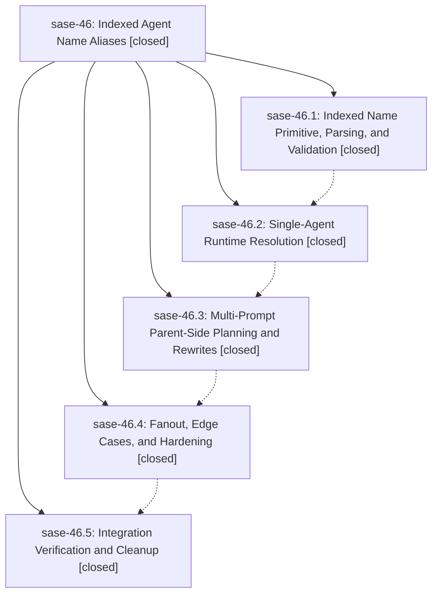

# Bead: sase-46 — Indexed Agent Name Aliases

[Bead Pages](../README.md) / sase-46

**Status:** ✓ closed · **Resolution:** (unrecorded) · **Type:** plan · **Tier:** epic
**Owner:** `bryanbugyi34@gmail.com`
**Created:** 2026-05-27 14:54:49 UTC · **Closed:** 2026-05-27 17:22:08 UTC
**Plan:** [202605/indexed\_agent\_names.md](https://github.com/sase-org/sase--plans/blob/main/202605/indexed_agent_names.md)

## Notes

COMMIT: 483dcab9a

## Phases

| Bead | Title | Status | Size | Agents | Commits |
|---|---|---|---|---:|---:|
| [sase-46.1](sase-46.1.md) | Indexed Name Primitive, Parsing, and Validation | ✓ closed | small | 1 | 1 |
| [sase-46.2](sase-46.2.md) | Single-Agent Runtime Resolution | ✓ closed | small | 1 | 1 |
| [sase-46.3](sase-46.3.md) | Multi-Prompt Parent-Side Planning and Rewrites | ✓ closed | small | 1 | 1 |
| [sase-46.4](sase-46.4.md) | Fanout, Edge Cases, and Hardening | ✓ closed | small | 1 | 1 |
| [sase-46.5](sase-46.5.md) | Integration Verification and Cleanup | ✓ closed | small | 0 | 0 |

## Lineage

## Agents

| Agent | Bead | Commits |
|---|---|---:|
| [bbugyi200.athena.sase-46.1](https://github.com/sase-org/sase--agents/blob/main/agents/bbugyi200.athena.sase-46.1/README.md) | [sase-46.1](sase-46.1.md) | 1 |
| [bbugyi200.athena.sase-46.2](https://github.com/sase-org/sase--agents/blob/main/agents/bbugyi200.athena.sase-46.2/README.md) | [sase-46.2](sase-46.2.md) | 1 |
| [bbugyi200.athena.sase-46.3](https://github.com/sase-org/sase--agents/blob/main/agents/bbugyi200.athena.sase-46.3/README.md) | [sase-46.3](sase-46.3.md) | 1 |
| [bbugyi200.athena.sase-46.4](https://github.com/sase-org/sase--agents/blob/main/agents/bbugyi200.athena.sase-46.4/README.md) | [sase-46.4](sase-46.4.md) | 1 |

## Commits

| Commit | Subject | Bead | Committed (UTC) |
|---|---|---|---|
| [`74f1042`](https://github.com/sase-org/sase/commit/74f104265028c81c27b8c0090fb38131c977a74b) | feat: add indexed agent name template parsing (sase-46.1) | [sase-46.1](sase-46.1.md) | 2026-05-27 15:19:27 |
| [`7722d31`](https://github.com/sase-org/sase/commit/7722d31450ee10f5d1263d9a107733b159b8c3a3) | feat: resolve indexed names in single-agent runtime (sase-46.2) | [sase-46.2](sase-46.2.md) | 2026-05-27 15:37:24 |
| [`7ee8e4e`](https://github.com/sase-org/sase/commit/7ee8e4e31fd7468528a5ce2a10a1069506ae8719) | feat: plan indexed names across multi-prompt launches (sase-46.3) | [sase-46.3](sase-46.3.md) | 2026-05-27 15:56:57 |
| [`dd58aa7`](https://github.com/sase-org/sase/commit/dd58aa71dacef87931075309a092fc94e2388092) | fix: harden indexed name fanout handling (sase-46.4) | [sase-46.4](sase-46.4.md) | 2026-05-27 16:13:20 |
