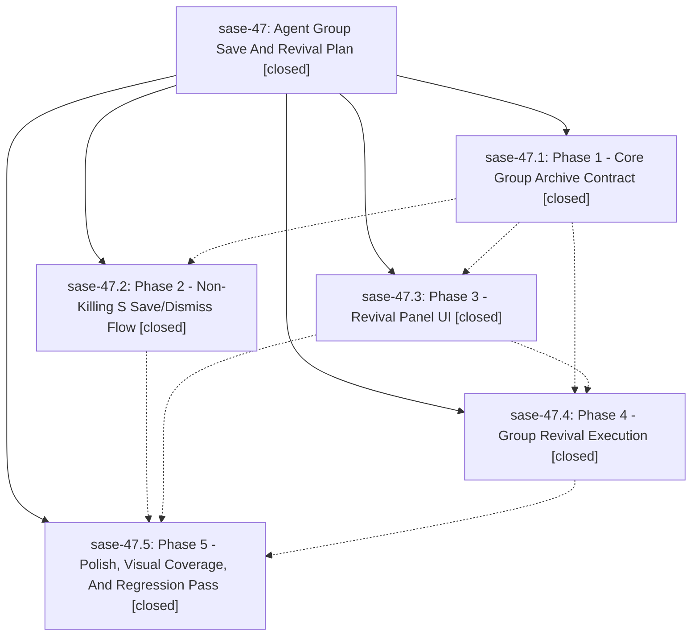

# Bead: sase-47 — Agent Group Save And Revival Plan

[Bead Pages](../README.md) / sase-47

**Status:** ✓ closed · **Resolution:** (unrecorded) · **Type:** plan · **Tier:** epic
**Owner:** `bryanbugyi34@gmail.com`
**Created:** 2026-05-27 15:53:35 UTC · **Closed:** 2026-05-27 17:54:36 UTC
**Plan:** [202605/agent\_group\_revival.md](https://github.com/sase-org/sase--plans/blob/main/202605/agent_group_revival.md)

## Notes

COMMIT: bd23967fe

## Phases

| Bead | Title | Status | Size | Agents | Commits |
|---|---|---|---|---:|---:|
| [sase-47.1](sase-47.1.md) | Phase 1 - Core Group Archive Contract | ✓ closed | small | 1 | 2 |
| [sase-47.2](sase-47.2.md) | Phase 2 - Non-Killing S Save/Dismiss Flow | ✓ closed | small | 1 | 1 |
| [sase-47.3](sase-47.3.md) | Phase 3 - Revival Panel UI | ✓ closed | small | 1 | 1 |
| [sase-47.4](sase-47.4.md) | Phase 4 - Group Revival Execution | ✓ closed | small | 1 | 1 |
| [sase-47.5](sase-47.5.md) | Phase 5 - Polish, Visual Coverage, And Regression Pass | ✓ closed | small | 1 | 1 |

## Lineage

## Agents

| Agent | Bead | Commits |
|---|---|---:|
| [bbugyi200.athena.sase-47.1](https://github.com/sase-org/sase--agents/blob/main/agents/bbugyi200.athena.sase-47.1/README.md) | [sase-47.1](sase-47.1.md) | 2 |
| [bbugyi200.athena.sase-47.2](https://github.com/sase-org/sase--agents/blob/main/agents/bbugyi200.athena.sase-47.2/README.md) | [sase-47.2](sase-47.2.md) | 1 |
| [bbugyi200.athena.sase-47.3](https://github.com/sase-org/sase--agents/blob/main/agents/bbugyi200.athena.sase-47.3/README.md) | [sase-47.3](sase-47.3.md) | 1 |
| [bbugyi200.athena.sase-47.4](https://github.com/sase-org/sase--agents/blob/main/agents/bbugyi200.athena.sase-47.4/README.md) | [sase-47.4](sase-47.4.md) | 1 |
| [bbugyi200.athena.sase-47.5](https://github.com/sase-org/sase--agents/blob/main/agents/bbugyi200.athena.sase-47.5/README.md) | [sase-47.5](sase-47.5.md) | 1 |

## Commits

| Commit | Subject | Bead | Committed (UTC) |
|---|---|---|---|
| [`sase-core@bb1c26a`](https://github.com/sase-org/sase-core/commit/bb1c26a3829bc49edf6ec43b4fc458c0246304b6) | feat: add saved agent group archive backend (sase-47.1) | [sase-47.1](sase-47.1.md) | 2026-05-27 16:25:20 |
| [`c598016`](https://github.com/sase-org/sase/commit/c598016e7402de0348e8ceab6935c9008af8da4d) | feat: add saved dismissed-agent group facade (sase-47.1) | [sase-47.1](sase-47.1.md) | 2026-05-27 16:30:37 |
| [`5d20c67`](https://github.com/sase-org/sase/commit/5d20c67579a30de947d43b35619594f74554b05f) | feat: add non-killing agent group save flow (sase-47.2) | [sase-47.2](sase-47.2.md) | 2026-05-27 16:56:03 |
| [`566f400`](https://github.com/sase-org/sase/commit/566f4000e4b86bbb02a26403dcc205b996e64052) | feat: add saved agent group revival panel (sase-47.3) | [sase-47.3](sase-47.3.md) | 2026-05-27 17:08:15 |
| [`95be995`](https://github.com/sase-org/sase/commit/95be995801991946cab61d03546d93c8895e6b07) | feat: revive saved agent groups (sase-47.4) | [sase-47.4](sase-47.4.md) | 2026-05-27 17:28:44 |
| [`e416320`](https://github.com/sase-org/sase/commit/e416320f42bfa704c36286d7f424da3231ad42f9) | feat: complete saved agent group revival polish (sase-47.5) | [sase-47.5](sase-47.5.md) | 2026-05-27 17:43:50 |
