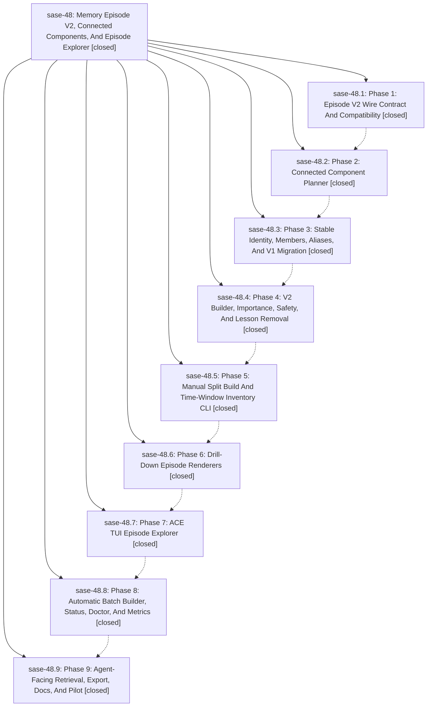

# Bead: sase-48 — Memory Episode V2, Connected Components, And Episode Explorer

[Bead Pages](../README.md) / sase-48

**Status:** ✓ closed · **Resolution:** (unrecorded) · **Type:** plan · **Tier:** epic
**Owner:** `bryanbugyi34@gmail.com`
**Created:** 2026-05-28 21:17:36 UTC · **Closed:** 2026-05-29 00:39:16 UTC
**Plan:** [202605/episode\_v2\_explorer.md](https://github.com/sase-org/sase--plans/blob/main/202605/episode_v2_explorer.md)

## Notes

COMMIT: 392f62c85

## Phases

| Bead | Title | Status | Size | Agents | Commits |
|---|---|---|---|---:|---:|
| [sase-48.1](sase-48.1.md) | Phase 1: Episode V2 Wire Contract And Compatibility | ✓ closed | small | 1 | 2 |
| [sase-48.2](sase-48.2.md) | Phase 2: Connected Component Planner | ✓ closed | small | 1 | 1 |
| [sase-48.3](sase-48.3.md) | Phase 3: Stable Identity, Members, Aliases, And V1 Migration | ✓ closed | small | 1 | 1 |
| [sase-48.4](sase-48.4.md) | Phase 4: V2 Builder, Importance, Safety, And Lesson Removal | ✓ closed | small | 1 | 1 |
| [sase-48.5](sase-48.5.md) | Phase 5: Manual Split Build And Time-Window Inventory CLI | ✓ closed | small | 1 | 2 |
| [sase-48.6](sase-48.6.md) | Phase 6: Drill-Down Episode Renderers | ✓ closed | small | 1 | 1 |
| [sase-48.7](sase-48.7.md) | Phase 7: ACE TUI Episode Explorer | ✓ closed | small | 1 | 1 |
| [sase-48.8](sase-48.8.md) | Phase 8: Automatic Batch Builder, Status, Doctor, And Metrics | ✓ closed | small | 1 | 1 |
| [sase-48.9](sase-48.9.md) | Phase 9: Agent-Facing Retrieval, Export, Docs, And Pilot | ✓ closed | small | 1 | 1 |

## Lineage

## Agents

| Agent | Bead | Commits |
|---|---|---:|
| [bbugyi200.athena.sase-48.1](https://github.com/sase-org/sase--agents/blob/main/agents/bbugyi200.athena.sase-48.1/README.md) | [sase-48.1](sase-48.1.md) | 2 |
| [bbugyi200.athena.sase-48.2](https://github.com/sase-org/sase--agents/blob/main/agents/bbugyi200.athena.sase-48.2/README.md) | [sase-48.2](sase-48.2.md) | 1 |
| [bbugyi200.athena.sase-48.3](https://github.com/sase-org/sase--agents/blob/main/agents/bbugyi200.athena.sase-48.3/README.md) | [sase-48.3](sase-48.3.md) | 1 |
| [bbugyi200.athena.sase-48.4](https://github.com/sase-org/sase--agents/blob/main/agents/bbugyi200.athena.sase-48.4/README.md) | [sase-48.4](sase-48.4.md) | 1 |
| [bbugyi200.athena.sase-48.5](https://github.com/sase-org/sase--agents/blob/main/agents/bbugyi200.athena.sase-48.5/README.md) | [sase-48.5](sase-48.5.md) | 2 |
| [bbugyi200.athena.sase-48.6](https://github.com/sase-org/sase--agents/blob/main/agents/bbugyi200.athena.sase-48.6/README.md) | [sase-48.6](sase-48.6.md) | 1 |
| [bbugyi200.athena.sase-48.7](https://github.com/sase-org/sase--agents/blob/main/agents/bbugyi200.athena.sase-48.7/README.md) | [sase-48.7](sase-48.7.md) | 1 |
| [bbugyi200.athena.sase-48.8](https://github.com/sase-org/sase--agents/blob/main/agents/bbugyi200.athena.sase-48.8/README.md) | [sase-48.8](sase-48.8.md) | 1 |
| [bbugyi200.athena.sase-48.9](https://github.com/sase-org/sase--agents/blob/main/agents/bbugyi200.athena.sase-48.9/README.md) | [sase-48.9](sase-48.9.md) | 1 |

## Commits

| Commit | Subject | Bead | Committed (UTC) |
|---|---|---|---|
| [`sase-core@123f0a7`](https://github.com/sase-org/sase-core/commit/123f0a7c135ae2cdcbf1302e49dd2268b3566e18) | feat: add episode v2 wire contract (sase-48.1) | [sase-48.1](sase-48.1.md) | 2026-05-28 21:43:41 |
| [`0107212`](https://github.com/sase-org/sase/commit/010721231e4966efffc9d8cbdacc2fef9012ccb5) | feat: add episode v2 Python wire compatibility (sase-48.1) | [sase-48.1](sase-48.1.md) | 2026-05-28 21:48:42 |
| [`df403f3`](https://github.com/sase-org/sase/commit/df403f3c873bc19846a2606db21bc7c497cdfa9c) | feat: add episode component planner (sase-48.2) | [sase-48.2](sase-48.2.md) | 2026-05-28 22:05:57 |
| [`15395ac`](https://github.com/sase-org/sase/commit/15395acd7f755f23386d148b9820066bf43a8cd4) | feat: add stable episode identity aliases (sase-48.3) | [sase-48.3](sase-48.3.md) | 2026-05-28 22:25:13 |
| [`73094ca`](https://github.com/sase-org/sase/commit/73094ca3ccdaa9ecd13b7d653bd03367601cf88f) | feat: add v2 episode importance and safety records (sase-48.4) | [sase-48.4](sase-48.4.md) | 2026-05-28 22:39:24 |
| [`sase-core@a45f14d`](https://github.com/sase-org/sase-core/commit/a45f14d0f8f377e2e2ea0ee782ca29a276b6cd8b) | fix: allow signed episode importance factors (sase-48.5) | [sase-48.5](sase-48.5.md) | 2026-05-28 22:59:47 |
| [`b9661ef`](https://github.com/sase-org/sase/commit/b9661efc4cc7623f017d1f5d911ac87bfb9646f4) | feat: add split episode build and inventory CLI (sase-48.5) | [sase-48.5](sase-48.5.md) | 2026-05-28 23:00:54 |
| [`32ca211`](https://github.com/sase-org/sase/commit/32ca21158dadaafdac5f0febbbf354bc4c98c649) | feat: add episode drill-down renderers (sase-48.6) | [sase-48.6](sase-48.6.md) | 2026-05-28 23:15:26 |
| [`d1a2da6`](https://github.com/sase-org/sase/commit/d1a2da6e3849d656b9e197ba15c7301e71c41964) | feat: add ACE episode explorer (sase-48.7) | [sase-48.7](sase-48.7.md) | 2026-05-28 23:40:21 |
| [`e24bfad`](https://github.com/sase-org/sase/commit/e24bfadd7b5484a2f7e3a9713d0d43f0c1be297f) | feat: add automatic memory episode builder (sase-48.8) | [sase-48.8](sase-48.8.md) | 2026-05-29 00:08:47 |
| [`44077a6`](https://github.com/sase-org/sase/commit/44077a6dfb8a97f069ced3536e0b66126f587ce6) | feat: add episode evidence recall export (sase-48.9) | [sase-48.9](sase-48.9.md) | 2026-05-29 00:28:47 |
