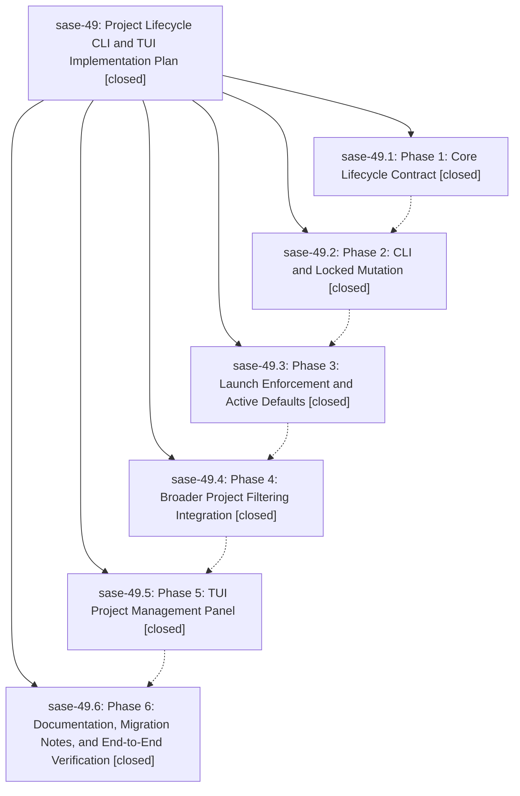

# Bead: sase-49 — Project Lifecycle CLI and TUI Implementation Plan

[Bead Pages](../README.md) / sase-49

**Status:** ✓ closed · **Resolution:** (unrecorded) · **Type:** plan · **Tier:** epic
**Owner:** `bryanbugyi34@gmail.com`
**Created:** 2026-06-01 16:39:25 UTC · **Closed:** 2026-06-01 18:58:34 UTC
**Plan:** /home/bryan/.local/state/sase/workspaces/sase-org/sase/sase\_10/sdd/plans/202606/project\_lifecycle\_cli\_tui.md

## Notes

COMMIT: 808fab3ca

[2026-07-27T19:10:22Z · sase-a1.6] [2026-06-01T18:48:11Z · bryanbugyi34@gmail.com] (restored 2026-07-27) COMMIT: e6c0dc71f

## Phases

| Bead | Title | Status | Size | Agents | Commits |
|---|---|---|---|---:|---:|
| [sase-49.1](sase-49.1.md) | Phase 1: Core Lifecycle Contract | ✓ closed | small | 1 | 1 |
| [sase-49.2](sase-49.2.md) | Phase 2: CLI and Locked Mutation | ✓ closed | small | 1 | 1 |
| [sase-49.3](sase-49.3.md) | Phase 3: Launch Enforcement and Active Defaults | ✓ closed | small | 1 | 1 |
| [sase-49.4](sase-49.4.md) | Phase 4: Broader Project Filtering Integration | ✓ closed | small | 1 | 1 |
| [sase-49.5](sase-49.5.md) | Phase 5: TUI Project Management Panel | ✓ closed | small | 1 | 1 |
| [sase-49.6](sase-49.6.md) | Phase 6: Documentation, Migration Notes, and End-to-End Verification | ✓ closed | small | 1 | 1 |

## Lineage

## Agents

| Agent | Bead | Commits |
|---|---|---:|
| [bbugyi200.athena.sase-49](https://github.com/sase-org/sase--agents/blob/main/agents/bbugyi200.athena.sase-49/README.md) | [sase-49](README.md) | 2 |
| [bbugyi200.athena.sase-49.1](https://github.com/sase-org/sase--agents/blob/main/agents/bbugyi200.athena.sase-49.1/README.md) | [sase-49.1](sase-49.1.md) | 1 |
| [bbugyi200.athena.sase-49.2](https://github.com/sase-org/sase--agents/blob/main/agents/bbugyi200.athena.sase-49.2/README.md) | [sase-49.2](sase-49.2.md) | 1 |
| [bbugyi200.athena.sase-49.3](https://github.com/sase-org/sase--agents/blob/main/agents/bbugyi200.athena.sase-49.3/README.md) | [sase-49.3](sase-49.3.md) | 1 |
| [bbugyi200.athena.sase-49.4](https://github.com/sase-org/sase--agents/blob/main/agents/bbugyi200.athena.sase-49.4/README.md) | [sase-49.4](sase-49.4.md) | 1 |
| [bbugyi200.athena.sase-49.5](https://github.com/sase-org/sase--agents/blob/main/agents/bbugyi200.athena.sase-49.5/README.md) | [sase-49.5](sase-49.5.md) | 1 |
| [bbugyi200.athena.sase-49.6](https://github.com/sase-org/sase--agents/blob/main/agents/bbugyi200.athena.sase-49.6/README.md) | [sase-49.6](sase-49.6.md) | 1 |

## Commits

| Commit | Subject | Bead | Committed (UTC) |
|---|---|---|---|
| [`067360d`](https://github.com/sase-org/sase/commit/067360dfdbb9b8c69b706687e3bc4769f770236a) | feat: add project lifecycle facade (sase-49.1) | [sase-49.1](sase-49.1.md) | 2026-06-01 17:06:47 |
| [`15efdc0`](https://github.com/sase-org/sase/commit/15efdc09b973edb994270069d1b1ed61530bf532) | feat: add project lifecycle CLI (sase-49.2) | [sase-49.2](sase-49.2.md) | 2026-06-01 17:25:05 |
| [`de1dc17`](https://github.com/sase-org/sase/commit/de1dc1796f85f29eeeb4e142d6bdc6194bcd70fb) | feat: enforce lifecycle launch defaults (sase-49.3) | [sase-49.3](sase-49.3.md) | 2026-06-01 17:42:46 |
| [`39260db`](https://github.com/sase-org/sase/commit/39260db42f168b5ba69946f0cf888309fde0b349) | feat: filter broader project discovery by lifecycle (sase-49.4) | [sase-49.4](sase-49.4.md) | 2026-06-01 18:08:30 |
| [`131b87b`](https://github.com/sase-org/sase/commit/131b87bfe34cfcfa4223cf65ec9b9d7b95081e09) | feat: add project management TUI panel (sase-49.5) | [sase-49.5](sase-49.5.md) | 2026-06-01 18:30:31 |
| [`d5570e2`](https://github.com/sase-org/sase/commit/d5570e2bba5eb563e9acfdcf23065e82368deb89) | chore: document project lifecycle completion (sase-49.6) | [sase-49.6](sase-49.6.md) | 2026-06-01 18:43:16 |
| [`d4cc896`](https://github.com/sase-org/sase/commit/d4cc896e21f0b0982adf15fff99017e9a40da259) | chore: Add SDD prompt and plan for sase\_49\_completion\_gap (sase-49) | [sase-49](README.md) | 2026-06-01 18:48:19 |
| [`43be21e`](https://github.com/sase-org/sase/commit/43be21ed806323667e4b658e941a13f5660b5f41) | fix: enforce workspace claim failures in launch paths (sase-49) | [sase-49](README.md) | 2026-06-01 18:59:05 |
