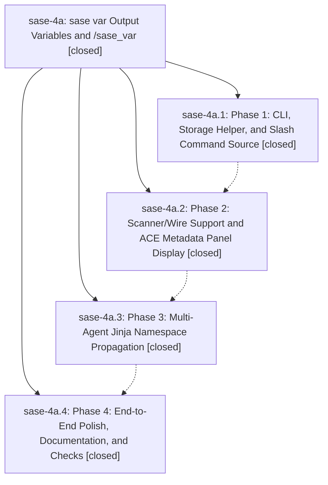

# Bead: sase-4a — sase var Output Variables and /sase\_var

[Bead Pages](../README.md) / sase-4a

**Status:** ✓ closed · **Resolution:** (unrecorded) · **Type:** plan · **Tier:** epic
**Owner:** `bryanbugyi34@gmail.com`
**Created:** 2026-06-03 00:20:05 UTC · **Closed:** 2026-06-03 01:49:59 UTC
**Plan:** [202606/sase\_var\_output\_variables.md](https://github.com/sase-org/sase--plans/blob/main/202606/sase_var_output_variables.md)

## Notes

COMMIT: a7c0e6c80

## Phases

| Bead | Title | Status | Size | Agents | Commits |
|---|---|---|---|---:|---:|
| [sase-4a.1](sase-4a.1.md) | Phase 1: CLI, Storage Helper, and Slash Command Source | ✓ closed | small | 1 | 1 |
| [sase-4a.2](sase-4a.2.md) | Phase 2: Scanner/Wire Support and ACE Metadata Panel Display | ✓ closed | small | 1 | 2 |
| [sase-4a.3](sase-4a.3.md) | Phase 3: Multi-Agent Jinja Namespace Propagation | ✓ closed | small | 1 | 1 |
| [sase-4a.4](sase-4a.4.md) | Phase 4: End-to-End Polish, Documentation, and Checks | ✓ closed | small | 1 | 1 |

## Lineage

## Agents

| Agent | Bead | Commits |
|---|---|---:|
| [bbugyi200.athena.sase-4a.1](https://github.com/sase-org/sase--agents/blob/main/agents/bbugyi200.athena.sase-4a.1/README.md) | [sase-4a.1](sase-4a.1.md) | 1 |
| [bbugyi200.athena.sase-4a.2](https://github.com/sase-org/sase--agents/blob/main/agents/bbugyi200.athena.sase-4a.2/README.md) | [sase-4a.2](sase-4a.2.md) | 2 |
| [bbugyi200.athena.sase-4a.3](https://github.com/sase-org/sase--agents/blob/main/agents/bbugyi200.athena.sase-4a.3/README.md) | [sase-4a.3](sase-4a.3.md) | 1 |
| [bbugyi200.athena.sase-4a.4](https://github.com/sase-org/sase--agents/blob/main/agents/bbugyi200.athena.sase-4a.4/README.md) | [sase-4a.4](sase-4a.4.md) | 1 |

## Commits

| Commit | Subject | Bead | Committed (UTC) |
|---|---|---|---|
| [`ecb4bf6`](https://github.com/sase-org/sase/commit/ecb4bf67987a625ed1fbe0a62ec240cc2cb11b0a) | feat: add agent output variables CLI (sase-4a.1) | [sase-4a.1](sase-4a.1.md) | 2026-06-03 00:38:58 |
| [`sase-core@c2b4d32`](https://github.com/sase-org/sase-core/commit/c2b4d326e8474fefa79e1f8d8163ed4c8e046615) | feat: scan agent output variables (sase-4a.2) | [sase-4a.2](sase-4a.2.md) | 2026-06-03 00:58:01 |
| [`5285661`](https://github.com/sase-org/sase/commit/528566175be79c3c986e9fe8e99645babeea3cba) | feat: show agent output variables in ACE (sase-4a.2) | [sase-4a.2](sase-4a.2.md) | 2026-06-03 00:58:54 |
| [`1d0cd11`](https://github.com/sase-org/sase/commit/1d0cd1140cf12d8838a36fa574d4592f969a3934) | feat: propagate output variables across named agents (sase-4a.3) | [sase-4a.3](sase-4a.3.md) | 2026-06-03 01:21:32 |
| [`a9c4095`](https://github.com/sase-org/sase/commit/a9c4095a8dbb9cf40207a0846d645a1ffad0006c) | chore: document output variable handoff (sase-4a.4) | [sase-4a.4](sase-4a.4.md) | 2026-06-03 01:37:49 |
